# NoRisk by FINLAI — Anwenderhandbuch

Willkommen bei NoRisk. Dieses Handbuch erklärt jede Funktion der Anwendung — laienverständlich und ohne Vorkenntnisse. Es richtet sich an Geschäftsleitung, Kanzlei- und Büroteams sowie alle, die ihre IT-Sicherheit verstehen und verbessern möchten, ohne selbst IT-Fachleute zu sein.

**So nutzen Sie dieses Handbuch.** Jedes Werkzeug-Kapitel ist gleich aufgebaut: Zuerst erklären wir **worum es geht** und den fachlichen Hintergrund (*Verstehen*), dann **warum** eine Maßnahme sinnvoll ist — oft mit einem kurzen Beispiel, was ohne sie passieren kann — und zuletzt die **konkreten Schritte** (*Anwenden*) samt Bildschirmfotos. Sie können das Handbuch von vorne lesen oder gezielt zu einem Kapitel springen. Wenn ein Fachbegriff zum ersten Mal auftaucht, wird er in Klammern kurz erklärt; alle Begriffe stehen zusätzlich im Glossar am Ende.

**Version dieses Handbuchs:** 2.0 · Gültig für NoRisk by FINLAI (Einzelplatz-Version, vollständig lokal).

---

## Inhaltsverzeichnis

- [1. Was ist NoRisk?](#1-was-ist-norisk)
- [2. Erste Einrichtung](#2-erste-einrichtung)
- [3. Schnellstart in fünf Minuten](#3-schnellstart-in-fünf-minuten)
- [4. Grundlagen: die wichtigsten Begriffe](#4-grundlagen-die-wichtigsten-begriffe)
- [5. Sicherheitskonzepte verstehen](#5-sicherheitskonzepte-verstehen)
- [6. Das Gesamtbild: wie die Werkzeuge zusammenspielen](#6-das-gesamtbild-wie-die-werkzeuge-zusammenspielen)
- [7. Das Cockpit](#7-das-cockpit)
- [8. Bereich „Lage" — die aktuelle Bedrohungslage](#8-bereich-lage--die-aktuelle-bedrohungslage)
- [9. Bereich „Scanner" — gezielte Prüfungen](#9-bereich-scanner--gezielte-prüfungen)
- [10. Bereich „Überwachung" — laufende Beobachtung](#10-bereich-überwachung--laufende-beobachtung)
- [11. Bereich „Sicherheit & Audit" — Bewerten, Nachweisen, Melden](#11-bereich-sicherheit--audit--bewerten-nachweisen-melden)
- [12. Einstellungen](#12-einstellungen)
- [13. Der FINLAI-Assistent und die Hilfe](#13-der-finlai-assistent-und-die-hilfe)
- [14. Probleme und Lösungen](#14-probleme-und-lösungen)
- [15. Glossar](#15-glossar)

---

## 1. Was ist NoRisk?

NoRisk ist ein Sicherheits-Cockpit für kleine und mittlere Organisationen — insbesondere für Kanzleien, Büros und Betriebe, die ihre IT-Sicherheit ernst nehmen, aber kein eigenes IT-Sicherheitsteam beschäftigen. Die Anwendung bündelt viele einzelne Sicherheitswerkzeuge unter einer Oberfläche: Sie prüft Ihren Computer und Ihr Netzwerk, beobachtet neue Schwachstellen in der Software-Welt, bewertet Ihren Sicherheitsstand mit nachvollziehbaren Punktzahlen und hilft Ihnen, gesetzliche Pflichten (Datenschutz, NIS2) zu erfüllen.

**Was NoRisk besonders macht.** Die Anwendung arbeitet grundsätzlich **vollständig auf Ihrem eigenen Gerät**. Es gibt keine zwingende Cloud-Anbindung, keine Telemetrie und kein automatisches „Nach-Hause-Telefonieren". Selbst der eingebaute KI-Assistent (eine künstliche Intelligenz, die Fragen beantwortet) läuft lokal — Ihre Eingaben verlassen den Computer nicht. Alle Daten, die NoRisk speichert, werden verschlüsselt abgelegt. Mehr dazu in [Kapitel 5](#5-sicherheitskonzepte-verstehen) und [Kapitel 12](#12-einstellungen).

**Für wen ist NoRisk gedacht?** Für Anwender ohne tiefe IT-Kenntnisse. Sie müssen keine Fachsprache beherrschen: NoRisk übersetzt technische Befunde in Alltagssprache, ordnet sie nach Dringlichkeit und schlägt konkrete nächste Schritte vor. Wer es genauer wissen will, kann in jedem Werkzeug zwischen einem **einfachen** und einem **fachlichen** Anzeige-Modus umschalten (siehe [Kapitel 13](#13-der-finlai-assistent-und-die-hilfe)).

**Wie ist die Anwendung aufgebaut?** Am linken Rand finden Sie die Navigationsleiste (Seitenleiste) mit fünf Bereichen, die dem natürlichen Ablauf folgen — von „Wo stehe ich?" bis „Was muss ich tun?":

- **Cockpit** — die Startseite mit Ihrem Gesamtüberblick.
- **Lage** — das tagesaktuelle Bedrohungsbild der IT-Welt.
- **Sicherheit & Audit** — Bewertung, Nachweis und Meldung (Audit, Score, Schulungen, Vorfälle).
- **Überwachung** — laufende Beobachtung (Updates, Passwörter, Lieferkette).
- **Scanner** — gezielte Einzelprüfungen (System, Netzwerk, Zertifikate, Dateien und mehr).

Ganz unten liegen fest die **Einstellungen** und Ihr Benutzerkonto. Der schwebende Roboter unten rechts ist das FINLAI-Maskottchen — ein Klick darauf öffnet Handbuch und Assistent.

---

## 2. Erste Einrichtung

**Worum geht es?** Beim allerersten Start richtet NoRisk sich einmalig ein: Sie stimmen den rechtlichen Grundlagen zu, legen ein Administrator-Konto an und erhalten einen Wiederherstellungs-Code. Danach melden Sie sich künftig mit Benutzername und Passwort an.

**Verstehen.** Ein *Administrator* ist das Konto mit den weitreichendsten Rechten (unter anderem darf nur er weitere Benutzer anlegen). Ein *Wiederherstellungs-Code* ist eine einmalige Zeichenfolge, mit der Sie Ihr Passwort zurücksetzen können, falls Sie es vergessen — vergleichbar mit einem Notschlüssel. NoRisk speichert diesen Code niemals im Klartext, sondern nur in verschlüsselter, nicht rückrechenbarer Form; deshalb kann ihn Ihnen niemand — auch der Hersteller nicht — nachträglich mitteilen.

**Warum so?** Die Zustimmung zu Nutzungsbedingungen und Datenschutzerklärung ist gesetzlich nötig und schafft Klarheit darüber, was die Anwendung tut. Das getrennte Administrator-Konto und der Wiederherstellungs-Code sorgen dafür, dass Ihre verschlüsselten Daten auch dann geschützt bleiben, wenn jemand Unbefugtes an Ihren Computer gelangt.

### 2.1 Der erste Start: Zustimmungen

Beim ersten Öffnen zeigt NoRisk nacheinander drei kurze Fenster, die Sie bestätigen müssen, bevor die Anwendung startet:

1. **Nutzungsvereinbarung.** Der vollständige Text der Nutzungsbedingungen. Setzen Sie das Häkchen „Ich habe die Nutzungsvereinbarung gelesen und stimme zu" und klicken Sie auf „Zustimmen".
2. **Datenschutzerklärung.** Erläutert, welche Daten lokal verarbeitet werden und welche wenigen externen Abrufe es gibt (dazu [Kapitel 12](#12-einstellungen)). Auch hier bestätigen Sie mit Häkchen und „Zustimmen".
3. **Datenschutzhinweis.** Ein Kurzhinweis, dass alles lokal bleibt und in den Protokollen nur Metadaten (Aktionen, Dateinamen, Zeitstempel) stehen — keine Dateiinhalte. Klicken Sie auf „Verstanden".

> **Achtung:** Lehnen Sie eine der Zustimmungen ab (oder schließen Sie das Fenster), beendet sich NoRisk. Ohne diese Einwilligungen kann die Anwendung nicht betrieben werden. Sie können die Zustimmung später jederzeit in den Einstellungen unter „Rechtliches" widerrufen — die Anwendung wird dann geschlossen und fragt beim nächsten Start erneut.

### 2.2 Der Einrichtungs-Assistent

Solange noch kein echtes Administrator-Konto existiert, führt Sie ein Assistent Schritt für Schritt durch die Erstkonfiguration. Am unteren Rand finden Sie stets „Zurück" und „Weiter" (auf der letzten Seite „Fertigstellen"). Die wichtigsten Schritte:

1. **Willkommen** — eine kurze Einführung.
2. **Administrator anlegen** — hier vergeben Sie Vorname, Benutzername, E-Mail-Adresse, Anzeigename und ein Passwort (mindestens 8 Zeichen, mindestens ein Buchstabe und eine Ziffer). Reservierte Namen wie „admin" oder „root" sind gesperrt.
3. **Unternehmens-Angaben** (optional) — Eckdaten Ihrer Organisation.
4. **Profil-Fragen** (optional) — einige Ja/Nein-Fragen (etwa „Betreiben Sie eine eigene Website?"). Ihre Antworten steuern, welche Werkzeuge später standardmäßig eingeblendet werden. Sie können jederzeit alle Werkzeuge sichtbar schalten (siehe [Kapitel 12](#12-einstellungen)).
5. **Wiederherstellungs-Code** — NoRisk zeigt Ihnen einmalig den generierten Code an. Kopieren Sie ihn oder speichern Sie ihn als Datei und bewahren Sie ihn sicher auf (nicht auf demselben Gerät). Erst wenn Sie das Häkchen „Ich habe den Code an einem sicheren Ort notiert" setzen, geht es weiter.
6. **Abschluss** — die Einrichtung ist fertig, und Sie werden zur Anmeldung geführt.

> **Voraussetzung:** Notieren Sie den Wiederherstellungs-Code, bevor Sie fortfahren. Er wird nur ein einziges Mal angezeigt. Ohne ihn (und ohne einen zweiten Administrator) lässt sich ein vergessenes Passwort nicht mehr zurücksetzen.

### 2.3 Anmelden

Im normalen Betrieb starten Sie NoRisk und geben Benutzername und Passwort ein. Ein kleines Auge-Symbol im Passwortfeld blendet die Eingabe zum Prüfen sichtbar ein. Über „Passwort vergessen?" gelangen Sie zum Zurücksetzen per Wiederherstellungs-Code.

Aus Sicherheitsgründen beendet sich die Anwendung nach mehreren Fehlversuchen; wiederholte Fehleingaben nach einer Abmeldung führen zu einer zeitlich begrenzten Sperre. Das erschwert das automatische Durchprobieren von Passwörtern erheblich.

> **Hinweis:** NoRisk kennt zwei Rollen — **Administrator** und **Benutzer**. Nur ein Administrator kann Konten anlegen, Rollen ändern, Passwörter zurücksetzen oder einzelne Werkzeuge für bestimmte Benutzer freigeben. Die Benutzerverwaltung erreichen Sie in den Einstellungen unter „Über FINLAI".

---

## 3. Schnellstart in fünf Minuten

Sie möchten sofort loslegen? Diese Reihenfolge liefert nach kurzer Zeit einen belastbaren Überblick über Ihren Sicherheitsstand.

1. **Cockpit ansehen.** Nach der Anmeldung landen Sie auf dem Cockpit. Es zeigt Ihre beiden Sicherheits-Punktzahlen, offene Themen und einen tagesaktuellen Hinweis. Verschaffen Sie sich hier einen ersten Eindruck (siehe [Kapitel 7](#7-das-cockpit)).
2. **System-Scan starten.** Öffnen Sie im Bereich „Scanner" den Punkt „System-Scan" und klicken Sie auf „Scan starten". Nach etwa einer Minute sehen Sie, ob Virenschutz, Firewall und Verschlüsselung auf Ihrem Rechner aktiv sind (siehe [Kapitel 9](#9-bereich-scanner--gezielte-prüfungen)).
3. **Sicherheits-Score berechnen.** Wechseln Sie zu „Sicherheit & Audit" und öffnen Sie „Security-Bewertung". Im Reiter „Security-Score" klicken Sie auf „Neu berechnen" — NoRisk verdichtet die Messwerte zu einer Punktzahl von 0 bis 100 (siehe [Kapitel 11](#11-bereich-sicherheit--audit--bewerten-nachweisen-melden)).
4. **Selbst-Audit ausfüllen.** Im selben Bereich starten Sie über „Neues Audit" den geführten Fragebogen. Er ergänzt, was sich nicht automatisch messen lässt (Backup-Konzept, Notfallplan, Schulungen), und liefert eine Risikomatrix.
5. **Lagebild und Updates prüfen.** Schauen Sie in „Lage" nach neuen Schwachstellen und in „Überwachung" unter „Patchmonitor" nach fehlenden Software-Aktualisierungen.

> **Tipp:** Aktualität schlägt Vollständigkeit. Ein wöchentlicher Kurzblick auf Cockpit, Lage und Patchmonitor hält Ihren Schutz spürbar besser als eine einmalige, umfassende Prüfung.

---

## 4. Grundlagen: die wichtigsten Begriffe

**Einordnung.** IT-Sicherheit steckt voller Fachbegriffe. Damit die späteren Kapitel leicht lesbar bleiben, erklärt dieser Abschnitt die wenigen Begriffe, die immer wieder vorkommen. Das vollständige Nachschlagewerk ist das Glossar in [Kapitel 15](#15-glossar).

- **Schwachstelle / CVE.** Eine *Schwachstelle* ist ein Fehler in Software, den Angreifer ausnutzen können. Jede weltweit bekannte Schwachstelle erhält eine eindeutige Kennung, die *CVE-Nummer* (englisch „Common Vulnerabilities and Exposures"). So lässt sich eindeutig darüber sprechen.
- **CVSS.** Der *CVSS-Wert* ist eine Schweregrad-Zahl von 0.0 bis 10.0 für eine Schwachstelle. Grob gilt: ab 9.0 kritisch, ab 7.0 hoch, ab 4.0 mittel.
- **Patch / Update.** Ein *Patch* ist eine Aktualisierung des Herstellers, die eine Schwachstelle schließt. „Patchen" heißt, diese Updates zeitnah einzuspielen.
- **Hardening (Härtung).** Das *Härten* eines Systems bedeutet, seine Angriffsfläche durch sichere Einstellungen zu verkleinern — etwa die Firewall einschalten, unnötige Dienste abschalten, die Festplatte verschlüsseln.
- **Audit.** Ein *Audit* ist eine systematische Soll-Ist-Prüfung Ihrer Sicherheit — vergleichbar mit einem TÜV für die IT. In NoRisk ist es ein geführter Fragebogen.
- **Score (Punktzahl).** Eine Punktzahl von 0 bis 100, bei der ein höherer Wert besser ist. NoRisk führt bewusst zwei getrennte Scores (siehe unten und [Kapitel 7](#7-das-cockpit)).
- **NIS2.** Eine EU-Richtlinie zur Cybersicherheit (Richtlinie 2022/2555). Sie verlangt unter anderem Sicherheitsmaßnahmen, Lieferketten-Sorgfalt und die Meldung erheblicher Vorfälle innerhalb gesetzlicher Fristen.
- **DSGVO und AVV.** Die *Datenschutz-Grundverordnung* (DSGVO) regelt den Umgang mit personenbezogenen Daten. Ein *Auftragsverarbeitungsvertrag* (AVV) ist der nach DSGVO Artikel 28 vorgeschriebene Vertrag mit Dienstleistern, die in Ihrem Auftrag personenbezogene Daten verarbeiten.
- **Lieferkette (Supply-Chain).** Die Gesamtheit der externen Dienstleister und Software, von denen Ihre eigene IT abhängt. Ein Vorfall bei einem Dienstleister trifft mittelbar auch Sie.

**Die zwei Punktzahlen von NoRisk.** Weil diese Unterscheidung im ganzen Handbuch wiederkehrt, hier vorab: NoRisk zeigt Ihren Sicherheitsstand in **zwei getrennten** Punktzahlen, die niemals zu einem Mischwert verrechnet werden.

- Die **Selbsteinschätzung (Audit)** stammt aus Ihren eigenen Antworten im Fragebogen — sie ist *selbst deklariert*.
- Die **Messung (Hardening)** stammt aus echten, automatischen Prüfungen Ihres Systems — sie ist *gemessen*.

Ein gemessener Wert von 72 hat einen anderen Beweiswert als ein selbst angegebener Wert von 72. Deshalb bleiben beide sichtbar nebeneinander stehen, jeweils mit ihrer Herkunft beschriftet.

---

## 5. Sicherheitskonzepte verstehen

**Einordnung.** Viele Empfehlungen in NoRisk sind zunächst unbequem — ein zweiter Anmeldefaktor kostet Sekunden, Updates unterbrechen die Arbeit. Wer aber versteht, *warum* diese Praktiken schützen, akzeptiert sie leichter. Dieses Kapitel erklärt die tragenden Prinzipien guter IT-Sicherheit, jeweils mit einem kurzen Beispiel, was ohne die Maßnahme passieren kann, und mit dem Verweis auf das NoRisk-Werkzeug, das dabei hilft.

### 5.1 Mehr-Faktor-Anmeldung (MFA/2FA)

Die *Mehr-Faktor-Anmeldung* verlangt zusätzlich zum Passwort einen zweiten Nachweis, etwa einen Einmalcode aus einer App. So bleibt ein Konto geschützt, selbst wenn das Passwort gestohlen wurde.

> **Beispiel:** Ohne zweiten Faktor genügt ein einziges geleaktes Passwort — der Angreifer meldet sich sofort und ungehindert an. Mit zweitem Faktor scheitert er an der zweiten Stufe, obwohl er das Passwort kennt.

NoRisk selbst verzichtet in dieser Version noch auf einen zweiten Anmeldefaktor (der Wiederherstellungs-Code dient nur dem Passwort-Reset). Ob auf Ihren Geräten und in Ihren Diensten eine Mehr-Faktor-Anmeldung aktiv ist, bewertet NoRisk jedoch im Security-Audit und im Security-Score.

### 5.2 Starke Passwörter und Passphrasen

Sicherheit entsteht vor allem durch **Länge** und **Einzigartigkeit**, nicht durch möglichst kryptische Kürze. Eine lange Passphrase aus mehreren Wörtern ist leichter zu merken und schwerer zu knacken als ein kurzes, wildes Passwort. Jedes wichtige Konto sollte ein eigenes Passwort haben.

> **Beispiel:** Wird ein Dienst mit einem wiederverwendeten Passwort gehackt, probieren Angreifer dieselbe Kombination automatisiert bei allen anderen Diensten durch („Credential Stuffing") — und übernehmen der Reihe nach jedes Konto.

Der **Passwort-Checker** ([Kapitel 10](#10-bereich-überwachung--laufende-beobachtung)) bewertet die Stärke lokal und prüft datenschonend, ob ein Passwort bereits in bekannten Datenlecks auftaucht.

### 5.3 Rollen und Berechtigungen (RBAC)

Bei einer *rollenbasierten Rechtevergabe* hängen Rechte an Rollen, nicht an einzelnen Personen. Jede und jeder erhält genau die Rolle, die zur Aufgabe passt. Das hält Berechtigungen übersichtlich und nachvollziehbar.

> **Beispiel:** Darf jeder alles, kann ein einziges gekapertes Alltagskonto Einstellungen, Benutzer und Daten verändern — und niemand kann hinterher nachvollziehen, wer worauf Zugriff hatte.

NoRisk trennt die Rollen **Administrator** und **Benutzer** und erlaubt, einzelnen Konten nur bestimmte Werkzeuge freizugeben. Im Security-Audit prüfen Sie Rollen- und Zugriffskonzepte auch bei Kunden.

### 5.4 Geringste Rechte (Least Privilege)

Jedes Konto und jeder Dienst sollte nur die minimal nötigen Rechte besitzen — Administrator-Rechte nur, wenn wirklich gebraucht. So bleibt der Schaden klein, wenn ein Konto missbraucht wird.

> **Beispiel:** Wer dauerhaft als Administrator arbeitet, gibt einer einzigen Schaddatei die Möglichkeit, sofort das ganze System zu übernehmen.

NoRisk fordert erhöhte Rechte nur punktuell an (etwa für bestimmte Messungen). System-Scan, System Optimierung und das Audit decken überflüssige Administrator-Rechte und riskante Einstellungen auf.

### 5.5 Mehrschichtige Verteidigung (Defense-in-Depth)

Sicherheit stützt sich nie auf eine einzige Maßnahme, sondern auf mehrere gestaffelte Schichten: Passwort, Verschlüsselung, Updates, Firewall, Backup, Überwachung. Fällt eine Schicht aus, fangen die übrigen den Angriff ab.

> **Beispiel:** Fehlt ein einziger Patch und es gibt keine weiteren Schichten, genügt diese eine Lücke für die vollständige Übernahme.

NoRisk deckt mit seinen Werkzeugen bewusst mehrere Schichten zugleich ab — vom lokalen System über das Netzwerk bis zur Lieferkette.

### 5.6 Null Vertrauen (Zero Trust)

*Zero Trust* behandelt jede Anfrage als potenziell unsicher — auch aus dem eigenen Netz — und verlangt fortlaufende Prüfung statt eines blind vertrauten „inneren" Bereichs.

> **Beispiel:** Wer einmal im Netz ist (etwa über ein infiziertes Gerät), bewegt sich ohne solche Prüfungen frei von System zu System weiter.

Der **Netzwerk-Scan** macht sichtbar, welche Geräte und offenen Zugänge überhaupt erreichbar sind — die Grundlage, um Unerwartetes zu erkennen.

### 5.7 Verschlüsselung — gespeichert und übertragen

Verschlüsselung schützt Daten in zwei Zuständen: *gespeichert* auf der Festplatte („at rest") und *übertragen* über das Netz („in transit", erkennbar am Schloss-Symbol und „https"). Ohne Verschlüsselung sind Daten bei Diebstahl oder Mitlesen im Klartext lesbar.

> **Beispiel:** Ein gestohlener Laptop ohne Festplattenverschlüsselung gibt alle Kundendaten im Klartext preis — ein meldepflichtiger Datenschutzvorfall.

NoRisk verschlüsselt **alle lokal gespeicherten Daten** mit einem starken Verfahren (SQLCipher, AES-256) ohne Klartext-Ausweg. Der **Zertifikats-Scan** prüft die Verschlüsselung von Webseiten auf dem Transportweg.

### 5.8 Datensicherung nach der 3-2-1-Regel

Eine gute Sicherung folgt der *3-2-1-Regel*: 3 Kopien der Daten, auf 2 verschiedenen Medien, davon 1 außer Haus (und idealerweise getrennt vom Netz). So übersteht man Hardwaredefekt, Diebstahl und Erpressungssoftware.

> **Beispiel:** Ein Verschlüsselungs-Trojaner oder ein Plattendefekt vernichtet die einzige Datenkopie unwiederbringlich. Eine Lösegeldzahlung ist keine Garantie für die Wiederherstellung.

NoRisk bringt in dieser Version keine eigene Sicherungsfunktion mit, fragt die Backup-Strategie aber im Security-Audit ab und bewertet sie.

### 5.9 Aktualität durch Patch-Management

Software-Updates schließen bekannte Lücken. Sie zeitnah einzuspielen ist eine der wirksamsten Einzelmaßnahmen überhaupt.

> **Beispiel:** Angreifer nutzen frisch veröffentlichte Lücken oft binnen Tagen automatisiert aus — ungepatchte Systeme sind das Haupteinfallstor für Erpressungssoftware.

Der **Patchmonitor**, der **Advisory-Monitor** und der **Dependency-Scan** arbeiten hier zusammen: Sie zeigen fehlende Updates, offizielle Herstellerwarnungen und verwundbare Programmbausteine.

### 5.10 Netzwerksegmentierung

*Segmentierung* teilt das Netz in getrennte Zonen (etwa Büro, Gäste, Server), damit sich ein Vorfall nicht ausbreitet.

> **Beispiel:** Ein infiziertes Gäste- oder Smart-Home-Gerät hat ohne Trennung direkten Draht zu Servern und Backups — der Angreifer springt ungehindert weiter.

Der **Netzwerk-Scan** macht sichtbar, welche Geräte in einer Zone tatsächlich vorhanden sind, und deckt vergessene oder falsch platzierte Geräte auf.

### 5.11 Protokollierung und Überwachung

Protokolle (Logs) und deren Auswertung machen Angriffe überhaupt erst sichtbar und nachweisbar. Ein *SIEM* (System zur Sammlung und Auswertung sicherheitsrelevanter Ereignisse) verdichtet viele Einzelereignisse zu Warnungen.

> **Beispiel:** Ohne Protokollierung bleibt ein Einbruch oft monatelang unbemerkt, und hinterher lässt sich weder Hergang noch Schadensumfang rekonstruieren — was auch DSGVO und NIS2 verlangen.

NoRisk führt ein manipulationssicheres Protokoll, bietet im Cockpit eine leichte SIEM-Sammlung samt Auffälligkeits-Erkennung und unterstützt mit dem NIS2-Werkzeug die Meldekette.

---

## 6. Das Gesamtbild: wie die Werkzeuge zusammenspielen

**Einordnung.** Die einzelnen Werkzeuge entfalten ihre Wirkung erst im Zusammenspiel. NoRisk folgt einem Kreislauf, der die Bereiche der Seitenleiste widerspiegelt — von der Beobachtung über die Bewertung bis zum Nachweis. Das folgende Schaubild zeigt diesen Kreislauf:

```text
      +-------------------------------------------------------------+
      |                                                             |
      v                                                             |
  [ ERKENNEN ]  -->  [ BEWERTEN ]  -->  [ SCHUETZEN ]  -->  [ NACHWEISEN ]
   Scanner &         Cockpit &          Massnahmen          Audit-Bericht,
   Lagebild          Security-Score     umsetzen            NIS2-Meldung
      ^                                                             |
      |                                                             |
      +----------------  [ UEBERWACHEN ]  <-------------------------+
                          Patch / Passwort / Lieferkette
```

- **Erkennen** — Sie verschaffen sich ein Bild: Scanner prüfen Ihr System und Netz, die Lage zeigt neue Bedrohungen der IT-Welt.
- **Bewerten** — das Cockpit und der Security-Score verdichten die Befunde zu Punktzahlen und Prioritäten.
- **Schützen** — Sie setzen die vorgeschlagenen Maßnahmen um (Updates einspielen, Einstellungen härten).
- **Überwachen** — die Überwachungs-Werkzeuge behalten Updates, Passwörter und Lieferkette laufend im Blick.
- **Nachweisen** — das Audit und das NIS2-Werkzeug erzeugen prüffähige Berichte und Meldungen.

Die folgende Tabelle ordnet jedes Werkzeug in diesen Kreislauf ein:

| Werkzeug | Wo im Kreislauf | Wann nutzen | Warum |
|---|---|---|---|
| System-Scan | Erkennen | nach Neuinstallation, quartalsweise | zeigt, ob Schutzfunktionen des PCs aktiv sind |
| Netzwerk-Scan | Erkennen | in neuem Netz, bei fremden Geräten | deckt erreichbare Geräte und offene Zugänge auf |
| Datei-Scan | Erkennen | vor dem Öffnen verdächtiger Dateien | erkennt Schadcode, bevor er ausgeführt wird |
| Lage / Bedrohungslage | Erkennen | täglich bis wöchentlich | meldet neue, ausgenutzte Schwachstellen |
| Advisory-Monitor | Erkennen | wöchentlich | filtert Herstellerwarnungen auf Ihre Software |
| Cockpit | Bewerten | bei jedem Start | verdichtet alles zum Gesamtüberblick |
| Security-Score | Bewerten | monatlich, vor Prüfungen | eine gemessene Punktzahl mit Verlaufskontrolle |
| Security-Audit | Bewerten / Nachweisen | je Kunde, jährlich | strukturierte Bewertung und Risikomatrix |
| System Optimierung | Schützen | bei neuer Einrichtung | zeigt und (perspektivisch) setzt Datenschutz-Einstellungen |
| Patchmonitor | Überwachen | wöchentlich | zeigt fehlende Updates und Auslaufsoftware |
| Passwort-Checker | Überwachen | bei neuen Passwörtern | prüft Stärke und Datenlecks |
| Supply-Chain-Monitor | Überwachen / Nachweisen | bei neuen Partnern | verwaltet Lieferanten und AVV-Verträge |
| Zertifikats-Scan | Überwachen | für eigene Webseiten | warnt vor ablaufenden Zertifikaten |
| Dependency-Scan | Überwachen | vor Software-Releases | prüft Programmbausteine auf Lücken |
| API-Scan | Erkennen | für eigene Schnittstellen | testet Web-Schnittstellen auf Mängel |
| NIS2-Vorfälle | Nachweisen | im Ernstfall | führt die gesetzliche Meldekette mit Fristen |
| Awareness-Tracker | Nachweisen | nach Schulungen | belegt Schulungs- und Übungspflichten |

Dieser Kreislauf schließt sich fortlaufend: Was Sie erkennen, bewerten und schützen, halten Sie durch die Überwachung stabil — und weisen es bei Bedarf nach.

---

## 7. Das Cockpit

**Worum geht es?** Das Cockpit ist die Startseite von NoRisk. Es verdichtet die Ergebnisse aller übrigen Werkzeuge zu einem Gesamtbild Ihrer Sicherheitslage — zwei Punktzahlen, offene Themen, Trends, Aufgaben und ein tagesaktueller Hinweis auf einen Blick.

**Verstehen.** Ein Cockpit funktioniert wie das Armaturenbrett im Auto: viele kleine Anzeigen (Tacho, Warnleuchten) an einer Stelle. NoRisk sammelt die Werte aus den verschlüsselten Datenbeständen der Einzelwerkzeuge und stellt sie übersichtlich dar. Zwei Begriffe kehren hier wieder: der *Score* (Punktzahl 0 bis 100, höher ist besser) und die *Frische* (das Alter der letzten Prüfung je Werkzeug).

**Warum so?** Ohne zentrale Übersicht liegen die Ergebnisse über viele Werkzeuge verstreut, und wichtige Verschlechterungen bleiben unbemerkt.

> **Beispiel:** Ein Zertifikat läuft ab und zugleich wird eine kritische Schwachstelle für ein eingesetztes Programm bekannt. Ohne Cockpit sieht das niemand, bis die Website ausfällt oder der Rechner übernommen wurde. Das Cockpit zeigt beides sofort.

**Wann nutzen?** Als erste Anlaufstelle nach jeder Anmeldung, für den Wochen- oder Monatsüberblick und zur Vorbereitung von Besprechungen (dank PDF-Export).

**Der Kopfbereich.** Ganz oben wählen Sie das **Subjekt** (Ihr eigenes System oder — falls angelegt — ein Kunde) und den Zeitraum über die Schaltflächen „Woche", „Monat", „Quartal". Rechts liegen „Als PDF exportieren" und ein runder Aktualisieren-Knopf. Darunter gliedert sich das Cockpit in vier Reiter: „Überblick", „Details", „Arbeitsbereich" und „Workflow" (ein geführter Leitfaden, siehe Abschnitt 7.4).

### 7.1 Reiter „Überblick"

Der Überblick beginnt mit einer Begrüßung und der Schnellstart-Leiste (direkte Sprünge zu häufig genutzten Werkzeugen). Es folgen die KI-Empfehlungen („FINLAI empfiehlt", die drei dringendsten Aufgaben), der Phishing-Radar (tagesaktuelle Betrugsmaschen) und — als Kernstück — Ihre eigene Sicherheitslage mit den **zwei Score-Kacheln**.

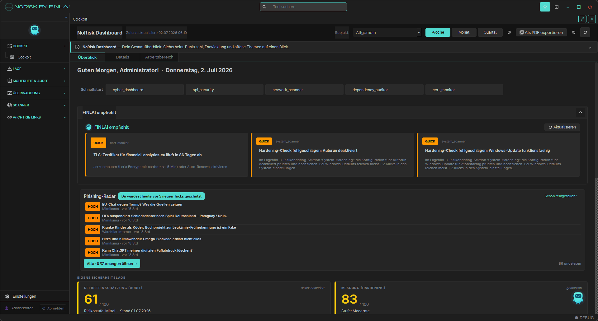

*Abbildung 1: Der Reiter „Überblick" des Cockpits mit den beiden Sicherheits-Punktzahlen (Selbsteinschätzung und Messung).*

So lesen Sie die beiden Score-Kacheln:

- **Selbsteinschätzung (Audit)** — trägt das Etikett „selbst deklariert" und färbt sich nach Risikostufe (grün = niedrig, gelb = mittel, orange = hoch, rot = kritisch). Der Wert stammt aus Ihrem Fragebogen.
- **Messung (Hardening)** — trägt das Etikett „gemessen" und färbt sich nach Score-Stufe. Der Wert stammt aus echten Prüfungen Ihres eigenen Systems.

> **Hinweis:** Weichen beide Werte stark voneinander ab (25 Punkte oder mehr), blendet das Cockpit einen Prüfhinweis ein — etwa: die Selbsteinschätzung liegt deutlich über der Messung, also möglicherweise zu optimistisch. Es wird nichts verrechnet; beide Zahlen bleiben getrennt sichtbar. Beide Kacheln beziehen sich immer auf Ihr eigenes System; ein gewählter Kunde erscheint als zusätzliche Karte.

Darunter liegen vier **Status-Kacheln** (Patch-Stand, Netzwerk, Lieferkette, Passwörter), ein **Vollständigkeits-Banner** (zeigt, ob die zugrunde liegenden Scans frisch, veraltet oder nicht vorhanden sind) und die **Risikomatrix** aus dem letzten Selbst-Audit. Ein Klick auf eine Kachel springt direkt in das zugehörige Werkzeug.

### 7.2 Reiter „Details"

Der Reiter „Details" öffnet aufklappbare Abschnitte für alle, die tiefer einsteigen möchten: den leichten Ereignis-Pool (Light-SIEM) samt Auffälligkeits-Erkennung, „Was hat sich geändert", die CVE-Liste mit Scan-Status, die organisatorische Sicherheit sowie die Score-Aufschlüsselung mit Verlauf.

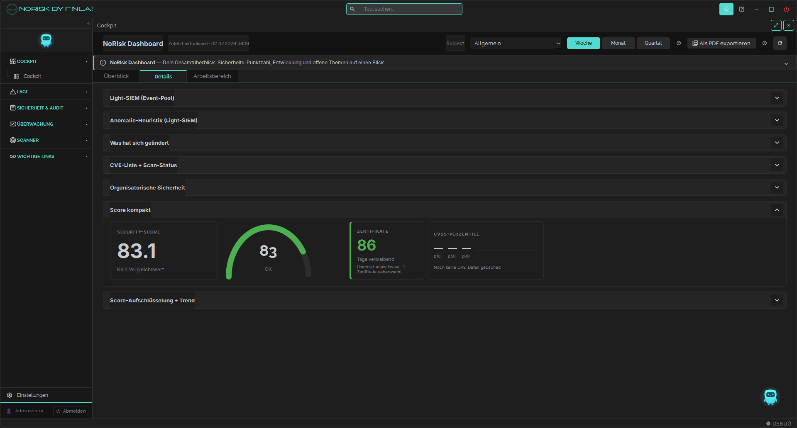

*Abbildung 2: Der Reiter „Details" mit der Sektion „Score kompakt" — der Halbkreis zeigt den Gesamtscore, daneben die Restlaufzeit des nächsten Zertifikats.*

Die Halbkreis-Anzeige (Gauge) ist schnell zu deuten: ab 80 grün („in Ordnung"), 60 bis 79 orange („Warnung"), unter 60 rot („kritisch"). Ein Pfeil zeigt den Trend gegenüber der Vorwoche (nach oben besser, nach unten schlechter).

### 7.3 Reiter „Arbeitsbereich"

Der Arbeitsbereich bündelt, was zu tun ist: offene NIS2-Vorfälle, eine Aufgabentafel (Kanban mit den Spalten „Offen", „In Arbeit", „Erledigt") und ein Tagesprotokoll für eigene Notizen. Viele Aufgaben entstehen automatisch aus den Befunden der Werkzeuge.

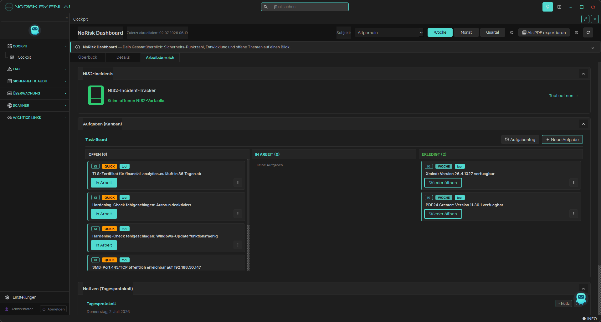

*Abbildung 3: Der Reiter „Arbeitsbereich" mit der Aufgabentafel — Befunde werden hier zu abarbeitbaren Aufgaben.*

> **Tipp:** Nutzen Sie den PDF-Export im Kopfbereich, um der Geschäftsleitung einen kompakten, prüffähigen Statusbericht zu geben — ganz ohne technische Fachsprache.

### 7.4 Reiter „Workflow" — der geführte Leitfaden

**Worum geht es?** NoRisk bündelt viele Werkzeuge, gibt aber von sich aus keine Reihenfolge vor. Der Reiter „Workflow" schließt diese Lücke: Er ist eine **Checkliste in der richtigen Reihenfolge** — vom ersten Scan bis zum fertigen Bericht. So finden Sie sicher ins System hinein, ohne raten zu müssen, was zuerst an der Reihe ist.

**Verstehen.** Die Aussagekraft von Score, Audit und PDF-Report hängt davon ab, dass die zugrunde liegenden Prüfungen **frisch** sind. Deshalb ordnet der Leitfaden die Schritte in fünf Phasen: erst prüfen und scannen, dann bewerten, dann nachweisen, dann laufend überwachen und zuletzt berichten. Jeder Schritt lässt sich abhaken, mit einer Notiz versehen und per Klick direkt im zugehörigen Werkzeug öffnen.

**Warum so?** Wer den Security-Score berechnet, bevor die Scans gelaufen sind, erhält eine Zahl auf veralteter Grundlage. Die feste Reihenfolge verhindert genau das — und macht sichtbar, welche Schritte noch offen sind.

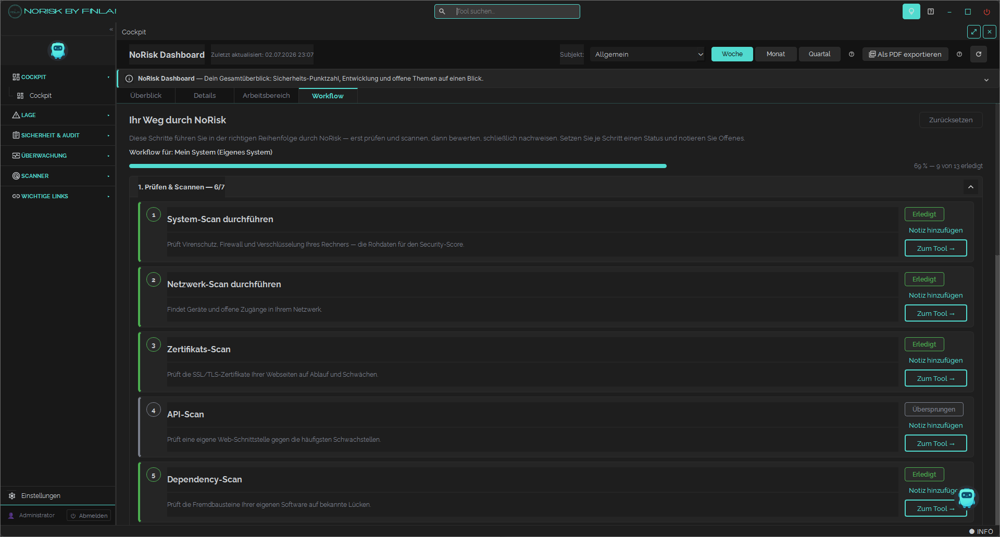

*Abbildung 4: Der Reiter „Workflow" — die Schritte in der richtigen Reihenfolge, je mit Status (erledigt/übersprungen), Notiz und „Zum Tool". Der Fortschrittsbalken oben zeigt, wie weit Sie gekommen sind.*

**Zwei Varianten — je nachdem, wen Sie prüfen.** Über den Subjekt-Wähler im Kopfbereich entscheidet sich, welche Checkliste erscheint.

**A) Eigenes System (bis zu 14 Schritte)** — mit den technischen Scans:

- *Phase 1 — Prüfen & Scannen:* System-Scan (Virenschutz, Firewall, Verschlüsselung) · Netzwerk-Scan · Zertifikats-Scan¹ · API-Scan¹ · Dependency-Scan¹ · Datei-Scan · Passwörter prüfen.
- *Phase 2 — Bewerten:* Security-Score berechnen (erst **nach** den Scans) · Security-Audit ausfüllen (Fragebogen + Risikomatrix).
- *Phase 3 — Nachweisen:* Schulungen erfassen (Awareness) · NIS2-Vorfälle pflegen.
- *Phase 4 — Überwachen:* Patchmonitor prüfen · Lieferkette & AVV pflegen.
- *Phase 5 — Bericht:* PDF-Report exportieren (als letzter Schritt, wenn die Daten frisch sind).

¹ Diese drei Schritte erscheinen nur, wenn Ihr Profil sie betrifft (eigene Website, eigene Programmierschnittstelle bzw. eigene Softwareentwicklung — festgelegt bei der Einrichtung, siehe [Kapitel 2](#2-erste-einrichtung)).

**B) Kundensystem (6 Schritte)** — ohne technisches Scannen, da sich ein Kundenrechner nicht aus der Ferne messen lässt; stattdessen der geführte Fragebogen:

- Kunde erfassen · Security-Audit (Fragebogen) · NIS2-Betroffenheit prüfen · Lieferkette & AVV erfassen · NIS2-Vorfälle pflegen · Audit-Report als PDF.

**Wann nutzen?** Beim ersten Einrichten, bei jedem neuen Kunden und immer dann, wenn Sie sichergehen möchten, nichts übersehen zu haben. Der Reiter ist bewusst **nicht** die Startseite nach der Anmeldung (das bleibt der Überblick), sondern ein Wegweiser, den Sie bei Bedarf öffnen.

**Anwenden.** Öffnen Sie den Reiter „Workflow" und arbeiten Sie die Schritte von oben nach unten ab. Setzen Sie je Schritt den Status (offen, in Arbeit, erledigt) und hinterlassen Sie bei Bedarf eine Notiz. Ein Klick auf einen Schritt öffnet direkt das passende Werkzeug. Der Fortschrittsbalken oben zeigt jederzeit, wie viele Schritte Sie schon erledigt haben.

---

## 8. Bereich „Lage" — die aktuelle Bedrohungslage

Während das Cockpit **Ihre** Organisation zeigt, richtet der Bereich „Lage" den Blick nach außen: auf die tagesaktuelle Bedrohungslage der IT-Welt. Er enthält zwei Werkzeuge — die **Bedrohungslage** und den **Advisory-Monitor**.

### 8.1 Bedrohungslage

**Worum geht es?** Die Bedrohungslage ist Ihr tägliches Lagebild: neue Schwachstellen, aktiv ausgenutzte Lücken, aktuelle Betrugsmaschen und eine von der lokalen KI erstellte Zusammenfassung.

**Verstehen.** Einige Begriffe helfen beim Lesen: Eine *KEV* (englisch „Known Exploited Vulnerability") ist eine Schwachstelle, die nachweislich bereits aktiv von Angreifern ausgenutzt wird — die dringlichste Kategorie überhaupt. *NVD* ist die große öffentliche Schwachstellen-Datenbank, aus der die Schweregrade stammen. Das *Risikobriefing* ist eine kurze, verständliche Tageszusammenfassung.

**Warum so?** Angreifer nutzen frisch veröffentlichte Lücken oft binnen Stunden.

> **Beispiel:** Wird für ein von Ihnen eingesetztes Programm eine aktiv ausgenutzte Lücke bekannt, aber Sie verfolgen die Lage nicht, patchen Sie womöglich Wochen zu spät — und werden in der Zwischenzeit über genau diese Lücke angegriffen. Das Lagebild markiert solche Fälle sofort.

**Wann nutzen?** Jeden Morgen oder zu Wochenbeginn und immer nach großen Sicherheitsmeldungen in den Medien.

**Anwenden.** Beim Öffnen sehen Sie oben drei Statistik-Kacheln (kritische und hohe Meldungen der letzten 24 Stunden sowie aktiv ausgenutzte Lücken). Darunter liegen mehrere Reiter:

- **Risikobriefing** — Ihre eigene Lage in Klartext, mit den beiden Score-Kacheln und priorisierten Handlungspunkten. Dieser Reiter arbeitet ohne KI, allein aus festen Regeln.
- **KI-Lagebild** — eine auf Knopfdruck erzeugte Zusammenfassung der lokalen KI (dreigeteilt in „relevant für Ihre IT", „aktuelle Betrugsmaschen" und „verbreitete Software").
- **Phishing-Wellen** — aktuelle Betrugs- und Phishing-Kampagnen (siehe unten).
- **CVE-Übersicht** und **CVEs** — Schwachstellen aus verschiedenen Quellen, filterbar nach Schweregrad und danach, ob Ihre eigene Software betroffen ist.
- **Warnungen** — die Originalmeldungen der Sicherheitsquellen.
- **Wochenbericht** — ein PDF zum Weitergeben.

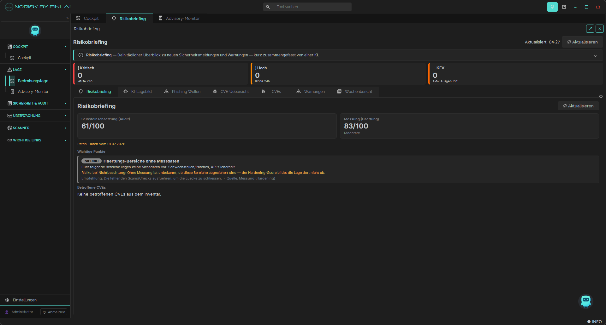

*Abbildung 5: Die Bedrohungslage — oben die Kacheln „Kritisch", „Hoch" und „KEV", darunter der Reiter „Risikobriefing".*

So lesen Sie die Farben: Schweregrade erscheinen als farbige Etiketten (kritisch rot, hoch orange, mittel gelb). Aktiv ausgenutzte Lücken sind gesondert markiert. Betroffene Schwachstellen unterscheidet NoRisk in „betroffen" (genauer Treffer in Ihrer Software) und „möglich" (unsicherer Treffer).

Der Reiter **Phishing-Wellen** verdient besondere Beachtung: Er zeigt aktuelle Betrugsmaschen, getrennt nach Zielgruppe (Unternehmen oder Privatpersonen), mit Quelle, Datum und Kurzbeschreibung. So erkennen Sie und Ihr Team Maschen wieder, bevor jemand darauf hereinfällt.

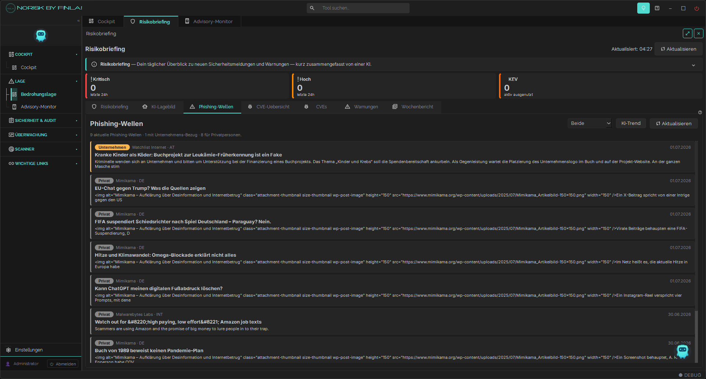

*Abbildung 6: Der Reiter „Phishing-Wellen" — jede Karte trägt ein Etikett „Unternehmen" oder „Privat", die Quelle und das Datum.*

> **Hinweis:** Die KI-Zusammenfassung läuft ausschließlich lokal und niemals automatisch — sie startet nur auf Knopfdruck. Voraussetzung ist ein installiertes lokales KI-Programm (Ollama, siehe [Kapitel 13](#13-der-finlai-assistent-und-die-hilfe)). Ist es nicht vorhanden, funktionieren alle übrigen Reiter dennoch.

**Alle Funktionen im Detail**

*Kopfzeile und Ladeanzeige (immer sichtbar)*

- **Titel „Risikobriefing"** — die Überschrift des Fensters (der Bereich heißt in der Seitenleiste „Bedrohungslage", die Kopfzeile trägt „Risikobriefing"); Nutzen: Sie erkennen sofort, wo Sie sich befinden.
- **Status-Anzeige** — zeigt „Lade …" während des Abrufs und danach „Aktualisiert: HH:MM"; Nutzen: Sie sehen auf einen Blick, wie frisch die angezeigten Daten sind.
- **Schaltfläche „Aktualisieren"** — erzwingt einen sofortigen Neuabruf aller Quellen (ohne Zwischenspeicher); Nutzen: nach einer großen Sicherheitsmeldung holen Sie die Lage per Knopfdruck auf den neuesten Stand, statt auf den automatischen Abgleich (alle 60 Minuten) zu warten.
- **Ladebildschirm mit Fortschrittsbalken** — erscheint nur beim allerersten Öffnen und zeigt die Schritte „Sicherheitsmeldungen … / CVE-Datenbank … / Statistiken …"; Nutzen: Sie sehen, dass im Hintergrund gearbeitet wird; nach 30 Sekunden erscheint das Lagebild in jedem Fall (auch wenn eine Quelle klemmt).

*Die drei Statistik-Kacheln (oben, farbig)*

- **Kachel „Kritisch" (letzte 24h)** — Anzahl der als kritisch eingestuften Schwachstellen der letzten 24 Stunden; Nutzen: Sofort-Fieberthermometer der Tageslage.
- **Kachel „Hoch" (letzte 24h)** — Anzahl der hoch eingestuften Schwachstellen der letzten 24 Stunden; Nutzen: zeigt die zweite Dringlichkeitsstufe.
- **Kachel „KEV" (aktiv ausgenutzt)** — Anzahl der Lücken, die nachweislich schon von Angreifern ausgenutzt werden (Known Exploited Vulnerability, CISA-Liste); Nutzen: die dringlichste Zahl überhaupt — hier zählt jede Stunde.

*Reiter 1 — Risikobriefing (ohne KI, aus festen Regeln, im Hintergrund berechnet)*

- **Schaltfläche „Aktualisieren" + Status** — baut das Risikobild neu auf; Nutzen: Sie können die Auswertung nach einem Scan erneut anstoßen.
- **Score-Kachel „Selbsteinschätzung (Audit)"** — Ihr Punktwert (0–100) aus dem Sicherheits-Audit (Fragebogen); Nutzen: zeigt, wie Sie sich selbst einschätzen.
- **Score-Kachel „Messung (Härtung)"** — Ihr Punktwert (0–100) aus den echten Messungen am System, mit Stufen-Beschriftung; Nutzen: zeigt den gemessenen Ist-Zustand. Beide Kacheln bleiben bewusst getrennt und werden **nie** zu einem Mischwert verrechnet (Selbstauskunft und Messung sind zweierlei).
- **Hinweiszeile** — meldet z. B. „X Programme konnten nicht per CPE geprüft werden" oder das Datum der letzten Patch-Daten; Nutzen: macht Lücken in der Datenbasis ehrlich sichtbar, statt sie zu verschweigen.
- **Abschnitt „Wichtige Punkte"** — priorisierte Handlungskarten, jede mit farbigem Dringlichkeits-Etikett (KRITISCH/HOCH/MITTEL/NIEDRIG), Titel, Befund, Zeile **„Risiko bei Nichtbeachtung:"** und **„Empfehlung: … · Quelle: …"**; Nutzen: Sie sehen nicht nur *was* zu tun ist, sondern auch *was passiert, wenn Sie es lassen* — und woher die Aussage stammt.
- **Abschnitt „Betroffene CVEs (X bestätigt, Y möglich)"** — kompakte Zeilen je Schwachstelle mit Etikett **„betroffen"** (genauer Treffer) oder **„möglich"** (unsicherer Treffer), CVE-Kennung, betroffenen Programmen, Markierung **„aktiv ausgenutzt"** und CVSS-Wert; Nutzen: verbindet die weltweite Bedrohungslage konkret mit *Ihrer* installierten Software.

*Reiter 2 — KI-Lagebild (lokale KI, nur auf Knopfdruck)*

- **KI-Hinweisbanner** — kennzeichnet den Bereich als KI-Zusammenfassung; Nutzen: Transparenz nach der EU-KI-Verordnung.
- **Auswahl „Modell"** — Liste der lokal installierten Ollama-Sprachmodelle; Nutzen: Sie wählen ein schnelleres oder gründlicheres Modell.
- **Schaltfläche „Neu generieren"** — startet die Zusammenfassung lokal im Hintergrund; Nutzen: die KI läuft nie automatisch — Sie behalten die Kontrolle, wann gerechnet wird.
- **Schaltfläche „Abbrechen"** — stoppt eine laufende Generierung; Nutzen: Sie warten nicht auf ein zu langsames Modell.
- **Schaltfläche „Ollama starten"** — erscheint nur, wenn das lokale KI-Programm nicht läuft, und startet es; Nutzen: Sie richten die KI ohne Kommandozeile ein.
- **Dreistufiger Fortschrittsbalken** — zeigt „Daten sammeln / Modell anfragen / Antwort verarbeiten" mit hochzählender Sekundenanzeige; Nutzen: Sie sehen, dass es voran geht, statt einen scheinbar eingefrorenen Bildschirm.
- **Spalte „Relevant für Ihre IT"** — Meldungen mit Bezug zu Ihrem Tech-Stack (Produkt-Etikett + CVE + ein Satz); Nutzen: filtert das Weltrauschen auf Ihre Programme.
- **Abschnitt „Aktuelle Betrugsmaschen"** mit **Umschalter „Beide / Unternehmen / Privat"** und den Gruppen **Unternehmen (KMU)** und **Privat**; Nutzen: trennt Maschen, die Ihre Firma treffen (CEO-Betrug, Rechnungsbetrug), von privaten (Bank-/Paket-Phishing) — die Wahl wird gespeichert.
- **Abschnitt „Verbreitete Software"** — Meldungen zu weit verbreiteten Programmen mit Quellen-Etikett (BSI, Microsoft, Chrome, Mozilla); Nutzen: Sie bleiben auch bei Alltagssoftware auf dem Laufenden.

*Reiter 3 — Phishing-Wellen (eigene, KI-freie Kartenansicht)*

- **Umschalter „Beide / Unternehmen / Privat"** — blendet die Zielgruppen ein/aus; Nutzen: Sie sehen genau die Warnungen, die zu Ihrer Rolle passen.
- **Schaltfläche „KI-Trend"** — erzeugt auf Wunsch eine kurze lokale KI-Zusammenfassung der aktuellen Wellen; Nutzen: ein Satz Überblick, ohne jede Karte zu lesen.
- **Schaltfläche „Aktualisieren"** — lädt die neuesten Warnungen aus dem Zwischenspeicher; Nutzen: aktueller Stand per Klick.
- **Überblickszeile** — z. B. „X aktuelle Phishing-Wellen · Y mit Unternehmens-Bezug · Z für Privatpersonen"; Nutzen: schnelle Mengeneinordnung.
- **Wellen-Karten** — je Karte ein Zielgruppen-Etikett (Unternehmen/Privat), die Herkunft samt Land (z. B. „Watchlist Internet · AT", „Mimikama · DE", „NCSC · CH"), das Datum, Titel und Beschreibung; Nutzen: Sie und Ihr Team erkennen eine Masche wieder, bevor jemand darauf hereinfällt.

*Reiter 4 — CVE-Übersicht (Schwachstellen aus allen Quellen gebündelt)*

- **Filter „Nur was Score beeinflusst"** — zeigt nur Einträge, die Ihre Bewertung verändern; Nutzen: konzentriert auf das Relevante.
- **Filter „Nur was Techstack betrifft"** — begrenzt auf Ihre eingesetzte Software; Nutzen: blendet Fremd-Schwachstellen aus.
- **Filter „System betroffen (Patch-Monitor)"** — zeigt nur die vom Patch-Monitor genau bestätigten Betroffenheiten; Nutzen: höchste Trefferqualität.
- **Schweregrad-Kästchen (Kritisch/Hoch/Mittel/Niedrig/Info)** — feinstufiges Ein-/Ausblenden; Nutzen: Sie legen die Aufmerksamkeitsschwelle selbst fest.
- **Schaltfläche „Aktualisieren"** — lädt die Gesamtsicht im Hintergrund neu; Nutzen: kein Einfrieren der Oberfläche während des Abrufs.
- **Drei Sektionen „Welt — NVD + CISA-KEV", „Hersteller-Advisories — CSAF", „Eigene Software — Techstack-Treffer"** — je Sektion Überschrift, Zähler und Tabelle (Spalten Severity, Quelle, CVE-ID, Betrifft, Titel); Nutzen: die drei Blickwinkel (Welt, Hersteller, Sie) getrennt und dennoch auf einer Seite.
- **Statuszeile** — „X sichtbar · Welt … · Advisories … · Software …", ggf. mit dezentem Hinweis auf ältere zwischengespeicherte NVD-Daten; Nutzen: Sie erkennen, ob Zahlen live oder aus dem Cache stammen.

*Reiter 5 — CVEs (durchsuchbare NVD-Tabelle)*

- **Suchfeld „Produkt suchen"** — Freitextsuche in der NVD-Schwachstellen-Datenbank (z. B. Windows, Apache); Nutzen: gezielte Recherche zu einem einzelnen Produkt.
- **Auswahl „Zeitraum" (7/14/30 Tage)** — begrenzt die Produktsuche zeitlich; Nutzen: nur frische Funde.
- **Auswahl „Quelle" (Alle CVEs / Aktiv ausgenutzt (KEV) / CRITICAL (NVD) / Mein Stack betroffen)** — bestimmt den angezeigten Topf; Nutzen: Sie springen direkt zu den aktiv ausgenutzten oder zu Ihren eigenen Treffern.
- **Auswahl „Schweregrad" (Alle/CRITICAL/HIGH/MEDIUM/LOW)** — verfeinert die Liste; Nutzen: kombinierbar mit der Quelle.
- **Schaltfläche „Suchen"** — startet die NVD-Produktsuche im Hintergrund (benötigt einen NVD-Zugangsschlüssel); Nutzen: erweitert die Cache-Ansicht um eine gezielte Live-Abfrage.
- **CVE-Tabelle (Spalten CVE-ID, CVSS, Schweregrad, Beschreibung, KEV, Details)** — sortierbar, Schweregrad farbig als Etikett, aktiv ausgenutzte Einträge mit „[KEV]" markiert; Nutzen: schneller Überblick; die Schaltfläche in der Spalte „Details" öffnet die Original-NVD-Seite.

*Reiter 6 — Warnungen (Originalmeldungen der Quellen)*

- **Filter „Quelle" (Alle Quellen …)** — begrenzt auf eine Meldungsquelle; Nutzen: Sie lesen gezielt nur eine Herkunft.
- **Filter „Schweregrad"** — blendet nach Dringlichkeit; Nutzen: nur das Wichtige.
- **Suchfeld „Suchen …"** — Volltextsuche in Titel und Beschreibung; Nutzen: schnelles Wiederfinden.
- **Meldungskarten** — je Karte Quelle + Datum (fett), eine Schaltfläche **„Details"** (öffnet die Originalseite), Titel und Kurztext; farbige linke Randlinie je Schweregrad; Nutzen: die Rohmeldung im Original, wenn Sie einer Sache auf den Grund gehen wollen.

*Reiter 7 — Wochenbericht (PDF zum Weitergeben)*

- **Feld „Speicherpfad" + Schaltfläche „Durchsuchen"** — legt Zielort und Dateinamen fest (Vorschlag „cyberrisiko_bericht_KWxx.pdf"); Nutzen: Sie steuern, wohin der Bericht gespeichert wird.
- **Schaltfläche „Wochenbericht erstellen"** — erzeugt im Hintergrund ein PDF mit KI-Briefing, kritischen CVEs und den wichtigsten Meldungen; Nutzen: ein vorzeigbares Dokument für Geschäftsführung oder Team.
- **Schaltfläche „PDF öffnen"** — erscheint nach erfolgreichem Export und öffnet die Datei; Nutzen: sofortige Kontrolle des Ergebnisses. (Benötigt die PDF-Komponente reportlab; fehlt sie, erscheint ein Hinweis.)

> **Hinweis:** Das kleine Fragezeichen-Symbol in der oberen Ecke der Reiterleiste und der Hilfe-Streifen über den Reitern öffnen das ausführliche Handbuch zu genau diesem Werkzeug.

### 8.2 Advisory-Monitor

**Worum geht es?** Der Advisory-Monitor ruft offizielle Sicherheitsmitteilungen von Herstellern und Behörden ab und hebt jene hervor, die genau Ihre Software betreffen.

**Verstehen.** Ein *Advisory* ist eine offizielle Sicherheitsmitteilung zu einem Produkt — vergleichbar mit einem Rückruf beim Auto, nur für Software. *CSAF* ist das maschinenlesbare Standardformat dafür; *Provider* sind die vertrauenswürdigen Quellen (etwa das BSI in Deutschland oder die US-Behörde CISA). Ihr *Tech-Stack* ist die Liste aller Programme, die Sie einsetzen — der Abgleich damit ergibt einen *Treffer* (englisch „Match").

**Warum so?** Man kann unmöglich täglich alle Hersteller-Kanäle von Hand lesen.

> **Beispiel:** Der Hersteller Ihres Mailservers veröffentlicht eine kritische Mitteilung zur eingesetzten Version. Ohne Monitor bleibt sie unentdeckt, das Update fehlt, und der Server wird über die dokumentierte Lücke übernommen. Der Advisory-Monitor hebt genau diese Mitteilung als Treffer hervor und empfiehlt „Update".

**Anwenden.** Der Monitor hat zwei Reiter. Im Reiter **Tech-Stack** pflegen Sie Ihre Programmliste — entweder von Hand über „Hinzufügen" oder bequem per „Aus System-Scan / Patch-Monitor übernehmen".

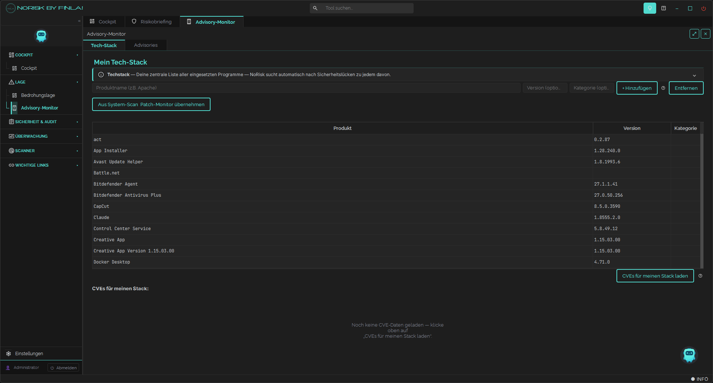

*Abbildung 7: Der Reiter „Tech-Stack" — hier pflegen Sie Ihre eingesetzte Software, gegen die alle Advisories abgeglichen werden.*

Im Reiter **Advisories** klicken Sie zunächst auf „Jetzt abrufen". Links filtern Sie nach Schweregrad und Zeitraum und können „Nur Treffer" einschalten. Die Liste zeigt Kennung, Schweregrad, den CVSS-Wert und das Veröffentlichungsdatum; ein Klick öffnet rechts die Details mit Herausgeber, betroffenen Produkten und Handlungsempfehlung.

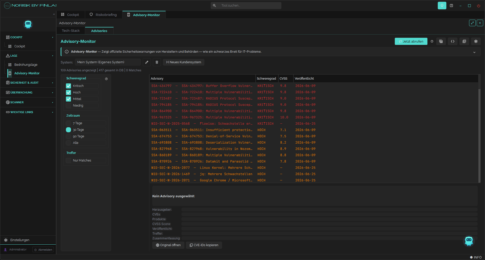

*Abbildung 8: Der Reiter „Advisories" — die Liste ist nach Schweregrad eingefärbt (KRITISCH rot, HOCH orange); Treffer in Ihrer Software sind mit „[MATCH]" markiert.*

> **Tipp:** Über das Zahnrad „Provider verwalten" bestimmen Sie, welche Quellen abgefragt werden. Standardmäßig sind sechs breit relevante Quellen aktiv (unter anderem BSI, CISA, Red Hat, Siemens); spezielle Industrie-Quellen können Sie bei Bedarf zuschalten.

**Alle Funktionen im Detail**

Der Advisory-Monitor besteht aus **zwei großen Reitern ganz oben: „Tech-Stack" und „Advisories".** Ein CVE-Klick aus der Bedrohungslage springt automatisch in den Reiter „Advisories" und setzt dort den passenden Filter.

*Reiter „Tech-Stack" — Ihre Programmliste pflegen (der einzige Tech-Stack-Editor)*

- **Feld „Produktname"** — Name des eingesetzten Programms (z. B. Apache); Nutzen: Grundlage jedes Abgleichs.
- **Feld „Version (optional)"** — die eingesetzte Version; Nutzen: erhöht die Treffergenauigkeit der Advisories.
- **Feld „Kategorie (optional)"** — freie Einordnung (z. B. Server, Browser); Nutzen: bessere Übersicht in der Liste.
- **Schaltfläche „+ Hinzufügen"** — trägt den Eintrag in Ihre Liste ein; Nutzen: Aufbau des Inventars von Hand.
- **Schaltfläche „Entfernen"** — löscht den in der Tabelle markierten Eintrag; Nutzen: hält die Liste sauber.
- **Schaltfläche „Aus System-Scan & Patch-Monitor übernehmen"** — schlägt automatisch erkannte, noch nicht erfasste Programme in einem Vorschau-Dialog zur Auswahl vor; Nutzen: Sie bauen die Liste in Sekunden auf, statt jedes Programm abzutippen.
- **Empty-State-Hinweis + Schaltfläche „Vorschlagsliste für österreichische Steuerkanzleien laden"** — füllt einen leeren Stack mit einer typischen Kanzlei-Grundausstattung (Windows, Office, BMD …); Nutzen: schneller Startpunkt für die Zielgruppe.
- **Tabelle „Produkt / Version / Kategorie"** — Ihr aktuelles Inventar; Nutzen: die eine Liste, gegen die alle Advisories geprüft werden.
- **Schaltfläche „CVEs für meinen Stack laden"** — sucht Schwachstellen für alle Einträge; funktioniert **auch ohne** NVD-Zugangsschlüssel (dann nur lokale, per Kennung (CPE) bestätigte Patch-Monitor-Treffer); Nutzen: Sie sehen sofort, was Ihre Software betrifft. Ein Fehlschlag wird ehrlich als „keine Aussage möglich" gemeldet, nie als falsche Entwarnung.
- **CVE-Tabelle (CVE-ID, CVSS, Schweregrad, Beschreibung, KEV, Details)** — die gefundenen Schwachstellen, farbig, mit „Link"-Schaltfläche zur NVD-Seite; Nutzen: direkter Weg von der Software zur Lücke.

*Reiter „Advisories" — Kopfzeile*

- **Titel „Advisory-Monitor"** — Überschrift des Reiters; Nutzen: Orientierung.
- **Schaltfläche „Jetzt abrufen"** — holt die CSAF-Sicherheitsmitteilungen von allen aktiven Quellen (Providern) ab; Nutzen: aktueller Stand per Klick, mit Fortschrittsbalken und Quell-Anzeige.
- **Export-Schaltfläche Excel (.xlsx)** — speichert die aktuelle Ansicht als Tabellenkalkulation; Nutzen: Weiterverarbeitung, Filtern, Ablage.
- **Export-Schaltfläche JSON** — speichert die Ansicht maschinenlesbar samt Filterangaben; Nutzen: Übergabe an andere Werkzeuge.
- **Export-Schaltfläche PDF** — erzeugt einen lesbaren Bericht; Nutzen: Weitergabe an Geschäftsführung oder Kunde.
- **Zahnrad „Provider verwalten"** — öffnet die Quellenverwaltung (siehe unten); Nutzen: Sie bestimmen, welche Behörden/Hersteller abgefragt werden.
- **Statuszeile** — „X Advisories angezeigt | Y gesamt in DB | Z Treffer"; Nutzen: Mengen- und Trefferüberblick auf einen Blick.

*Reiter „Advisories" — System-Auswahl (Zeile über der Liste)*

- **Auswahl „System"** — schaltet zwischen Ihrem eigenen System und angelegten Kundensystemen um; Nutzen: ein Monitor für mehrere Mandanten.
- **Stift „Tech-Stack bearbeiten"** — öffnet den Tech-Stack-Editor für das gewählte System; Nutzen: schnelle Pflege ohne Reiterwechsel.
- **Papierkorb „Kundensystem löschen"** — nur bei Kundensystemen aktiv (das eigene System ist geschützt), mit Sicherheitsabfrage; Nutzen: verhindert versehentliches Löschen der eigenen Daten.
- **Schaltfläche „[+] Neues Kundensystem"** — legt ein neues Mandanten-System an und öffnet direkt dessen Tech-Stack-Dialog; Nutzen: sauberer, geführter Anlage-Weg.

*Reiter „Advisories" — Filterleiste (links)*

- **Schweregrad-Kästchen Kritisch / Hoch / Mittel / Niedrig** — blenden nach Dringlichkeit (Standard: Kritisch + Hoch + Mittel an, Niedrig aus); Nutzen: Sie sehen zuerst das Wichtige.
- **Zeitraum-Auswahl 7 / 30 / 90 Tage / Alle** — begrenzt das Alter der Mitteilungen (Standard: 30 Tage); Nutzen: nur relevante, frische Advisories.
- **Kästchen „Nur Matches"** — zeigt ausschließlich Mitteilungen, die Ihre Software betreffen; Nutzen: filtert das Weltrauschen auf Ihr Inventar.

*Reiter „Advisories" — Liste und Detailbereich*

- **Advisory-Liste (Spalten Advisory, Schweregrad, CVSS, Veröffentlicht)** — nach Schweregrad eingefärbt; Treffer im eigenen Inventar tragen das Etikett **„[MATCH]"**; Nutzen: Sie erkennen sofort, was Sie betrifft und wie dringlich es ist.
- **Detailbereich** — zeigt zum ausgewählten Advisory: **Herausgeber**, **CVEs**, **betroffene Produkte** (max. 10 + „+N weitere"), **CVSS-Score**, **Veröffentlicht** (Erst- und aktuelle Fassung), **Treffer** (bei Übereinstimmung „Betrifft: Programm Version (Confidence: X %) — Update empfohlen / Workaround anwenden / Beobachten", sonst „Kein Treffer im Software-Inventar") und **Zusammenfassung**; Nutzen: die vollständige Mitteilung samt konkreter Handlungsempfehlung.
- **Schaltfläche „Original öffnen"** — ruft die Originalquelle im Browser auf; Nutzen: Beleg und Volltext beim Hersteller/der Behörde.
- **Schaltfläche „CVE-IDs kopieren"** — legt die CVE-Kennungen in die Zwischenablage; Nutzen: schnelles Übernehmen in Ticket oder Recherche.

*Dialog „Provider verwalten" (hinter dem Zahnrad)*

- **Provider-Liste** — alle Quellen mit Etikett „[Kuratiert]" oder „[Eigener]" und einem Häkchen-/Sperr-Symbol für aktiv/inaktiv; per **Doppelklick** schalten Sie eine Quelle an oder aus; Nutzen: Sie steuern, welche Behörden/Hersteller abgefragt werden (standardmäßig sind einige breit relevante Quellen aktiv).
- **Schaltfläche „Provider hinzufügen"** — öffnet eine Eingabemaske mit **Name**, **Provider-Metadata-URL** und optionaler **Feed-URL**; Nutzen: Sie binden branchenspezifische Quellen selbst ein.
- **Schaltfläche „Ausgewählt löschen"** — entfernt eine selbst hinzugefügte Quelle (kuratierte lassen sich nicht löschen, nur deaktivieren); Nutzen: hält die Quellenliste sauber, ohne die geprüften Standardquellen zu gefährden.
- **Schaltfläche „Schließen"** — übernimmt die Änderungen und lädt die Liste neu; Nutzen: die neue Quellenauswahl wirkt sofort.

---

## 9. Bereich „Scanner" — gezielte Prüfungen

Der Bereich „Scanner" bündelt sechs Prüfungen, die Sie bewusst starten (kein Dauerbetrieb): den System-Scan, den Netzwerk-Scan, den Zertifikats-Scan, den API-Scan, den Datei-Scan und den Dependency-Scan. Drei davon (Zertifikat, API, Dependency) sind nur dann uneingeschränkt sichtbar, wenn sie zu Ihrem Profil passen (eigene Website, eigene Schnittstelle, eigene Softwareentwicklung); ausgeblendete Werkzeuge lassen sich in den Einstellungen jederzeit wieder einblenden.

> **Hinweis:** Einige Scanner brauchen einen Zugriff auf das Internet (Zertifikat, API, Dependency und der Datei-Hash-Abgleich). Ist der Offline-Modus aktiv (siehe [Kapitel 12](#12-einstellungen)), zeigen diese Werkzeuge den Hinweis „Externe Abrufe deaktiviert (Einstellungen)" statt eines Ergebnisses. System-Scan, Netzwerk-Scan und die lokale Datei-Prüfung arbeiten stets ohne Internet.

### 9.1 System-Scan

**Worum geht es?** Der System-Scan prüft Ihren eigenen Windows-Computer: Sind Virenschutz, Firewall, Festplattenverschlüsselung, VPN, Passwort-Manager und Fernzugriff aktiv, inaktiv oder veraltet? Er ergänzt Angaben zum Betriebssystem-Lebenszyklus und zur Lizenz. Der Scan verändert nichts — er liest nur.

**Verstehen.** Der Scan misst den Härtungs-Zustand Ihres PCs. *BitLocker* ist die Windows-Festplattenverschlüsselung; *EDR* ist ein besonders wachsamer, verhaltensbasierter Virenschutz. „End-of-Life" bedeutet, dass ein Produkt keine Sicherheitsupdates mehr erhält.

**Warum so?** Ein Rechner mit abgeschalteter Firewall oder ohne Verschlüsselung ist eine offene Flanke, die im Alltag unbemerkt bleibt.

> **Beispiel:** Ein Laptop läuft monatelang ohne Festplattenverschlüsselung. Wird er gestohlen, liest der Dieb die ausgebaute Platte im Klartext — ein meldepflichtiger Vorfall, den ein 60-Sekunden-Scan sichtbar gemacht hätte.

**Anwenden.** Klicken Sie auf „Scan starten". Nach etwa 30 bis 60 Sekunden erscheinen die Ergebnisse in Abschnitten: Betriebssystem, Compliance-Status, Verschlüsselung, Virenschutz, Firewall, Updates, Browser, VPN, Passwort-Manager und Fernzugriff. Am Ende können Sie das Ergebnis als JSON, Excel oder PDF exportieren.

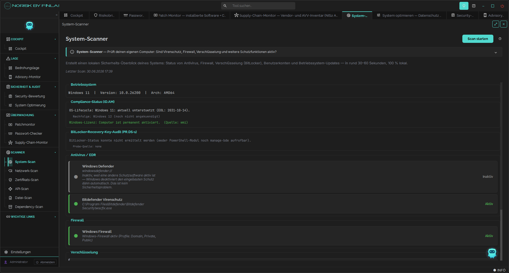

*Abbildung 9: Der System-Scan — jede Komponente trägt einen farbigen Punkt und ein Statuswort.*

So lesen Sie die Ampel: **Aktiv** (grün) ist in Ordnung, **Inaktiv** (rot) heißt fehlender Schutz, **Veraltet** oder **Risiko** (orange) verlangt Aufmerksamkeit. Wichtig: **Unbekannt** wird bewusst gedämpft grau dargestellt und ist **kein** roter Befund — der Scanner konnte die Komponente nur nicht automatisch erkennen.

> **Hinweis:** Ist der eingebaute Windows-Virenschutz inaktiv, *weil* ein anderer Virenschutz läuft, zeigt NoRisk das neutral (nicht rot) mit einem Erklärtext. Das ist ein bewusstes Gestaltungsprinzip: Ein Mess-Fehlschlag oder ein harmloser Sonderfall soll nie fälschlich als Verstoß erscheinen.

**Alle Funktionen im Detail**

*Steuerung und Kopfbereich*

- **Titel „System-Scanner" mit Kurzbeschreibung** — nennt den Zweck des Werkzeugs und fasst in einer Zeile zusammen, was der Scan liefert (Status von Virenschutz, Firewall, Verschlüsselung, Benutzerkonten und Updates in rund 30–60 Sekunden, vollständig lokal). Nutzen: Sie wissen sofort, was Sie erwartet, bevor Sie starten.
- **Kurzhilfe-Feld (Hilfe-Panel)** — direkt unter der Überschrift eingeblendet; enthält den Link „Vollständige Hilfe öffnen", der das ausführliche Handbuchkapitel im Hilfe-Dialog aufruft. Nutzen: Erklärung genau dort, wo Sie arbeiten, ohne das Werkzeug zu verlassen.
- **Fragezeichen-Symbole (Hilfe-Punkte)** — kleine Sprechblasen neben einzelnen Schaltflächen (z. B. neben „Scan starten" und „Manuell hinzufügen"); ein Klick zeigt einen kurzen Erklärtext. Nutzen: punktgenaue Erklärung ohne Handbuch-Suche.
- **Schaltfläche „Scan starten"** — löst die Prüfung aus (läuft im Hintergrund, die Oberfläche bleibt bedienbar) und ist während eines laufenden Scans deaktiviert. Nutzen: ein Klick genügt, nichts wird verändert (reiner Lesevorgang).
- **Fortschrittsbalken** — erscheint während des Scans und zeigt den Fortschritt. Nutzen: Sie sehen, dass gearbeitet wird, und die App wirkt nicht eingefroren.
- **Statuszeile** — zeigt vor dem Scan das Datum des letzten Ergebnisses („Letzter Scan: …"), während des Scans „Scan läuft — bitte warten…" und danach „Scan abgeschlossen — N Komponenten erkannt (x s)". Nutzen: Sie erkennen Aktualität und Umfang des Ergebnisses auf einen Blick.

*Aktionen und Export (erst nach einem Scan sichtbar)*

- **Schaltfläche „JSON"** — speichert das vollständige Ergebnis als maschinenlesbare Datei (inklusive manueller Einträge). Nutzen: Weiterverarbeitung in anderen Programmen oder als Rohbeleg.
- **Schaltfläche „Excel"** — legt eine Tabellendatei an. Nutzen: bequeme Ablage und Weitergabe im Büroalltag.
- **Schaltfläche „PDF"** — erzeugt einen druckfertigen Bericht (inklusive manueller Einträge). Nutzen: Dokumentation und Nachweis für Prüfungen oder die Geschäftsleitung.

*Ergebnisabschnitte (Karten von oben nach unten)*

- **„Betriebssystem"** — zeigt Name, Version und Architektur (32-/64-Bit) Ihres Windows. Nutzen: Grundlage aller weiteren Bewertungen und Beleg, welches System geprüft wurde.
- **„Compliance-Status (ID.AM)"** — Banner mit zwei Zeilen: dem Lebenszyklus des Betriebssystems (rot bei End-of-Life, orange bei baldigem Ende, mit Nachfolge-Empfehlung) und dem Windows-Lizenzstatus (grün = lizenziert, rot = benötigt Aufmerksamkeit, gedämpft grau = nicht messbar). Nutzen: Sie erkennen, ob Ihr System noch Updates erhält und ordnungsgemäß aktiviert ist.
- **„BitLocker-Recovery-Key-Audit (PR.DS-1)"** — bewertet je Laufwerk die Festplattenverschlüsselung mit Stufen OK/INFO/WARNUNG/KRITISCH/UNBEKANNT, zeigt eine Kopfzeile, bis zu fünf Detailzeilen und die Herkunft der Prüfung („Probe-Quelle"). Auf Nicht-Windows oder ohne Berechtigung bleibt der Abschnitt aus. Nutzen: Sie sehen, ob Wiederherstellungsschlüssel gesichert sind — der häufigste blinde Fleck bei Diebstahl.
- **Komponentengruppen** — je Kategorie eine eigene Gruppe: „Antivirus / EDR", „Firewall", „Verschlüsselung", „Betriebssystem-Updates", „Browser", „VPN", „Passwort-Manager" und „Remote-Access (Risiko prüfen!)". Nutzen: thematisch sortierter Überblick statt einer unübersichtlichen Gesamtliste; die Remote-Access-Gruppe ist bewusst als kritisch beschriftet.
- **„Hinweise / Warnungen"** — sammelt am Ende ergänzende Meldungen des Scans in Orange. Nutzen: Randfälle und Einschränkungen der Messung sind auf einen Blick sichtbar.

*Komponentenkarte (jede einzelne Zeile innerhalb einer Gruppe)*

- **Farbiger Statuspunkt und farbige Randlinie** — signalisiert die Ampelfarbe der Komponente. Nutzen: Sie erfassen den Zustand, ohne den Text lesen zu müssen.
- **Name** — Bezeichnung der erkannten Schutzsoftware oder Komponente. Nutzen: eindeutige Zuordnung zum tatsächlich installierten Produkt.
- **Versionszeile** — zeigt, sofern erkannt, die Versionsnummer. Nutzen: Grundlage für die Einschätzung „aktuell oder veraltet".
- **Detailzeile** — kursive Zusatzinformation zur Komponente. Nutzen: Kontext, warum ein Status so gesetzt wurde.
- **Statuswort rechts** — „Aktiv", „Inaktiv", „Veraltet", „Risiko" oder „Unbekannt". Nutzen: klare Textaussage zusätzlich zur Farbe (auch ohne Farbwahrnehmung verständlich).
- **Kennzeichnung „(manuell)"** — markiert selbst eingetragene Komponenten. Nutzen: Sie unterscheiden automatisch Erkanntes von selbst Ergänztem.
- **Bearbeiten- und Löschen-Symbol** — erscheinen nur bei manuellen Einträgen und öffnen die Bearbeitung bzw. entfernen den Eintrag nach Rückfrage. Nutzen: volle Kontrolle über selbst gepflegte Angaben.

*Ampelstufen (Bedeutung der Farben)*

- **Aktiv (grün)** — Schutz vorhanden und eingeschaltet. Nutzen: Bestätigung, dass hier nichts zu tun ist.
- **Inaktiv (rot)** — Schutz fehlt oder ist ausgeschaltet. Nutzen: klare Handlungsaufforderung, diese Lücke zu schließen.
- **Veraltet / Risiko (orange)** — vorhanden, aber nicht mehr aktuell bzw. mit erhöhtem Risiko. Nutzen: Priorität für Aktualisierung, bevor daraus eine Lücke wird.
- **Unbekannt (gedämpft grau)** — der Scanner konnte die Komponente nicht automatisch erkennen; ausdrücklich **kein** roter Befund. Nutzen: kein Fehlalarm — Sie können den Eintrag bei Bedarf manuell klarstellen.
- **Neutraler Sonderfall (blau/INFO)** — ein inaktiver eingebauter Windows-Schutz wird neutral (nicht rot) gezeigt, wenn ein anderer Virenschutz aktiv ist, samt Erklärtext. Nutzen: der normale Windows-Zustand „Defender weicht dem Dritt-Virenschutz" erscheint nicht fälschlich als Lücke.

*Manuelle Einträge*

- **Schaltfläche „Manuell hinzufügen"** — erscheint in den Gruppen Antivirus, Firewall und Verschlüsselung, wenn dort nichts erkannt wurde oder ein Status „Unbekannt" ist. Nutzen: Sie ergänzen Software, die der automatische Scan nicht sieht (z. B. Enterprise-Virenschutz oder eine Hardware-Firewall).
- **Eingabedialog** — Formular mit den Feldern **Name** (Pflicht, bis 100 Zeichen), **Version** (optional, bis 50 Zeichen) und **Status** (Auswahl „Aktiv / Inaktiv / Unbekannt"), abgeschlossen mit „Hinzufügen"/„Speichern" oder „Abbrechen". Nutzen: strukturierte, dauerhaft gespeicherte Ergänzung, die auch in jeden Export einfließt.

### 9.2 Netzwerk-Scan

**Worum geht es?** Der Netzwerk-Scan findet die Geräte in Ihrem lokalen Netz (Hosts) und prüft an einem ausgewählten Gerät, welche Zugänge (Ports) offenstehen — samt Risiko-Einstufung.

**Verstehen.** Ein *Host* ist ein Gerät im Netz (PC, Drucker, Kamera). Ein *Port* ist ein nummerierter Zugang, hinter dem ein Dienst lauscht (etwa Port 3389 für die Windows-Fernwartung). Ein offener Port ist eine mögliche Angriffsfläche. Das optionale Zusatzwerkzeug *nmap* erkennt Dienste genauer; ohne es läuft eine einfachere Prüfung.

**Warum so?** Jeder unnötig offene Port vergrößert die Angriffsfläche.

> **Beispiel:** Eine vergessene Überwachungskamera im Firmennetz hat einen offenen Fernzugang mit Standardpasswort. Ein Angreifer übernimmt sie und nutzt sie als Sprungbrett ins interne Netz — der Scan hätte Kamera und offenen Port sofort rot markiert.

**Anwenden.** Geben Sie im Reiter „Scan" Ihr Subnetz ein (NoRisk schlägt es vor) und klicken Sie auf „Hosts entdecken". Wählen Sie anschließend die zu prüfenden Geräte aus und klicken Sie auf „Ausgewählte Hosts scannen". Alternativ prüfen Sie unten ein einzelnes Ziel. Die Reiter „Verlauf" und „Live" zeigen frühere Scans und laufende Verbindungen.

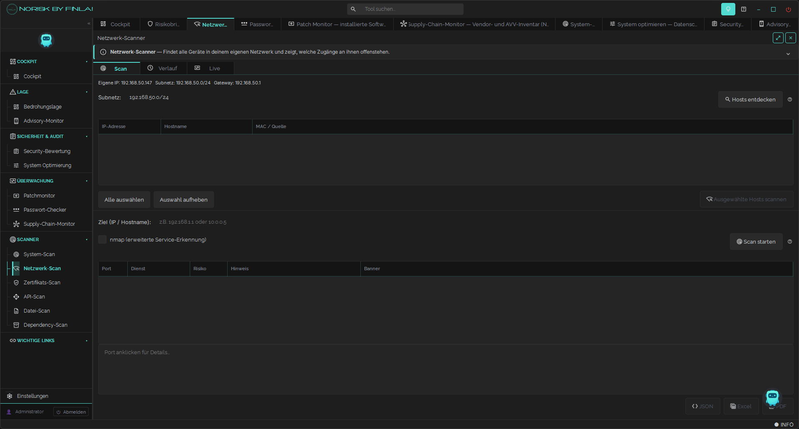

*Abbildung 10: Der Netzwerk-Scan — oben die gefundenen Geräte, darunter die Porttabelle mit Spalten für Port, Dienst, Risiko, Hinweis und Kennung.*

So lesen Sie das Ergebnis: Die Porttabelle listet nur offene Ports; die Risiko-Spalte reicht von KRITISCH (rot) über HOCH und MITTEL bis NIEDRIG und INFO. Ein Klick auf eine Zeile zeigt Details und oft einen konkreten Abhilfe-Hinweis. Ist ein Gerät erreichbar, aber kein Port offen, erscheint ein neutraler Hinweis (häufig blockt eine Sicherheitssoftware die Prüfung) — kein roter Befund.

**Alle Funktionen im Detail**

*Reiter-Aufbau*

- **Reiter „Scan"** — vereint in einem geteilten Fenster oben die Geräte-Suche und unten die Port-Prüfung. Nutzen: Der zweistufige Ablauf (erst Geräte finden, dann prüfen) bleibt ohne Reiterwechsel sichtbar; die ganze Seite ist bei wenig Platz nach unten scrollbar.
- **Reiter „Verlauf"** — zeigt frühere Scans. Nutzen: Vergleich über die Zeit und Nachweis, was wann geprüft wurde.
- **Reiter „Live"** — bettet den Netzwerkmonitor ein (siehe unten). Nutzen: laufende Verbindungen in Echtzeit direkt neben dem Scan.
- **Kurzhilfe-Feld** — über den Reitern; verlinkt in die ausführliche Hilfe. Nutzen: Erklärung im Werkzeug.

*Scan-Reiter — obere Hälfte: Geräte-Suche (Host-Discovery)*

- **Netz-Info-Zeile „Eigene IP / Subnetz / Gateway"** — zeigt die automatisch ermittelten Netzwerkdaten Ihres Rechners. Nutzen: Sie erkennen sofort, in welchem Netz Sie sich befinden, ohne selbst nachzusehen.
- **Eingabefeld „Subnetz"** — mit Platzhalter „z. B. 192.168.1.0/24"; wird beim Öffnen mit Ihrem eigenen Subnetz vorbelegt. Nutzen: Der richtige Suchbereich steht meist schon da; Sie können ihn bei Bedarf anpassen.
- **Schaltfläche „Hosts entdecken"** — startet die Gerätesuche (ARP-Abgleich plus Ping); Eingabetaste im Feld genügt ebenfalls. Nutzen: findet vorhandene und oft vergessene Geräte im Netz.
- **Fortschrittsbalken und Statuszeile der Suche** — zeigen den Fortschritt und danach „N Host(s) gefunden — x s". Nutzen: Rückmeldung über Dauer und Trefferzahl.
- **Geräteliste (Spalten „IP-Adresse", „Hostname", „MAC / Quelle")** — listet jedes gefundene Gerät; Mehrfachauswahl über Strg/Umschalt, standardmäßig sind nach der Suche alle Geräte markiert. Nutzen: Sie sehen Adresse, Name und Herkunft (woher das Gerät bekannt ist) und wählen gezielt aus.
- **Schaltfläche „Alle auswählen"** — markiert die gesamte Liste. Nutzen: schneller Rundum-Scan des Netzes.
- **Schaltfläche „Auswahl aufheben"** — hebt die Markierung auf. Nutzen: bewusst nur einzelne Geräte prüfen.
- **Schaltfläche „Ausgewählte Hosts scannen"** — prüft alle markierten Geräte nacheinander; die Ergebnisse sammeln sich je Gerät unter einer Trennzeile in der Porttabelle. Nutzen: ein Klick prüft mehrere Geräte, ohne jedes einzeln eintippen zu müssen.

*Scan-Reiter — untere Hälfte: Port-Prüfung*

- **Eingabefeld „Ziel (IP / Hostname)"** — für ein einzelnes Prüfziel; wird bei der Geräteauswahl automatisch befüllt. Nutzen: gezielte Einzelprüfung, auch für Ziele außerhalb der Liste.
- **Kontrollkästchen „nmap (erweiterte Service-Erkennung)"** — schaltet die genauere Dienst-Erkennung zu; ist nmap nicht installiert, steht dort „nmap (nicht installiert — Basis-Scan)" mit erklärendem Hinweis. Nutzen: bessere Erkennung, wenn verfügbar — und Sie sehen ehrlich, warum die Option ausgegraut ist.
- **Schaltfläche „Scan starten"** — prüft das eingetragene Ziel auf offene Zugänge. Nutzen: zeigt die tatsächliche Angriffsfläche eines Geräts.
- **Fortschrittsbalken und Statuszeile** — melden den laufenden Scan und danach „N offene Port(s) — x s (Scanner-Typ)". Nutzen: Ergebnisumfang und verwendete Methode auf einen Blick.
- **Neutraler Hinweis bei 0 Ports** — erscheint gedämpft, wenn ein Gerät erreichbar ist, aber kein Port gefunden wurde (häufig blockt eine Sicherheitssoftware die Prüfung), samt Abhilfe-Tipp. Nutzen: ein Mess-Hindernis wird nicht fälschlich als „alles sicher" oder als Fehler dargestellt.
- **Porttabelle (Spalten „Port", „Dienst", „Risiko", „Hinweis", „Banner")** — listet nur offene Ports; die Risiko-Spalte ist farbig, ein Klick auf eine Zeile zeigt Details, bekannte Hochrisiko-Ports tragen einen Abhilfe-Tooltip, und die Banner-Spalte zeigt den TLS-Fingerabdruck (Version/Verschlüsselung) direkt in der Tabelle. Nutzen: Sie erkennen je Zugang Dienst, Gefährlichkeit und konkrete Gegenmaßnahme.
- **Detailfeld unter der Tabelle** — zeigt für den angeklickten Port Zustand, Risiko, Hinweis und vollständiges Banner. Nutzen: Tiefergehende Erklärung ohne überladene Tabelle.
- **Rechtsklick-Kontextmenü auf einer Portzeile** — bietet „→ API-Scan starten" (bei Web-Ports 80/443/8080/8443) und „→ Cert-Monitor: Domain anlegen" (bei HTTPS). Nutzen: nahtloser Sprung ins passende Folge-Werkzeug mit vorausgefüllter Adresse.
- **Export „JSON" / „Excel" / „PDF"** — sichern das letzte Port-Ergebnis (erst nach einem Scan aktiv). Nutzen: Dokumentation und Weitergabe der Befunde.

*Risikostufen der Porttabelle*

- **KRITISCH (rot)** — höchste Gefahr, sofort handeln. **HOCH (orange-rot)** — dringend prüfen. **MITTEL (orange)** — beobachten/absichern. **NIEDRIG (grün)** — geringes Risiko. **INFO (blau)** — reine Information. Nutzen: klare Priorisierung, welche Zugänge zuerst zu schließen sind.

*Verlauf-Reiter*

- **Schaltfläche „Aktualisieren"** — lädt die Liste neu. Nutzen: stets aktueller Stand.
- **Schaltfläche „Verlauf löschen"** — entfernt nach Rückfrage alle gespeicherten Scans. Nutzen: Aufräumen und Datensparsamkeit.
- **Verlaufstabelle (Spalten „Datum", „Ziel", „Scanner", „Offene Ports")** — zeigt die letzten bis zu 20 Scans; ein Klick öffnet die Detailansicht darunter. Nutzen: Entwicklung nachvollziehen und alte Ergebnisse wieder aufrufen.
- **Detailfeld** — listet je Host die offenen Ports mit Dienst, Risiko und Hinweis. Nutzen: vollständige Nachschau eines früheren Scans.

*Live-Reiter (eingebetteter Netzwerkmonitor)*

- **Verzögertes Laden** — beim ersten Öffnen erscheint kurz „Live-Monitor wird beim Öffnen geladen …"; die Live-Messung startet und stoppt automatisch mit dem Reiterwechsel. Nutzen: kein Dauer-Rechenaufwand, solange Sie die Live-Ansicht nicht nutzen.
- **Kopfzeile** — Titel „Netzwerkmonitor", Zusatz „Live · 1 Sekunde Auflösung", ein „Aktualisiert vor X s"-Vertrauenssignal und die Schaltfläche „Historie exportieren" (CSV der 24-Stunden-Historie). Nutzen: Sie erkennen, wie frisch die Anzeige ist, und können den Verlauf sichern.
- **Unter-Reiter „Live-Übersicht"** — enthält das Bandbreiten-Diagramm, die Schnittstellen-Übersicht und die Verbindungstabelle. Nutzen: Gesamtbild des aktuellen Datenverkehrs.
- **Bandbreiten-Diagramm** — zeigt Kilobyte pro Sekunde (Türkis = Download, Grün = Upload) in einem 60-Sekunden-Fenster und setzt bei Auffälligkeiten einen Markierungspunkt. Nutzen: ungewöhnliche Datenspitzen werden sofort sichtbar.
- **Schnittstellen-Karten** — je Netzwerkanschluss (Kabel, WLAN, VPN) mit Name, Status (aktiv/inaktiv), IP, MAC, aktueller Up-/Download-Rate und Gesamtvolumen seit dem Systemstart. Nutzen: Sie sehen, welcher Anschluss wie viel Verkehr trägt.
- **Verbindungstabelle (Spalten „Ziel-IP", „Ziel-Port", „Eigener Port", „Prozess", „Prozess-Nr.", „Status")** — listet alle aktiven Verbindungen, markiert verdächtige rot und bietet per Rechtsklick „Diese IP scannen". Nutzen: Sie erkennen, welches Programm mit welchem Server spricht, und prüfen Verdächtiges mit einem Klick.
- **Unter-Reiter „Auffälligkeiten"** — Suchfeld plus Tabelle (Spalten „Schweregrad", „Prozess", „Typ", „Wert / Schwelle", „Ziel-IP", „Detail"); die Trefferzahl steht im Reitertitel, per Rechtsklick lässt sich die IP scannen. Nutzen: automatisch erkannte Ausreißer gebündelt und durchsuchbar.
- **Unter-Reiter „Datenverbrauch (24 h)"** — Schaltfläche „Aktualisieren" und Tabelle (Spalten „Prozess", „Prozess-Nr.", „Gesendet", „Empfangen", „Gesamt"). Nutzen: entlarvt Programme, die im Hintergrund viel Datenvolumen verbrauchen.
- **Unter-Reiter „Bedrohungslisten"** — Schaltfläche „Jetzt aktualisieren" (lädt die Bedrohungs-Feeds neu) sowie ein Whitelist-Bereich mit Eingabefeld und „Hinzufügen"/„Entfernen". Nutzen: Sie halten die Erkennung aktuell und nehmen bekannte, harmlose Ziele von der Warnung aus.
- **Unter-Reiter „Konversationen"** — Schaltfläche „Aktualisieren", Filter „Nur verdächtige" und „Nur extern", ein Suchfeld, ein Experten-Filterfeld und eine Tabelle (Spalten „Prozess", „Ziel-IP", „Verbindungen", „Gesendet", „Empfangen", „Ports", „Status", „Verdächtig", „Zuletzt") mit Rechtsklick „Diese IP scannen". Nutzen: die verdichtete „Wer-spricht-mit-wem"-Sicht macht Muster erkennbar, die in der Momentaufnahme untergehen.

### 9.3 Zertifikats-Scan

**Worum geht es?** Der Zertifikats-Scan überwacht die Sicherheitszertifikate Ihrer Webseiten und Dienste auf Restlaufzeit, Aussteller und Schwächen. Er führt eine dauerhafte Beobachtungsliste, keine Einmalprüfung.

**Verstehen.** Ein *TLS-Zertifikat* ist der digitale Ausweis einer Website: Es belegt die Echtheit und verschlüsselt die Verbindung (das Schloss im Browser). Zertifikate haben ein Ablaufdatum; danach warnen Browser. Auch eine veraltete Verschlüsselungsversion ist eine Schwäche.

**Warum so?** Ein abgelaufenes Zertifikat legt einen Online-Auftritt lahm und schreckt Besucher mit einer Warnung ab.

> **Beispiel:** Das Zertifikat Ihres Webshops läuft an einem Feiertag ab. Kunden sehen tagelang „Diese Verbindung ist nicht sicher" und brechen Käufe ab — der Scan hätte Wochen vorher orange gewarnt.

**Anwenden.** Geben Sie eine Domain ein und klicken Sie auf „Hinzufügen". Mit „Alle prüfen" prüft NoRisk die gesamte Liste. Oben sehen Sie die Kennzahlen (überwacht, kritisch, Warnung, in Ordnung), darunter die Tabelle mit Domain, Ablaufdatum, verbleibenden Tagen, Verschlüsselungsversion und Status.

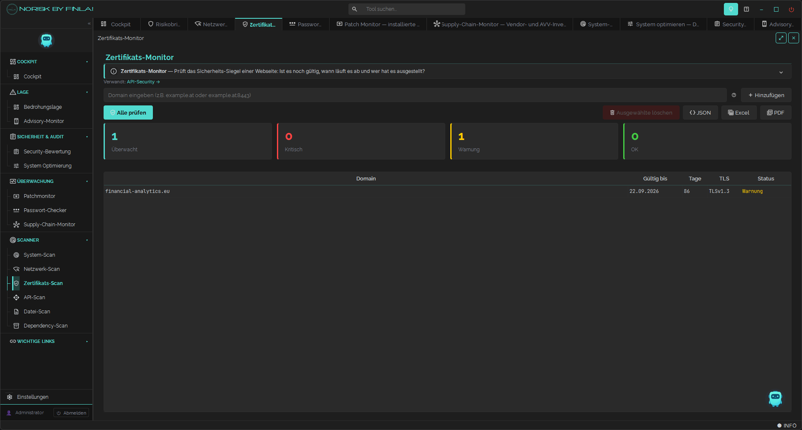

*Abbildung 11: Der Zertifikats-Scan — die Ampel wird kritisch (rot) bei Ablauf innerhalb von 30 Tagen und warnt (orange) ab 90 Tagen Restlaufzeit.*

**Alle Funktionen im Detail**

*Kopfbereich*

- **Titel „Zertifikats-Monitor" mit Kurzhilfe-Feld** — nennt den Zweck und verlinkt in die ausführliche Hilfe. Nutzen: Orientierung direkt im Werkzeug.
- **Verweiszeile „Verwandt: API-Security →"** — dezenter Link zum API-Sicherheits-Scanner. Nutzen: schneller Wechsel zum zweiten Werkzeug, das denselben Endpunkt aus anderer Sicht (Schnittstellen-Härtung statt Zertifikat) prüft.

*Domain hinzufügen*

- **Eingabefeld „Domain"** — mit Platzhalter „Domain eingeben (z. B. example.at oder example.at:8443)"; ohne „https://" und ohne Pfad, ein abweichender Port wird als „:Nummer" angehängt (Standard ist 443). Nutzen: Sie tragen eine Adresse laienfreundlich ein und können bei Bedarf auch andere Ports überwachen.
- **Fragezeichen-Symbol** — kurze Erklärung zur richtigen Eingabe. Nutzen: vermeidet häufige Tippfehler.
- **Schaltfläche „Hinzufügen"** — nimmt die Domain dauerhaft in die Beobachtungsliste auf (Eingabetaste genügt ebenfalls). Nutzen: die Adresse wird fortlaufend überwacht, nicht nur einmal geprüft.

*Aktionsleiste*

- **Schaltfläche „Alle prüfen"** — prüft alle gelisteten Domains im Hintergrund und aktualisiert die Tabelle. Nutzen: ein Klick bringt die gesamte Liste auf den neuesten Stand.
- **Schaltfläche „Ausgewählte löschen"** — entfernt die markierte Domain aus der Überwachung (nur bei Auswahl aktiv). Nutzen: die Liste bleibt schlank und aktuell.
- **Export „JSON" / „Excel" / „PDF"** — sichern die gesamte Zertifikatsliste (erst aktiv, wenn Daten vorliegen). Nutzen: Dokumentation und Weitergabe des Zertifikatsstatus.

*Kennzahl-Kacheln (KPI-Strip)*

- **Kachel „Überwacht"** — Gesamtzahl der beobachteten Domains. Nutzen: Umfang der Überwachung auf einen Blick.
- **Kachel „Kritisch" (rot)** — Zahl der Domains mit dringendem Handlungsbedarf. Nutzen: sofortiges Erkennen akuter Ablauf-/Gültigkeitsprobleme.
- **Kachel „Warnung" (orange)** — Zahl der bald ablaufenden Zertifikate. Nutzen: rechtzeitige Verlängerung, bevor es kritisch wird.
- **Kachel „OK" (grün)** — Zahl der unauffälligen Domains. Nutzen: Bestätigung, wie viel bereits in Ordnung ist. (Der Kennzahl-Streifen erscheint, sobald mindestens eine Domain gelistet ist, und zeigt den Wert auch ohne neuen Scan.)

*Fortschritt und Status*

- **Fortschrittsbalken** — läuft während einer Prüfung. Nutzen: sichtbare Rückmeldung bei mehreren Domains.
- **Statuszeile** — zeigt „Prüfe: „Domain"" während des Scans und danach „Scan abgeschlossen — N Domains, K kritisch". Nutzen: Fortschritt und Ergebnis in Klartext.

*Übersichtstabelle*

- **Leerzustand mit Handlungsaufruf** — solange keine Domain gelistet ist, erklärt ein Text den Nutzen des Werkzeugs und bietet die Schaltfläche „Domain hinzufügen". Nutzen: das Werkzeug ist auch ohne Daten selbsterklärend.
- **Spalte „Domain"** — die überwachte Adresse (mit Port, falls abweichend). Nutzen: eindeutige Zuordnung.
- **Spalte „Gültig bis"** — Ablaufdatum des Zertifikats im Format TT.MM.JJJJ. Nutzen: der wichtigste Termin auf einen Blick.
- **Spalte „Tage"** — verbleibende Tage bis zum Ablauf. Nutzen: Dringlichkeit sofort abschätzbar.
- **Spalte „TLS"** — die verwendete Verschlüsselungsversion. Nutzen: veraltete, unsichere Versionen werden erkennbar.
- **Spalte „Status"** — das Prüfergebnis als Wort mit Ampelfarbe. Nutzen: klare Gesamtaussage je Domain.

*Statusstufen (Ampel)*

- **OK (grün)** — Zertifikat gültig und unauffällig. Nutzen: kein Handlungsbedarf.
- **Warnung (orange)** — läuft in absehbarer Zeit ab. Nutzen: rechtzeitig verlängern.
- **Kritisch (rot)** — Ablauf sehr nah, abgelaufen oder ungültig. Nutzen: sofort handeln, bevor Besucher Browserwarnungen sehen.
- **Fehler (blau/Info)** — die Domain war nicht erreichbar oder nicht prüfbar. Nutzen: neutral gekennzeichnet, nicht als Sicherheitsverstoß missverstanden.
- **Unbekannt (grau)** — noch nicht geprüft. Nutzen: Sie sehen, welche Domains noch auf ihre erste Prüfung warten.

*Detail-Panel (öffnet sich beim Anklicken einer Zeile)*

- **Detailfelder** — zeigen je nach Verfügbarkeit „Domain", „Aussteller", „Gültig von", „Gültig bis", „TLS-Version", „Cipher" (mit Bitstärke), „SAN" (weitere abgedeckte Domains), „Self-Signed" (selbst-signiert Ja) und „Fehler". Nutzen: vollständiger digitaler Ausweis der Website auf einen Blick.
- **Befund-Liste (Findings)** — listet unterhalb einer Trennlinie konkrete Schwächen des Zertifikats. Nutzen: Sie erfahren nicht nur den Status, sondern auch, was genau zu verbessern ist. (Das Panel klappt bei leerer Auswahl wieder ein, damit die Tabelle die volle Höhe behält.)

### 9.4 API-Scan

**Worum geht es?** Der API-Scan prüft eine eigene Web-Schnittstelle (API) daraufhin, ob Fremde darüber an Daten oder Funktionen gelangen könnten — orientiert an einer anerkannten Liste der häufigsten Schnittstellen-Schwachstellen.

**Verstehen.** Eine *API* ist eine maschinelle Schnittstelle, über die Programme Daten austauschen (etwa wenn eine App Bestellungen vom Server holt). Der Scan liest zunächst nur die Antworten der Schnittstelle (passiv); auf Wunsch sendet er zusätzliche Testanfragen (aktiv).

**Warum so?** Schnittstellen geben oft mehr preis als beabsichtigt.

> **Beispiel:** Eine Bestell-Schnittstelle antwortet auf Fehler mit einem vollständigen technischen Innenleben und liefert Daten ohne Begrenzung. Ein Angreifer liest die Struktur ab und zieht die Kundendatenbank per Massenabruf — der Scan hätte beides gemeldet.

**Anwenden.** Geben Sie die Adresse der Schnittstelle ein, wählen Sie optional „Aktive Prüfungen" und klicken Sie auf „Scan starten". Das Ergebnis ordnet die Befunde nach Schweregrad und Kategorie; im Reiter „Verlauf" können Sie zwei Scans vergleichen (was neu, behoben oder unverändert ist).

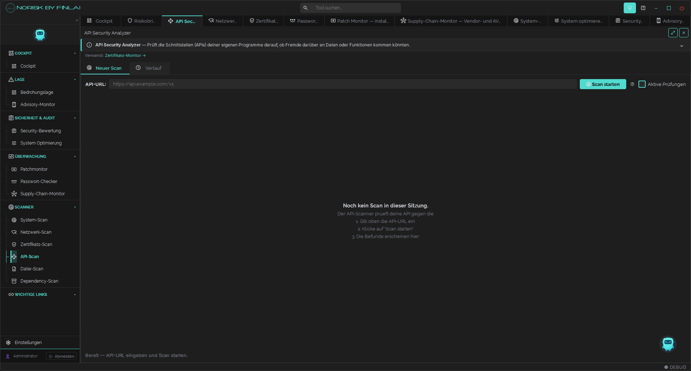

*Abbildung 12: Der API-Scan — nach dem Start erscheinen die Befunde nach Schweregrad geordnet, dazu ein Risikowert von 0 bis 100.*

**Alle Funktionen im Detail**

*Reiter „Neuer Scan" — Eingabe und Steuerung*

- **Feld „API-URL"** — Eingabezeile für die Adresse der zu prüfenden Schnittstelle (Platzhalter `https://api.example.com/v1`, ideal die OpenAPI-/Swagger-Beschreibung); Nutzen: legt das Ziel fest. Fehlt `http://`/`https://`, ergänzt NoRisk automatisch `https://`.
- **Schaltfläche „Scan starten"** — löst die Prüfung in einem Hintergrund-Prozess aus, sodass die Oberfläche flüssig bedienbar bleibt; Nutzen: startet den Test per Klick oder Enter-Taste. Ein kleines Fragezeichen daneben erklärt, dass eine URL zur OpenAPI-/Swagger-Beschreibung nötig ist.
- **Kontrollkästchen „Aktive Prüfungen"** — schaltet zusätzliche, aktiv gesendete Testanfragen zu (u. a. erlaubte HTTP-Methoden, Content-Type, Umgehung der Anmeldung, Größenlimits, zu gesprächige Fehlermeldungen); Nutzen: findet Schwächen, die eine reine Mitlese-Prüfung nicht sieht. Bewusst freiwillig (opt-in), weil dabei echte Anfragen an das Ziel gehen.
- **Sprunglink „Zertifikats-Monitor →"** — dezenter Verweis über der Reiterleiste; Nutzen: wechselt direkt zur TLS-Zertifikatsprüfung desselben Endpunkts.
- **Startbildschirm (vor dem ersten Scan)** — erklärt den Nutzen (Prüfung gegen die OWASP API Security Top 10, u. a. fehlerhafte Authentifizierung, unzureichende Objekt-Zugriffsrechte „BOLA", übermäßige Datenrückgabe) und führt in drei Schritten (URL eingeben → „Scan starten" → Befunde); Nutzen: macht Einsteigern sofort klar, wofür das Werkzeug gut ist. Bei vorhandenem Verlauf steht unten „Zuletzt geprüft: … — N Befunde".
- **Fortschrittsbalken und Statuszeile** — zeigen den Lauf und danach eine Zusammenfassung; Nutzen: Sie sehen, dass etwas passiert und wann es fertig ist.

*Ergebnisanzeige nach dem Scan*

- **Kennzahl-Zeile (KPI)** — fasst oben „X kritisch · Y hoch · Z mittel" in Signalfarben zusammen, bei null Treffern „Keine Befunde — gut so."; Nutzen: der Ernst der Lage ist auf einen Blick erfassbar.
- **Abschluss-Statuszeile** — nennt Befundzahl, den **Risikoscore (0–100)**, die Dauer und den Hinweis „Im Verlauf gespeichert"; Nutzen: ein Vergleichswert und die Gewissheit, dass der Lauf archiviert wurde.
- **Übersichtsbaum „OWASP Kategorie / Befunde"** (links) — „Alle" mit Gesamtzahl, darunter jede der zehn OWASP-Kategorien mit Trefferzahl (leere gedämpft); Nutzen: zeigt, in welcher Schwachstellen-Klasse die Probleme liegen. Ein Klick filtert die Befundliste.
- **Befundtabelle** (rechts) mit den Spalten **Schweregrad**, **Code** (Prüf-Kennung), **Titel**, **OWASP** (Kategorie) und **Empfehlung** (gekürzte Abhilfe); Nutzen: jede Zeile ein konkreter Befund mit Handlungsanweisung. Der Mauszeiger zeigt die volle Beschreibung und die technischen Details.
- **Schweregrad-Stufen** — Kritisch (rot), Hoch (kräftiges Orange), Mittel (Orange/Gelb), Niedrig (Blau), Info (gedämpft); Nutzen: einheitliche Ampel-Logik, nach der die Befunde auch sortiert werden (Kritisch zuerst).

*Export (nach erfolgreichem Scan aktiv)*

- **JSON / Excel / PDF** — speichert das vollständige Ergebnis maschinenlesbar, als Tabelle zum Filtern/Abarbeiten bzw. als fertigen Bericht; Nutzen: Weitergabe an Entwickler, Bearbeitung oder Ablage. Vor dem ersten Scan absichtlich ausgegraut.

*Reiter „Verlauf"*

- **Auswahlfeld „URL-Filter"** — schränkt die Anzeige auf eine bestimmte geprüfte Schnittstelle ein; Nutzen: trennt die Historie mehrerer APIs sauber.
- **Schaltfläche „Aktualisieren"** — lädt Verlauf und Filterliste neu; Nutzen: holt neue Scans nach.
- **Trend-Balken „Trend (letzte 10 Scans)"** — je Scan ein Balken (Länge nach Befundzahl, Farbe nach schlimmstem Schweregrad); Nutzen: die zeitliche Entwicklung ist ohne Lesen erkennbar.
- **Scan-Liste** mit den Spalten **Datum**, **URL**, **K/H/M/N/I** (Zähler je Schweregrad, mit erklärendem Tooltip), **Findings** (Gesamtzahl) und **Dauer**; Nutzen: kompakter Überblick aller Läufe.
- **Schaltfläche „Details"** (bei einem markierten Scan) — öffnet alle Befunde dieses Laufs; **„Vergleichen"** (bei zwei markierten) öffnet den Vergleich; **„Löschen"** (rot) entfernt einen Scan nach Sicherheitsabfrage; **„Mehr laden …"** blendet zehn ältere Scans ein. Nutzen: gezieltes Nachschlagen, Vergleichen und Aufräumen ohne Überladung.

*Vergleichs-Dialog (zwei Scans)*

- **Kopf-/Zusammenfassungszeile** — „Vergleich: neuerer Scan gegen älteren Scan" und „X neu · Y behoben · Z unverändert"; Nutzen: die Kernaussage „besser oder schlechter?" sofort sichtbar.
- **Reiter „Neu" (grün) / „Behoben" / „Unverändert"** — hinzugekommene, verschwundene bzw. weiter bestehende Befunde (Spalten Schweregrad, Code, Titel, OWASP); Nutzen: zeigt neu eingeschleppte Schwächen, bestätigt Korrekturen und listet die offene Restarbeit.

### 9.5 Datei-Scan

**Worum geht es?** Der Datei-Scan prüft verdächtige Dateien lokal, *bevor* Sie sie öffnen: E-Mail-Anhänge, PDF-Dokumente und Office-Dateien auf Makros, Skripte, eingebetteten Schadcode und Tarnung.

**Verstehen.** Ein *Makro* ist ein in Office-Dateien eingebettetes Miniprogramm, das beim Öffnen automatisch Schadcode ausführen kann. *Typ-Tarnung* liegt vor, wenn sich eine Datei mit falscher Endung ausgibt. Verdächtige Dateien können in eine *Quarantäne* verschoben werden — einen isolierten, schreibgeschützten Ablageort.

**Warum so?** Anhänge sind der häufigste Infektionsweg für Erpressungssoftware und Trojaner.

> **Beispiel:** Sie erhalten eine „Rechnung" als Office-Datei mit Makro. Ein Doppelklick würde im Hintergrund Erpressungssoftware nachladen — der Scan meldet das Makro vorher, und Sie öffnen die Datei nie.

**Anwenden.** Der Datei-Scan hat drei Reiter: „E-Mail-Anhang", „PDF" und „Office / Dokument". Ziehen Sie Dateien per Maus in den Bereich oder wählen Sie sie über die Schaltfläche aus. Das Ergebnis erscheint als Tabelle bzw. Karte mit einem Status.

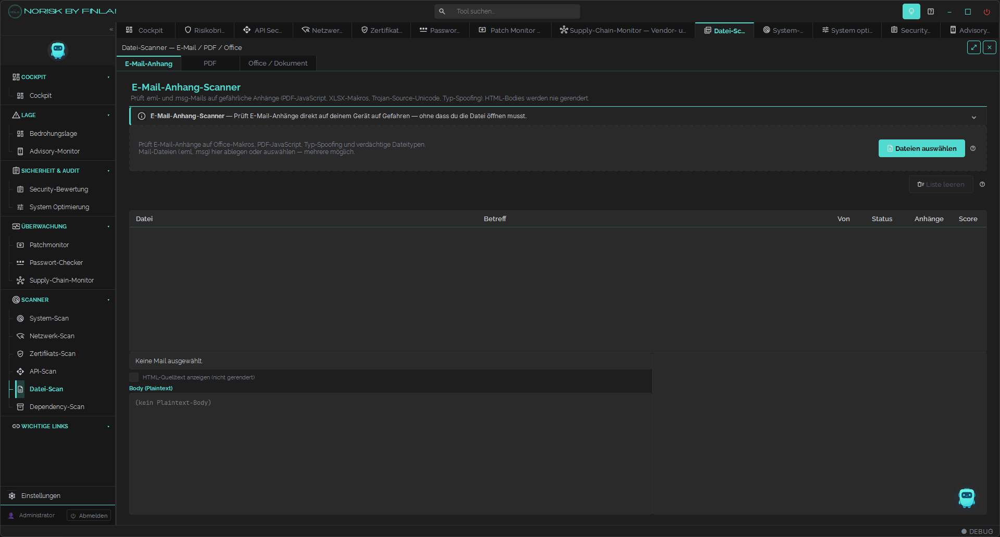

*Abbildung 13: Der Datei-Scan — hier der Reiter „E-Mail-Anhang", der Nachrichten samt Anhängen prüft, ohne den HTML-Inhalt darzustellen.*

So lesen Sie das Ergebnis: **Sicher** (grün), **Warnung/Verdächtig** (gelb bis orange) und **Blockiert/Gefährlich** (rot). NoRisk arbeitet nach dem Grundsatz „im Zweifel nicht sicher": Lässt sich eine Datei nicht vollständig prüfen, gilt sie nie automatisch als sicher.

> **Hinweis:** E-Mail- und PDF-Prüfung laufen vollständig lokal; nichts wird hochgeladen, und HTML-Nachrichten werden nie dargestellt (kein Nachladen von Zählpixeln). Nur im Office-Reiter gibt es auf ausdrücklichen Wunsch einen Abgleich gegen einen Online-Dienst — dabei wird ausschließlich ein Prüfwert (Hash) der Datei gesendet, niemals die Datei selbst.

**Alle Funktionen im Detail**

Der Datei-Scan ist ein Behälter mit drei Reitern; jeder Reiter ist ein eigenständiger Prüfer mit eigener Oberfläche. Ein Deep-Link kann direkt einen Reiter vorwählen (`email`, `pdf`, `office`). Beim Beenden von NoRisk fahren alle Reiter sauber herunter und räumen ihre Quarantäne auf.

*Reiter „E-Mail-Anhang"*

- **Ablage-/Auswahlbereich** — nimmt `.eml`- und `.msg`-Maildateien per Maus (Drag & Drop) entgegen; nur diese Endungen werden akzeptiert; Nutzen: mehrere Mails auf einmal prüfen, ohne sie im Mailprogramm zu öffnen.
- **Schaltfläche „Dateien auswählen"** — öffnet den Dateidialog (Filter `*.eml *.msg`); Nutzen: Alternative zum Ziehen, mit Mehrfachauswahl. Die Datei wird niemals hochgeladen — alles läuft lokal.
- **Schaltfläche „Liste leeren"** — entfernt alle Ergebnisse der Sitzung und leert die Detailansicht; Nutzen: für einen frischen Prüflauf.
- **Fortschrittsbalken und Statuszeile** — melden „Scanne: „Datei" (n/gesamt)" und am Ende „Fertig — N Mails, X blockiert, Y Warnungen"; Nutzen: Fortschritt und Gesamtbilanz auf einen Blick.
- **Übersichtstabelle** mit den Spalten **Datei**, **Betreff**, **Von**, **Status**, **Anhänge** (Anzahl) und **Score** (Risikowert); Nutzen: eine Zeile je Mail mit dem Wichtigsten. Die Statusfarbe unterscheidet **Sicher** (grün), **Warnung** (gelb/orange) und **Blockiert** (rot).
- **Detailfeld „Body (Plaintext)"** — zeigt den reinen Text der markierten Mail (Kopf: Betreff, Von, An, Datum); Nutzen: den Inhalt gefahrlos lesen. Adressen werden entschärft dargestellt.
- **Kontrollkästchen „HTML-Quelltext anzeigen (nicht gerendert)"** und **Feld „Body (HTML-Quelltext)"** — blendet auf Wunsch den rohen HTML-Code als reinen Text ein (nur aktiv, wenn ein HTML-Teil existiert); Nutzen: Fachkundige können den Quelltext prüfen, ohne dass HTML dargestellt wird — kein Nachladen von Zählpixeln, keine aktiven Inhalte.
- **Anhang-Liste** — je Anhang eine Karte mit Dateiname, Status, einer Metazeile (MIME-Typ, Größe, Score, Anfang des SHA-256-Prüfwerts) und den erkannten Bedrohungen (Schweregrad-Farbe, Code, Klartext); Nutzen: sehen, welcher konkrete Anhang gefährlich ist und warum. Geprüft wird u. a. auf Office-Makros, PDF-JavaScript, „Trojan-Source"-Unicode-Tricks und Typ-Tarnung.
- **Schaltfläche „Hash kopieren"** (je Anhang) — legt den vollständigen SHA-256-Prüfwert in die Zwischenablage; Nutzen: zum Abgleich mit einer Bedrohungsdatenbank oder zur Weitergabe an den IT-Support.
- **Schaltfläche „In Quarantäne speichern"** (je Anhang) — verschiebt den Anhang in einen isolierten, schreibgeschützten Ablageort; Nutzen: das verdächtige Objekt sichern, ohne es je zu öffnen. Bewusst gibt es **keinen** „Öffnen"-Knopf.

*Reiter „PDF"*

- **Ablage-/Auswahlbereich** und **Schaltfläche „Dateien auswählen"** — nehmen `.pdf`-Dateien per Ziehen oder Dialog entgegen (Mehrfachauswahl); Nutzen: PDFs prüfen, bevor sie geöffnet werden. Untersucht werden JavaScript, automatisch startende Aktionen (`/OpenAction`), „Launch"-Befehle, eingebettete Dateien und Typ-Tarnung.
- **Schaltfläche „Liste leeren"** — verwirft die bisherigen Ergebnisse; Nutzen: sauberer Neustart.
- **Ergebnistabelle** mit den Spalten **Datei**, **Status**, **Score**, **Threats** (Anzahl erkannter Auffälligkeiten) und **Dauer** (Prüfzeit in ms); Nutzen: kompakter Überblick je Datei. Statusfarben wie beim E-Mail-Reiter (Sicher/Warnung/Blockiert).
- **Detailbereich „Erkannte Risiken"** — listet je markierter Datei die einzelnen Funde als `[Schweregrad] Code — Beschreibung`, bei sauberem Ergebnis „Keine Auffälligkeiten erkannt"; Nutzen: die genaue Begründung des Status. Die fünf Schweregrade Info, Niedrig, Mittel, Hoch und Kritisch sind farblich abgestuft; ein Fragezeichen erklärt, dass JavaScript in PDFs oft, aber nicht immer verdächtig ist.
- **Statuszeile** — „Fertig — N Dateien, X blockiert, Y Warnungen"; einzelne Lesefehler werden hier neutral gemeldet, ohne den ganzen Lauf abzubrechen.

*Reiter „Office / Dokument"*

- **Kopf-Erklärtext** — beschreibt den Ablauf: NoRisk kopiert die Datei in einen Schutzbereich, bestimmt den *tatsächlichen* Dateityp (Magika, eine Typ-Erkennung), führt eine statische Analyse aus und zeigt das Ergebnis als Karte; die Datei wird nie automatisch geöffnet, und der Schutzbereich wird beim Beenden vollständig gelöscht; Nutzen: schafft Vertrauen, dass nichts unkontrolliert ausgeführt wird.
- **Unterreiter „Aktuelle Session" und „Bisherige Scans"** — trennen den laufenden Prüfvorgang von der gespeicherten Historie; Nutzen: aktuelle Arbeit und Nachschlagen bleiben getrennt.
- **Ablagezone** — großer Bereich „Datei oder E-Mail-Anhang hierhin ziehen oder klicken zum Auswählen" mit dem Hinweis „Office | PDF | Archive | Skripte | Bilder/SVG" und der Schaltfläche **„Datei auswählen …"**; Nutzen: nimmt beliebige Dateitypen entgegen (mehrere möglich). Das Zurückziehen aus der Zone ist absichtlich gesperrt, damit keine Datei versehentlich aus der Quarantäne ins System gelangt.
- **Prüf-Karte (während des Scans)** — Platzhalterkarte, die anzeigt, dass eine Datei gerade geprüft wird; Nutzen: die Oberfläche bleibt bedienbar, während im Hintergrund gearbeitet wird.
- **Ergebnis-Karte (je Datei)** mit: **Namenszeile und Verdikt-Plakette** (Sicher / Verdächtig / Gefährlich mit „Score X/100"); **Metazeile** aus erkanntem Magika-Typ, Größe und ggf. dem Warnhinweis „TYP-SPOOFING ERKANNT" (Datei gibt sich als anderer Typ aus); **Befundliste** mit Schweregrad-Chip und Klartext bzw. „Keine Auffälligkeiten erkannt"; **Detailzeile** mit SHA-256-Anfang und Quarantäne-Pfad. Geprüft wird auf YARA-Muster, Office-Makros, Archiv-Risiken, verdächtige Skripte und Typ-Tarnung. Nutzen: ein vollständiges Urteil pro Datei mit nachvollziehbarer Begründung.
- **Schaltfläche „VirusTotal prüfen"** (je Karte) — schickt ausschließlich den SHA-256-Prüfwert (nicht die Datei) an den Online-Dienst VirusTotal und zeigt das Urteil farbig (bösartig/verdächtig/sauber) mit anklickbarem Detail-Link; Nutzen: eine unabhängige Zweitmeinung, ohne die Datei preiszugeben. Ohne hinterlegten API-Schlüssel erscheint ein Hinweis, wo man ihn (kostenlos) in den Einstellungen einträgt.
- **Schaltfläche „Löschen"** (je Karte, rot beim Überfahren) — entfernt die Karte und räumt den zugehörigen Quarantäne-Ablageort ab; Nutzen: erledigte oder harmlose Funde sauber wegräumen.
- **Unterreiter „Bisherige Scans"** mit **Schaltfläche „Aktualisieren"** und einer Tabelle (Spalten **Zeit**, **Datei**, **Magika**, **Verdict**, **Score**, **Befunde**, **Größe**, Verdikt-Zelle farbig hinterlegt); Nutzen: alle früheren Dokument-Prüfungen nachschlagen. Bei leerer Datenbank erscheint „Noch keine Scans in der Datenbank."

### 9.6 Dependency-Scan

**Worum geht es?** Der Dependency-Scan prüft die fertigen Fremdbausteine (Bibliotheken), aus denen eine selbst entwickelte Software zusammengesetzt ist, gegen bekannte Sicherheitslücken. Er ist für die eigene Softwareentwicklung gedacht und deckt Python-Bausteine ab.

**Verstehen.** Eine *Abhängigkeit* (englisch „Dependency") ist eine fertige Fremdbibliothek, auf der Ihre Software aufbaut — wie eine Zutat im Rezept. Hat die Zutat eine Lücke, erbt Ihre Anwendung das Problem. Grundlage ist eine offene, herstellerübergreifende Schwachstellen-Datenbank.

**Warum so?** Verwundbare Bausteine sind ein Haupteinfallstor moderner Angriffe.

> **Beispiel:** Eine ältere Bibliothek mit einer aktiv ausgenutzten Lücke bleibt im Einsatz. Ohne Prüfung übernimmt ein Angreifer den Server — der Scan hätte den Baustein rot als „kritisch" mit der behebenden Version gemeldet.

**Anwenden.** Wählen Sie eine Datei mit der Bausteinliste oder klicken Sie auf „FINLAI Self-Audit", um NoRisk selbst zu prüfen. Nach „Audit starten" zeigt eine Leiste die Trefferzahlen nach Schweregrad; der Baum darunter listet je Baustein die Kennung der Schwachstelle, die betroffenen Versionen und die behebende Version.

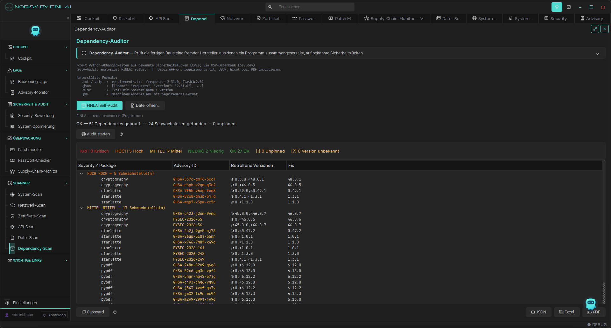

*Abbildung 14: Der Dependency-Scan nach einem Selbst-Audit — die Ergebnisse sind nach Schweregrad gruppiert; zu jedem Fund gibt es eine behebende Version.*

> **Tipp:** Nur Bausteine mit bekannter Version können sicher abgeglichen werden. Fehlt die genaue Version, sammelt NoRisk mögliche Treffer in einem eigenen, eingeklappten Abschnitt „Version unbekannt" — diese zählen bewusst nicht als bestätigt kritisch.

**Alle Funktionen im Detail**

*Eingabe und Start*

- **Anleitungstext mit Formatliste** — nennt die unterstützten Eingabeformate: `.txt`/`.pip` (klassische `requirements.txt`), `.json` (Liste aus Name/Version), `.xlsx` (Excel mit Spalten Name + Version) und `.pdf` (maschinenlesbares PDF im requirements-Format); Nutzen: Sie wissen sofort, welche Datei Sie mitbringen müssen. Grundlage ist die offene Schwachstellen-Datenbank OSV (osv.dev).
- **Schaltfläche „FINLAI Self-Audit"** (hervorgehoben) — prüft NoRisks eigene Bausteinliste und startet den Lauf sofort; Nutzen: ein Ein-Klick-Probelauf, der zeigt, wie der Auditor arbeitet, ganz ohne eigene Datei.
- **Schaltfläche „Datei öffnen…"** — öffnet den Dateidialog mit Filtern für alle unterstützten Formate; Nutzen: die Bausteinliste der eigenen oder einer fremden Software einlesen. Das Format wird automatisch am Dateityp erkannt.
- **Datei-Zeile** — zeigt „Keine Datei ausgewählt" bzw. den Namen der gewählten Datei oder „FINLAI — requirements.txt (Projektroot)"; Nutzen: Kontrolle, welche Quelle geprüft wird.
- **Schaltfläche „Audit starten"** (erst nach Dateiwahl aktiv) — löst die Prüfung in einem Hintergrund-Prozess aus; Nutzen: startet den Abgleich, ohne die Oberfläche zu blockieren. Ein Fragezeichen erklärt, dass gegen öffentliche CVE-Datenbanken verglichen wird. Ist der Offline-Modus aktiv, erscheint statt eines Laufs der Hinweis „Externe Abrufe deaktiviert".
- **Fortschrittsbalken mit Zähler und Zeile „Prüfe: „Paket""** — zeigen „aktuell/gesamt" und den Namen des gerade geprüften Bausteins; Nutzen: bei langen Listen sehen Sie, wie weit der Lauf ist.

*Zusammenfassungs-Leiste (Zähler nach Schweregrad)*

- **KRIT — Kritisch** (rot) — Zahl der Bausteine mit kritischer, oft aktiv ausgenutzter Lücke; Nutzen: höchste Dringlichkeit auf einen Blick.
- **HOCH — Hoch** (orange-rot) — schwerwiegende Lücken; Nutzen: als Nächstes anzugehen.
- **MITTEL — Mittel** und **NIEDRIG — Niedrig** — abgestufte Restlücken; Nutzen: vollständige Priorisierung.
- **OK — OK** (grün) — Bausteine ohne bekannte, abgleichbare Lücke; Nutzen: zeigt den unbedenklichen Anteil (Pakete ohne verifizierbare Version zählen bewusst nicht als OK).
- **[!] — Unpinned** (gelb) — Bausteine ohne festgelegte Version; Nutzen: markiert Zutaten, deren genaue Fassung offen ist und die deshalb schwer prüfbar sind.
- **[?] — Version unbekannt** (gelb) — Advisories, für die keine Version zum Abgleich vorlag; Nutzen: trennt unbestätigte von bestätigten Funden, damit die Ampel nicht fälschlich rot wird.

*Ergebnisbaum*

- **Spalten „Severity / Package", „Advisory-ID", „Betroffene Versionen", „Fix"** — je Fund der Baustein, die Schwachstellen-Kennung, die betroffenen Versionsbereiche und die behebende Version (oder „kein Fix"); Nutzen: alle Angaben, die man zum Beheben braucht, in einer Zeile.
- **Gruppierung nach Schweregrad** — kritische/hohe/mittlere/niedrige Funde stehen unter aufklappbaren Überschriften „„Stufe" — N Schwachstelle(n)"; Nutzen: das Dringendste zuerst, ausgeklappt sichtbar.
- **Abschnitt „[?] VERSION UNBEKANNT — … Abgleich nicht möglich"** — eingeklappte, gelb markierte Sammlung der Funde ohne Versionsabgleich; Nutzen: mögliche Treffer bleiben sichtbar, gelten aber ausdrücklich nicht als bestätigt kritisch.
- **Abschnitt „[!] UNPINNED — … Package(s)"** — Bausteine ohne feste Version samt Angabe der Versionsvorgabe (oder „(keine Angabe)"); Nutzen: Hinweis, wo eine Versionsfestlegung fehlt.
- **Sammelzeile „OK — Keine Schwachstellen gefunden"** — erscheint, wenn nichts zu beanstanden ist; Nutzen: klares Entwarnungssignal.
- **Doppelklick auf einen Fund** — öffnet die zugehörige OSV-Detailseite im Browser; die Kurzbeschreibung liegt zusätzlich als Tooltip an der Advisory-Spalte; Nutzen: Hintergründe zur Lücke ohne eigene Suche.

*Ergebnis-Weitergabe*

- **Schaltfläche „Clipboard"** — kopiert eine Textzusammenfassung (Gruppen plus Paket, Advisory-ID und Fix) in die Zwischenablage; Nutzen: schnell in eine E-Mail oder ein Ticket einfügen.
- **Schaltflächen „JSON", „Excel", „PDF"** (nach dem Audit aktiv) — exportieren das Ergebnis als maschinenlesbare Datei, als Tabelle bzw. als fertigen Bericht; Nutzen: Weitergabe an Entwickler, Abarbeiten in einer Tabelle oder Ablage/Vorlage als Report.
- **Abschluss-Statuszeile** — „N Dependencies geprüft — X Schwachstellen gefunden — Y unpinned" und bei Bedarf „— Z ohne Versionsabgleich"; Nutzen: die Gesamtbilanz eines Laufs in einem Satz.

---

## 10. Bereich „Überwachung" — laufende Beobachtung

Der Bereich „Überwachung" begleitet Sie fortlaufend: Er behält die Aktualität Ihrer Software, die Stärke Ihrer Passwörter und die Verträge Ihrer Lieferkette im Blick. Er enthält drei Werkzeuge — den Patchmonitor, den Passwort-Checker und den Supply-Chain-Monitor.

### 10.1 Patchmonitor

**Worum geht es?** Der Patchmonitor erfasst die auf Ihrem Rechner installierte Software, gleicht sie gegen verfügbare Updates und bekannte Schwachstellen ab und kann Updates direkt einspielen. Zusätzlich warnt er vor Programmen am Ende ihres Lebenszyklus.

**Verstehen.** Patch-Management heißt, Sicherheitslücken durch Hersteller-Updates zeitnah zu schließen. NoRisk nutzt dafür den in Windows enthaltenen Paket-Mechanismus. „End-of-Life" bedeutet: Der Hersteller liefert keine Sicherheitsupdates mehr — solche Software bleibt dauerhaft verwundbar, hier hilft nur der Umstieg auf eine Nachfolgeversion.

**Warum so?** Veraltete Anwendungen mit öffentlich bekannten Lücken sind das bevorzugte Ziel automatisierter Angriffe.

> **Beispiel:** Ein Mitarbeiter nutzt weiter eine PDF-Software mit einer bekannten, kritischen Lücke, für die längst ein Update existiert. Über ein präpariertes PDF wird Schadcode ausgeführt und verschlüsselt die Kanzleidaten — der Patchmonitor hätte die Zeile rot markiert und das Update angeboten.

**Wann nutzen?** Beim Einrichten einmal vollständig, danach regelmäßig — der schnelle Update-Check dauert nur etwa eine Minute und eignet sich für den wöchentlichen Blick.

**Anwenden.** Klicken Sie auf „Scan starten" für die vollständige Bestandsaufnahme oder auf „Schnell nach Updates suchen" für den kurzen Abgleich. Über das Suchfeld und den Filter grenzen Sie die Liste ein (etwa auf „Nur kritisch" oder „Updates verfügbar"). Setzen Sie Häkchen bei den gewünschten Updates und klicken Sie auf „Updates installieren"; ein Bestätigungsfenster listet alle Änderungen „von Version → nach Version", bevor die Installation läuft.

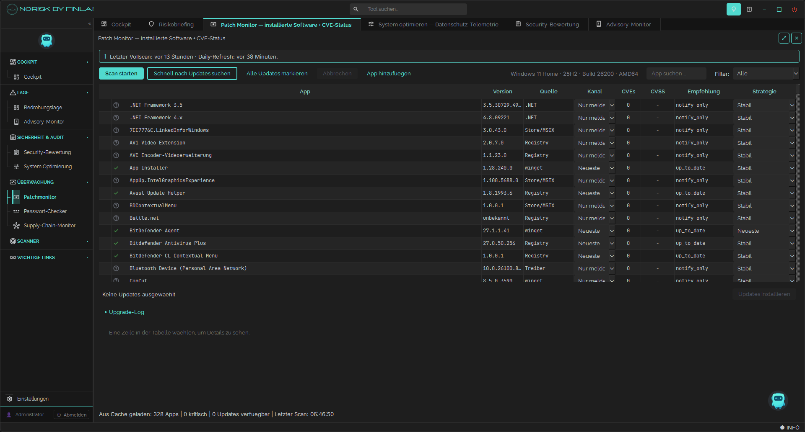

*Abbildung 15: Der Patchmonitor — jede Zeile zeigt Status, Version, Quelle, gefundene Schwachstellen und eine Empfehlung; die Statusleiste unten fasst „installierbare" und „nur anzeigbare" Updates zusammen.*

So lesen Sie das Ergebnis: Ein rotes Symbol steht für ein dringendes Update, orange für ein normales, grün für „aktuell". Der Schweregrad-Wert (CVSS) ist als Ampel eingefärbt. Wichtig ist die Unterscheidung in der Statusleiste: NoRisk kann nur solche Programme automatisch aktualisieren, die über den Paket-Mechanismus verwaltet werden; andere zeigt es nur als Hinweis an (dann fehlt das Häkchen).

> **Achtung:** Die automatische Installation erfordert in der Regel Administrator-Rechte, und Windows fragt diese beim Einspielen ab. Ein rotes Banner am oberen Rand warnt zusätzlich, wenn Programme am Ende ihres Lebenszyklus angekommen sind — diese lassen sich nicht mehr patchen und sollten ersetzt werden.

**Alle Funktionen im Detail**

*Werkzeugleiste (oben)*

- **Scan starten** — löst die vollständige Bestandsaufnahme aus (erfasst alle installierten Programme, sucht verfügbare Updates und gleicht sie gegen bekannte Schwachstellen ab); der Erst-Vollscan dauert rund 15–20 Minuten. Nutzen: die einmalige, gründliche Inventur, auf der alles Weitere aufbaut.
- **Schnell nach Updates suchen** — leichter Abgleich (~30–60 Sekunden), der nur prüft, ob es für bereits bekannte Programme neue Versionen gibt, ohne den langen Vollscan. Nutzen: der wöchentliche Kurz-Blick; öffnet danach automatisch das Popup „Gefundene Updates".
- **Alle Updates markieren** — kreuzt mit einem Klick alle aktuell sichtbaren, automatisch installierbaren Update-Zeilen an. Nutzen: Sie müssen nach einem Kurz-Check nicht jede Zeile einzeln anhaken.
- **Abbrechen** — stoppt einen laufenden Scan. Nutzen: Sie behalten die Kontrolle, wenn ein Scan gerade ungelegen kommt.
- **App hinzufügen** — öffnet den Dialog „App manuell hinzufügen" für Programme, die der Windows-Paket-Mechanismus nicht kennt (siehe unten). Nutzen: auch selten gepflegte Spezialsoftware lässt sich überwachen.
- **Betriebssystem-Anzeige (rechts, gedämpft)** — zeigt Edition, Version und Build Ihres Windows. Nutzen: Sie sehen auf einen Blick, welches System gerade bewertet wird.
- **App suchen …** — Freitext-Feld, das die Liste nach Programmnamen einschränkt (mit „Löschen"-Kreuz); wirkt zusätzlich zum Filter. Nutzen: in einer langen Liste finden Sie ein bestimmtes Programm sofort.
- **Filter (Auswahlfeld)** — grenzt die Liste ein: „Alle", „Nur kritisch (urgent)", „Updates verfügbar", „Up-to-date", „Notify-only". Nutzen: Sie richten den Blick gezielt auf das Dringende.

*Hinweisbanner (situationsabhängig eingeblendet)*

- **Modul-Status-Banner (gelb)** — meldet, wenn das benötigte Windows-Zusatzmodul (Microsoft.WinGet.Client) fehlt oder blockiert ist; mit Schaltfläche **Modul installieren** und aufklappbarer **Diagnose**. Nutzen: Sie erkennen und beheben die Voraussetzung für die zuverlässige Update-Erkennung.
- **Aktualitäts-Banner** — zeigt „Letzter Vollscan vor X · Daily-Refresh vor Y" bzw. „Patch-Inventar noch nicht aufgebaut". Nutzen: Sie wissen jederzeit, wie frisch die angezeigten Daten sind.
- **End-of-Life-Banner (rot)** — nennt die Zahl der Programme am Ende ihres Lebenszyklus und bietet **Nur EOL anzeigen**. Nutzen: dauerhaft verwundbare Software wird sichtbar und lässt sich isolieren.
- **Fortschrittsbalken mit Zähler** — erscheint während eines Scans und zeigt „aktuell / gesamt (%)". Nutzen: Sie sehen, dass gearbeitet wird und wie lange es noch dauert.

*Tabellenspalten (jede Zeile ein Programm)*

- **Auswahl (Kontrollkästchen)** — nur bei automatisch installierbaren Zeilen aktiv (winget-/Store-Programme mit verfügbarem Update); bei Registry-, Store/MSIX- oder Windows-Update-Zeilen ausgegraut. Nutzen: Sie können nur das ankreuzen, was NoRisk auch wirklich selbst einspielen kann.
- **Status (Symbol)** — färbt die Empfehlung als Ampel-Symbol: rotes Ausrufezeichen (dringend), Pfeil-nach-oben orange (normal), Kreis blau (Update vorhanden), grüner Haken (aktuell), Fragezeichen grau (nur melden), Anker (eingefroren), Schild blau (Patch mit CSAF-Kontext), Werkzeug orange (Workaround), Totenkopf-Symbol rot (End-of-Life), Verbots-Symbol grau (von Ihnen ausgenommen); der Mauszeiger-Tooltip zeigt den konkreten Handlungstext. Nutzen: der Dringlichkeitsgrad ist sofort erfassbar.
- **App** — der Programmname. Nutzen: eindeutige Zuordnung.
- **Version** — die installierte Version. Nutzen: Sie sehen den Ist-Stand.
- **Quelle (Herkunft)** — woher die Zeile stammt: „winget", „Registry", „Store/MSIX", „Eigene Quelle", „Windows-Update", „.NET" oder „Treiber", mit erklärendem Tooltip. Nutzen: Sie verstehen, warum manche Programme nur als Hinweis erscheinen und in den Windows-Einstellungen aktualisiert werden müssen.
- **Kanal** — für winget-Programme ein Auswahlfeld (Nur melden / Nur Patches / Stabil / Neueste / Eingefroren), sonst ein farbiges Etikett. Nutzen: Sie können ein bisher „nur meldendes" Programm auf einen Kanal stellen, über den es dann direkt aktualisierbar wird.
- **CVEs** — Anzahl der gefundenen Schwachstellen-Einträge. Nutzen: ein schneller Mengen-Indikator.
- **CVSS** — höchster Schweregrad-Wert, ampelgefärbt (ab 9,0 kritisch, ab 7,0 hoch, ab 4,0 mittel, darunter niedrig; „-" wenn unbekannt). Nutzen: Sie erkennen die Gefährlichkeit ohne Fachwissen.
- **Empfehlung** — die Handlungsklasse im Klartext (z. B. update_urgent, up_to_date, notify_only, eol_no_patch), mit Tooltip zur Begründung. Nutzen: NoRisk sagt Ihnen, was zu tun ist.
- **Strategie** — für winget-Programme ein Auswahlfeld „Stabil / Neueste / Nicht patchen"; sonst ein Gedankenstrich. „Nicht patchen" nimmt das Programm dauerhaft aus und deaktiviert sein Kontrollkästchen. Nutzen: Sie steuern pro Programm, ob und wie aggressiv aktualisiert wird.

*Fußleiste, Protokoll und Detailbereich*

- **Auswahlzähler** — „N Updates ausgewählt". Nutzen: Sie sehen den Umfang der geplanten Aktion.
- **Updates installieren** — startet die Installation der angekreuzten Programme (erst nach Bestätigung); nur aktiv, wenn mindestens eines gewählt und kein Lauf aktiv ist. Nutzen: der Ein-Klick-Weg zum Schließen der Lücken.
- **Batch abbrechen** — erscheint während einer laufenden Installation und bricht die restliche Warteschlange ab (bereits gestartete Installationen laufen fertig). Nutzen: Notbremse ohne Datenchaos.
- **Upgrade-Log (aufklappbar)** — zeigt live jede Aktion mit Start-, Erfolgs-/Fehler-Zeile und Dauer. Nutzen: volle Nachvollziehbarkeit, was gerade passiert.
- **Detailbereich** — bei Klick auf eine Zeile: App + Version, Kanal, Richtlinien-Herkunft samt Vertrauenswert, Quelle, Hersteller, CPE-Hinweis, Empfehlung, höchster CVSS, „Exploit vorhanden", „End-of-Life" sowie die Liste der CVE-Kennungen (bis 20, Rest als „… und N weitere"). Nutzen: die vollständige Begründung einer Einstufung auf einen Blick.
- **Statuszeile (unten)** — „N Apps | X kritisch | Y Updates verfügbar (davon Z automatisch installierbar) | Letzter Scan: HH:MM:SS". Nutzen: die Gesamtlage in einem Satz; die Klammer erklärt, warum evtl. weniger ankreuzbar als gemeldet sind.
- **Live-Statusüberlagerung während der Installation** — Sanduhr blau (läuft), Haken grün (erfolgreich), Kreuz rot (fehlgeschlagen), Uhr orange (Zeitüberschreitung), Verbots-Symbol grau (übersprungen). Nutzen: der Fortschritt ist pro Programm sichtbar.

*Dialoge*

- **Bestätigungsfenster „N Updates installieren"** — listet jede Änderung als „App  von → nach", weist auf nötige Administrator-Rechte und den sequentiellen, abbrechbaren Ablauf hin; Schaltflächen „Abbrechen" / „N Updates starten". Nutzen: keine Installation ohne klare Vorschau.
- **Popup „Gefundene Updates" (nach dem Kurz-Check)** — kompakte Tabelle (Auswahl / Programm / Version / Quelle / Kanal / Strategie) mit „Alle markieren", Auswahlzähler, „Schließen" und „Ausgewählte installieren"; Kanal-/Strategie-Änderungen werden sofort in den Hauptmonitor übernommen; mit Administrator-Rechte-Hinweis. Nutzen: direkt aus dem Kurz-Check heraus konfigurieren und installieren.
- **„App manuell hinzufügen"** — Warnbanner (die Versionsseite wird per HTTP abgefragt, kein automatischer Download/keine Installation, nur ein Hinweis mit Hersteller-Link); Felder Name, Hersteller-URL, Versions-Erkennungsmuster (Regex mit Fundstelle), Plattform (Windows/macOS/Linux), installierte Version (optional) und Notiz (optional); Eingaben werden geprüft. Nutzen: auch nicht-katalogisierte Software bleibt im Blick.
- **Einrichtungs-Dialog „Voraussetzung einrichten"** — installiert das PowerShell-Modul Microsoft.WinGet.Client im Benutzerprofil (ohne Administrator-Rechte); Schaltflächen „Installieren", „Diesmal überspringen" (legt eine kritische Erinnerung an), „Nie wieder fragen". Nutzen: einmalige, geführte Einrichtung der zuverlässigen Erkennung.

*Verlauf/Zwischenspeicher*

- **Automatisches Laden aus dem Zwischenspeicher** — beim Öffnen zeigt der Monitor sofort den zuletzt gespeicherten Scan-Stand statt einer leeren Tabelle; nach jedem Scan wird der Stand (inklusive Verlaufseintrag) verschlüsselt gespeichert. Nutzen: Sie müssen nach einem App-Neustart nicht 20 Minuten warten, um etwas zu sehen.

### 10.2 Passwort-Checker

**Worum geht es?** Der Passwort-Checker bewertet die Stärke eines Passworts vollständig lokal, prüft es gegen eine wählbare Richtlinie und gleicht es datenschonend gegen bekannte Datenlecks ab. Zusätzlich erzeugt er starke Zufallspasswörter.

**Verstehen.** Die *Entropie* misst in Bit, wie schwer ein Passwort zu erraten ist — grob gilt ab 60 Bit stark, ab 80 Bit sehr stark. Ein *Datenleck* ist eine Sammlung erbeuteter Zugangsdaten. Der Abgleich nutzt ein Verfahren namens *k-Anonymität*: NoRisk sendet nur die ersten fünf Zeichen eines Prüfwerts (Hash) an den Prüfdienst; das Passwort selbst verlässt niemals das Gerät.

**Warum so?** Schwache oder bereits geleakte Passwörter sind die Haupteinfallstür für automatisierte Angriffe.

> **Beispiel:** Ein Mitarbeiter verwendet ein Passwort, das zwar mittel-stark wirkt, aber in Leak-Listen steht, auch für das Kanzlei-Postfach. Ein Angreifer probiert die aus einem fremden Leck stammende Kombination automatisiert durch und übernimmt das Postfach — der Checker hätte es als „kompromittiert" gekennzeichnet und zum sofortigen Wechsel geraten.

**Anwenden.** Geben Sie links ein Passwort ein, wählen Sie eine Richtlinie (etwa „BSI Grundschutz") und klicken Sie auf „Passwort prüfen". Wer nur einmal sehen möchte, wie das Ergebnis aussieht, klickt rechts auf „Beispiel ansehen". Unten links erzeugt der Generator auf Wunsch ein starkes Zufallspasswort.

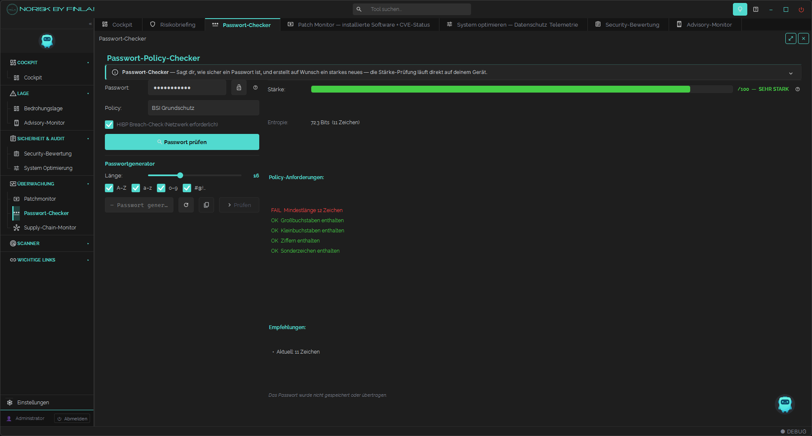

*Abbildung 16: Der Passwort-Checker — der Balken zeigt die Stärke von 0 bis 100, darunter die Entropie und die Prüfung gegen die gewählte Richtlinie.*

So lesen Sie das Ergebnis: Der Balken reicht von „sehr schwach" (rot) bis „sehr stark" (grün). Darunter sehen Sie die Entropie und, punktweise, welche Richtlinien-Anforderungen erfüllt sind. Findet der Leak-Abgleich einen Treffer, kappt NoRisk die Bewertung hart auf „kompromittiert" — unabhängig davon, wie stark das Passwort sonst wäre.

> **Hinweis:** Das eingegebene Passwort wird niemals gespeichert oder im Klartext übertragen. Der Leak-Abgleich braucht eine Internetverbindung; ohne sie erscheint ein neutraler Hinweis statt eines Fehlalarms.

**Alle Funktionen im Detail**

*Eingabe (linke Spalte)*

- **Passwort-Feld** — verdeckte Eingabe (Platzhalter „Passwort eingeben …"); die Eingabetaste startet die Prüfung direkt. Nutzen: schnelle Prüfung ohne Mausweg. Ein danebenliegender Hilfe-Knopf erklärt: das Passwort wird niemals gespeichert, beim Datenleck-Abgleich verlässt nur ein 5-Zeichen-Teilcode das Gerät.
- **Auge-Schaltfläche** — schaltet zwischen Verbergen und Anzeigen des Passworts um (Tooltip „Passwort anzeigen/verbergen"). Nutzen: Sie kontrollieren Tippfehler, ohne die Eingabe abzuschicken.
- **Policy-Auswahl** — Auswahlfeld mit drei Richtlinien: „BSI Grundschutz" (mindestens 12 Zeichen, alle Zeichenarten, Höchstalter 365 Tage, Leak-Prüfung, keine Wiederverwendung der letzten 10), „NIST 800-63B (2024)" (mindestens 15 Zeichen, keine erzwungene Komplexität, kein Ablauf, Leak-Prüfung Pflicht) und „ISO 27001:2022" (mindestens 10 Zeichen, alle Zeichenarten, Höchstalter 90 Tage, keine Wiederverwendung der letzten 12). Nutzen: Sie prüfen gegen genau den Standard, dem Sie unterliegen.
- **HIBP Breach-Check (Netzwerk erforderlich)** — Kontrollkästchen (voreingestellt aktiv), das den Online-Abgleich gegen bekannte Datenlecks ein-/ausschaltet. Nutzen: Sie erfahren, ob ein Passwort bereits geleakt ist — datenschonend per k-Anonymität.
- **Passwort prüfen** — startet die Bewertung; erst nach einer Eingabe aktiv. Nutzen: die eigentliche Analyse; die lokale Stärke-Prüfung erscheint sofort, das Leak-Ergebnis wird nachgezogen, ohne die Oberfläche zu blockieren.

*Passwortgenerator (linke Spalte, unten)*

- **Länge-Schieberegler** — 8 bis 32 Zeichen (voreingestellt 16), mit Zahlenanzeige. Nutzen: Sie bestimmen die Passwortlänge und damit maßgeblich die Stärke.
- **Zeichenkategorien** — vier Kontrollkästchen „A–Z", „a–z", „0–9" und „#@!…" (alle voreingestellt aktiv). Nutzen: Sie steuern, aus welchen Zeichenarten das Zufallspasswort besteht.
- **Ausgabefeld** — schreibgeschützt, in Festschrift-Darstellung (Platzhalter „— Passwort generieren —"). Nutzen: das Ergebnis ist gut ablesbar.
- **Erzeugen-Schaltfläche (Kreispfeil)** — erzeugt kryptografisch sicher ein neues Zufallspasswort. Nutzen: ein starkes Passwort per Klick, ohne selbst zu tüfteln.
- **Kopieren-Schaltfläche** — legt das erzeugte Passwort in die Zwischenablage (erst nach Erzeugung aktiv). Nutzen: bequeme Übernahme in Ihren Passwort-Tresor.
- **Prüfen-Schaltfläche (Pfeil nach rechts)** — überträgt das erzeugte Passwort ins Prüffeld (erst nach Erzeugung aktiv). Nutzen: Sie sehen sofort, wie stark das eben erzeugte Passwort bewertet wird.

*Rechte Spalte — Startzustand*

- **Erklär-Kachel mit „Beispiel ansehen"** — beschreibt den Nutzen des Werkzeugs und analysiert per Klick ein Beispielpasswort (rein lokal, ohne Netzabgleich). Nutzen: Sie sehen mit einem Klick, wie ein Ergebnis aussieht, bevor Sie ein echtes Passwort eingeben.

*Rechte Spalte — Ergebnis*

- **Stärke-Balken + Wertung** — Balken von 0 bis 100 plus Text „X/100 — STUFE" (SEHR SCHWACH, SCHWACH, MITTEL, STARK, SEHR STARK), farblich gestuft von rot bis grün; ein Hilfe-Knopf erklärt die Bewertungsgrundlage. Nutzen: die Kernaussage auf einen Blick.
- **Entropie-Zeile** — „X.X Bits (N Zeichen)"; Tooltip: ab 60 Bit stark, ab 80 Bit sehr stark. Nutzen: das Maß, wie schwer das Passwort zu erraten ist — verständlich eingeordnet.
- **Policy-Anforderungen** — je Anforderung eine Zeile mit „OK" (grün) oder „FAIL" (rot) und erklärendem Tooltip. Nutzen: Sie sehen punktgenau, welche Regel der gewählten Richtlinie erfüllt ist und welche nicht.
- **Muster-Warnungen** — orange „[WARN] …"-Zeilen für erkannte Schwächen (z. B. Tastaturfolgen, häufige Wörter). Nutzen: typische Fallen werden benannt, nicht nur bewertet.
- **Breach-Ergebnis** — grün „Nicht in bekannten Datenpannen gefunden (HIBP)" oder rot „Passwort in N Datenpannen gefunden — sofort ändern!"; ein Treffer kappt die Stärke hart auf „KOMPROMITTIERT", egal wie stark das Passwort sonst wäre. Nutzen: ein geleaktes Passwort wird nie fälschlich als sicher dargestellt. Ist kein Netz verfügbar, erscheint ein neutraler Hinweis statt eines Fehlalarms.
- **Prüf-Anzeige** — „Breach-Datenbank wird geprüft …" während des Online-Abgleichs. Nutzen: Sie sehen, dass im Hintergrund gearbeitet wird.
- **Empfehlungen** — konkrete Verbesserungsvorschläge als Liste. Nutzen: klarer nächster Schritt zu einem stärkeren Passwort.
- **Datenschutz-Hinweis** — „Das Passwort wurde nicht gespeichert oder übertragen." Nutzen: die Zusicherung, dass die Prüfung Sie nicht selbst gefährdet.

### 10.3 Supply-Chain-Monitor

**Worum geht es?** Der Supply-Chain-Monitor verwaltet Ihre Geschäftspartner und deren Auftragsverarbeitungsverträge (AVV) — klar getrennt nach **Lieferanten** (bei denen Sie Kunde sind) und **eigenen Kunden** (für die Sie Auftragsverarbeiter sind). Dieses Inventar ist die Grundlage für die NIS2-Lieferketten-Anforderung.

**Verstehen.** Ein *AVV* ist der nach DSGVO Artikel 28 vorgeschriebene Vertrag mit einem Dienstleister, der in Ihrem Auftrag personenbezogene Daten verarbeitet. Ein *Sub-Auftragnehmer* ist ein Dritter, den ein Dienstleister seinerseits einsetzt (etwa ein Rechenzentrum hinter einem Cloud-Dienst). Nutzen viele Ihrer Partner denselben Sub-Auftragnehmer, entsteht ein *Konzentrationsrisiko* — fällt dieser eine aus, trifft es viele zugleich.

**Warum so?** Ohne dokumentierte Lieferanten und Verträge sind Datenschutz- und NIS2-Pflichten nicht erfüllbar, und Klumpenrisiken bleiben unsichtbar.

> **Beispiel:** Ein Cloud-Dienstleister erleidet eine Datenpanne mit Mandantendaten. Bei einer Aufsichtsprüfung können Sie weder einen gültigen AVV noch eine Übersicht der eingesetzten Sub-Auftragnehmer vorlegen — es drohen Bußgeld und Haftung. Der Monitor hätte den fehlenden oder abgelaufenen Vertrag rot markiert.

**Anwenden.** Das Werkzeug hat vier Reiter: „AVV-Tracker", „Auto-Detection", „Sub-Auftragnehmer" und „Reports". Im AVV-Tracker wechseln Sie zwischen den inneren Reitern „Lieferanten" und „Kunden". Oben verwalten Sie die Partner (Hinzufügen, Bearbeiten, Off-Boarding), unten laden Sie den Vertrag als PDF hoch und pflegen die Pflichtinhalts-Checkliste.

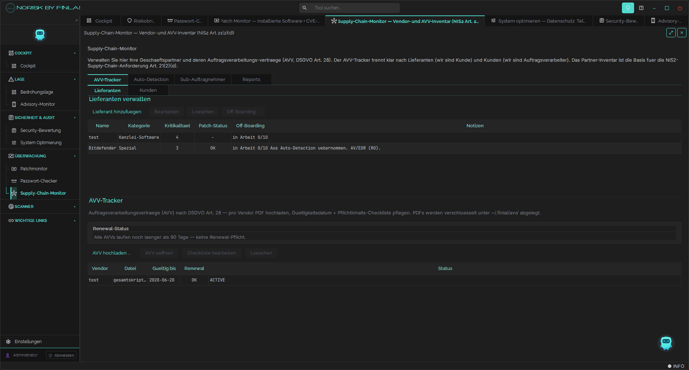

*Abbildung 17: Der Supply-Chain-Monitor — oben die Lieferanten mit Kritikalität und Patch-Status, darunter die zugehörigen AVV-Verträge mit Renewal-Status.*

So lesen Sie das Ergebnis: Die *Kritikalität* reicht von 1 (niedrig) bis 5 (sehr hoch). Der Vertragsstatus lautet ENTWURF, AKTIV oder ABGELAUFEN. Der Renewal-Status warnt „läuft ab", sobald weniger als 90 Tage Restlaufzeit bleiben, und „überfällig" nach Ablauf. Die Pflichtinhalts-Prüfung färbt sich grün (vollständig), gelb (lückenhaft) oder rot (eine sicherheitskritische Klausel fehlt).

> **Achtung:** Aus Aufbewahrungsgründen schützt NoRisk referenzierte Kunden vor dem Löschen: Solange noch ein Audit, ein Score oder ein aufbewahrungspflichtiger Vertrag auf einen Kunden verweist, lässt er sich nicht entfernen. Hochgeladene Verträge werden verschlüsselt auf Ihrem Gerät abgelegt; ohne den passenden Schlüssel (auf einem anderen Windows-Profil) sind sie nicht lesbar. Die Vollständigkeits-Prüfung ist eine Hilfestellung, keine Rechtsberatung.

**Alle Funktionen im Detail**

Der Monitor hat vier Hauptreiter: **AVV-Tracker**, **Auto-Detection**, **Sub-Auftragnehmer** und **Reports**. Der AVV-Tracker (Position 1) enthält zwei innere Reiter, **Lieferanten** (wir sind Kunde) und **Kunden** (wir sind Auftragsverarbeiter); in jedem stehen oben die Partner-Verwaltung und darunter — über einen ziehbaren Trennbalken frei einteilbar — die zugehörigen Verträge.

*AVV-Tracker → Lieferanten (wir sind Kunde)*

- **Lieferanten-Verwaltung (oben)** — Schaltflächen „Lieferant hinzufügen", „Bearbeiten", „Löschen", „Off-Boarding …". Tabellenspalten: **Name**, **Kategorie** (Kanzlei-Software / Cloud-SaaS / IT-Dienstleister / Kommunikation / Spezial), **Kritikalität** (1 niedrig bis 5 sehr hoch, nach BSI-Schadenshöhen-Skala), **Patch-Status** (aus dem Patchmonitor verknüpft: z. B. „2 Update / 1 CVE (CVSS≤7.5)", „OK", „Warnung: Exploit" oder „-"), **Off-Boarding** (in Arbeit d/t / abgeschlossen / abgebrochen / -), **Notizen**. Nutzen: das vollständige Lieferanten-Inventar mit Wichtigkeit und Sicherheitslage in einer Zeile.
- **Lieferant anlegen/bearbeiten (Formular)** — Felder Name, Kategorie, Kritikalität (Auswahlfeld 1–5 mit Klartext-Bedeutung) und Notizen (bis 2000 Zeichen). Nutzen: einheitlich erfasste Stammdaten, die die Kritikalitäts-Bewertung tragen.
- **Off-Boarding-Dialog** — begleitet den geordneten Abschied von einem Lieferanten und ist zugleich die DSGVO-Dokumentation: zehn Pflichtschritte mit Erledigt-Häkchen und ausgeschriebenem Rechtsbezug (Datenexport/Rückgabe Art. 28, Löschnachweis Art. 28, AVV-Kündigung, Konten deaktivieren Art. 32, Zugangsdaten rotieren, Integrationen entfernen, Zahlung beenden, Sub-Auftragnehmer informieren Art. 28, Backup für Rechtsfrist sichern Art. 17(3), Verzeichnis aktualisieren Art. 30); Statuszeile „Erledigt d/t (Defaults d/10)"; „Custom-Schritt hinzufügen/entfernen"; **Off-Boarding abschließen** wird erst aktiv, wenn alle zehn Pflichtschritte erledigt sind; **Off-Boarding abbrechen** setzt den Status auf „abgebrochen"; Speichern/Abbrechen. Nutzen: kein vergessener Löschnachweis, keine offenen Zugänge — belegbar.
- **AVV-Liste (unten)** — Info „PDFs werden verschlüsselt unter ~/.finlai/avv/ abgelegt", Renewal-Banner-Kachel (z. B. „2 überfällig, 3 laufen in <90 Tagen ab"). Schaltflächen „AVV hochladen …", „AVV öffnen", „Checkliste bearbeiten", „Löschen". Spalten: **Vendor**, **Datei**, **Gültig bis**, **Renewal** (OK / LÄUFT AB / ÜBERFÄLLIG), **Status** (ENTWURF / AKTIV / ABGELAUFEN). Nutzen: der Vertragsbestand samt Ablauf-Ampel auf einen Blick.
- **AVV hochladen (Dialog)** — Lieferant auswählen, PDF-Datei wählen, Gültig-ab, Gültig-bis und Notizen. Die Datei wird verschlüsselt auf Ihrem Gerät abgelegt. Nutzen: der Vertrag ist revisionssicher hinterlegt.
- **AVV öffnen** — entschlüsselt die PDF kurz in einen temporären Ablageort und öffnet sie im System-Betrachter; fehlende Datei, altes Klartext-Format oder fehlender Schlüssel werden klar gemeldet. Nutzen: Ansehen ohne Sicherheitsverlust; Temp-Dateien werden beim Schließen wieder entfernt.
- **Checkliste bearbeiten (Art-28-Pflichtcheckliste)** — Konformitäts-Banner „Art-28-Vollständigkeit: X/10 dokumentiert (Urteil). Es fehlen: … Sicherheitskritisch offen: …" (grün/gelb/rot, live). Tabelle **Pflichtinhalt / Status / Typ**; je Zeile ein Status-Auswahlfeld „Ungeprüft / Ja, erfüllt / Nein, fehlt". Zehn feste Art-28-Punkte (a Weisungsbindung, b Verschwiegenheit, c TOMs, d Sub-Auftragnehmer, e Betroffenenrechte, f DSFA/Meldepflicht-Unterstützung, g Rückgabe/Löschung, h Audit-/Prüfrechte, DPIA-Mitwirkung, EU-Standardvertragsklauseln); „Custom-Check hinzufügen/entfernen". Nutzen: Sie sehen sofort, welche Pflichtklausel im Vertrag fehlt — ausdrücklich als Vollständigkeits-Hilfe, nicht als Rechtsberatung.

*AVV-Tracker → Kunden (wir sind Auftragsverarbeiter)*

- **Kunden-Verwaltung (oben)** — Schaltflächen „Kunde hinzufügen", „Bearbeiten", „Löschen". Spalten: **Firmenname**, **Branche**, **Größe**, **Ansprechpartner**. Kunden sind dieselbe geteilte Identität wie in Security-Audit und Security-Score. Nutzen: eine einzige Kundenliste für alle Bereiche, kein doppeltes Pflegen.
- **Kunden-Löschschutz** — das Löschen ist blockiert, solange ein Audit, ein Score, ein aufbewahrungspflichtiger AVV oder eine Sub-Verknüpfung auf den Kunden verweist; ein Hinweis nennt den Grund. Nutzen: keine versehentliche Zerstörung nachweispflichtiger Bezüge.
- **Kunden-AVV-Liste (unten)** — Info „PDFs unter ~/.finlai/avv/customers/", Renewal-Banner. Schaltflächen „Kunden-AVV hochladen …", „AVV öffnen", „Checkliste bearbeiten", „Löschen". Spalten **Kunde / Datei / Gültig bis / Renewal / Status** (wie oben). Der Upload-Dialog lässt einen bestehenden Kunden wählen oder legt einen neuen an; dieselbe Art-28-Checkliste wird wiederverwendet; das Löschen weist auf Aufbewahrungspflichten hin. Nutzen: die Kunden-Perspektive spiegelbildlich zur Lieferanten-Perspektive.

*Auto-Detection*

- **Domains-Feld + „Detection starten"** — komma-getrennte Domain-Eingabe (leer = nur installierte Software); erkennt Lieferanten über drei Quellen: lokal installierte Programme, MX-Einträge der Domain (E-Mail-Wegweiser im DNS) und den Aussteller des TLS-Zertifikats. Ein Ergebnis-Fenster nennt die Trefferzahlen je Quelle. Nutzen: NoRisk schlägt Ihnen Lieferanten vor, die Sie sonst übersehen.
- **„Catalog verwalten"** — öffnet die Katalog-Verwaltung, aus der die Vorschläge gespeist werden. Nutzen: Sie können die Erkennungsbasis pflegen.
- **Vorschlags-Tabelle** — Spalten **Vendor**, **Kategorie**, **Confidence** (HOCH / MITTEL / NIEDRIG samt Punktzahl), **Quellen** (z. B. „Cert+MX+Apps (3+2+1=6)"), **Letzte Detection**. Nutzen: Sie sehen, wie sicher ein Vorschlag ist und worauf er beruht.
- **„Als Vendor übernehmen" / „Vertagen" / „Verwerfen"** — übernimmt einen Vorschlag als Lieferanten, schiebt ihn auf oder lehnt ihn dauerhaft ab (dann kein erneuter Vorschlag). Nutzen: schnelle, nachvollziehbare Triage der gefundenen Kandidaten.

*Sub-Auftragnehmer*

- **Konzentrationsrisiko-Kachel** — meldet „Sub (Anzahl Vendoren) …" bzw. „Kein Konzentrationsrisiko — kein Sub wird von 3 oder mehr Vendoren genutzt" oder „Noch keine Vendor-Verknüpfungen". Nutzen: Klumpenrisiken (viele Lieferanten hängen am selben Rechenzentrum) werden sichtbar.
- **Schaltflächen** — „Sub hinzufügen …", „Bearbeiten", „Verknüpfungen verwalten …", „Löschen" (Löschen warnt, wie viele Verknüpfungen mitentfernt werden). Nutzen: gepflegtes Sub-Auftragnehmer-Register.
- **Tabelle** — **Name**, **Land**, **Kategorie**, **Genutzt von (Vendoren)** [Anzahl]. Nutzen: pro Sub-Auftragnehmer die Streuung über Ihre Lieferanten.
- **Sub anlegen/bearbeiten (Formular)** — Name, Land, Kategorie, Notizen. Nutzen: einheitliche Erfassung.
- **Verknüpfungen verwalten (Dialog)** — Tabelle **Typ (Lieferant/Kunde) / Partner / Rolle**; „Verknüpfung anlegen …" (Partner-Typ wählen, Partner, Rolle wie „Storage", „CDN", „E-Mail-Versand") und „Verknüpfung entfernen"; identische Verknüpfungen werden nicht dupliziert. Nutzen: Sie bilden ab, welcher Sub-Auftragnehmer hinter welchem Lieferanten oder Kunden welche Rolle übernimmt.

*Reports*

- **Kundenname (optional, für Deckblatt)** — Freitextfeld für das Deckblatt der Berichte. Nutzen: fertige, adressierte Nachweise.
- **GV.SC-Compliance-Report exportieren …** — erzeugt eine PDF, die die aktuellen Lieferketten-Daten gegen NIST CSF 2.0 (GV.SC) und BSI Grundschutz (OPS.2.3 + ORP.5) abbildet; Speichern über einen „Speichern unter"-Dialog. Nutzen: der prüfungsfertige Nachweis Ihrer Lieferketten-Governance.
- **AVV-Status-Report exportieren …** — erzeugt eine PDF mit allen AVV-Dokumenten samt Renewal-Status und Art-28-Erfüllungsquote. Nutzen: der lückenlose Vertragsüberblick auf einen Ausdruck.
- **Statuszeile** — bestätigt nach dem Export Dateiname, Größe und Ablageort. Nutzen: Sie wissen sofort, wo der erzeugte Nachweis liegt.

---

## 11. Bereich „Sicherheit & Audit" — Bewerten, Nachweisen, Melden

Dieser Bereich fasst alles zusammen, was mit der Frage „Wie sicher sind wir, und was müssen wir nachweisen oder melden?" zu tun hat. Der Eintrag **Security-Bewertung** bündelt dazu vier Werkzeuge als Reiter — Security-Audit, Security-Score, Awareness-Tracker und NIS2-Vorfälle. Daneben liegt das eigenständige Werkzeug **System Optimierung**.

Beim Öffnen sehen Sie die vier Reiter nebeneinander; jeder Reiter wird beim ersten Anklicken geladen.

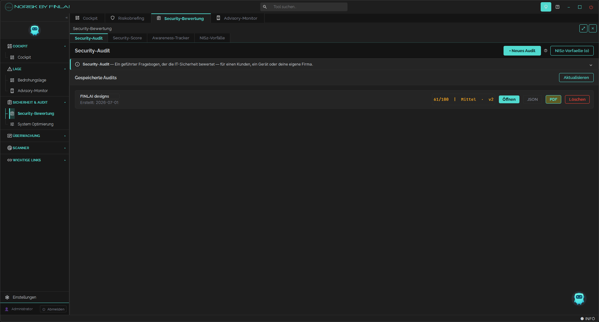

*Abbildung 18: Der Bereich „Security-Bewertung" — die vier Reiter bündeln Audit, Score, Schulungen und Vorfälle an einer Stelle.*

### 11.1 Security-Audit

**Worum geht es?** Das Security-Audit ist ein geführter Fragebogen, der die IT-Sicherheit einer Organisation bewertet — Ihre eigene Kanzlei, ein Gerät oder einen Kunden. Er berechnet eine Gesamtpunktzahl mit Risikostufe, liefert Handlungsempfehlungen und eine Risikomatrix.

**Verstehen.** Ein Audit ist eine strukturierte Soll-Ist-Prüfung. Die Punktzahl entsteht aus gewichteten Teilbereichen (IT-Infrastruktur, organisatorische Sicherheit, Netzwerk, Backup, Datensouveränität, Notfallplan). Die *Risikomatrix* nach der Methode BSI 200-3 ordnet jedes Risiko nach Eintrittswahrscheinlichkeit und Schadenshöhe in ein Raster ein. Die Begriffe *RPO* und *RTO* beschreiben, wie viel Datenverlust bzw. wie lange Ausfall im Ernstfall tolerierbar ist.

**Warum so?** Ein Audit macht den Sicherheitsstand messbar, priorisierbar und gegenüber Geschäftsleitung oder Mandant belegbar.

> **Beispiel:** Ohne Audit bleiben Lücken wie ein veraltetes WLAN-Passwort oder ein nie getesteter Wiederherstellungs-Vorgang unsichtbar — bis ein Angriff sie ausnutzt und zugleich der Nachweis der Sorgfalt fehlt.

**Anwenden.** Klicken Sie auf „Neues Audit". Im ersten Schritt wählen Sie den **Modus**: ein *Selbst-Audit* Ihrer eigenen Organisation (dabei füllen Messungen Teile automatisch vor) oder ein *Kunden-Audit* (klassischer Fragebogen; auf fremden Rechnern läuft bewusst keine Messung).

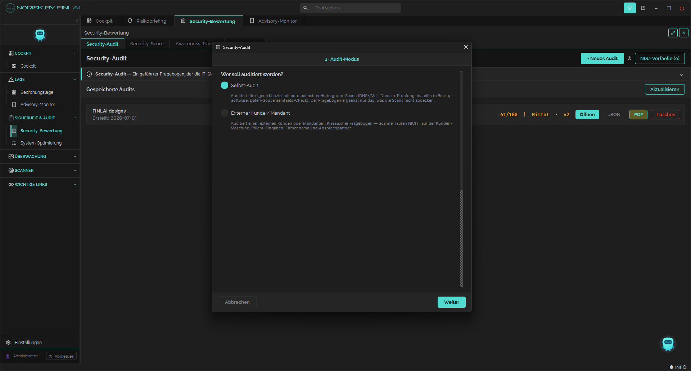

*Abbildung 19: Der Audit-Assistent, Schritt 1 — die Wahl zwischen Selbst-Audit (mit automatischen Messungen) und Kunden-Audit (reiner Fragebogen).*

Anschließend führt der Assistent durch mehrere Schritte: Stammdaten, IT-Infrastruktur, organisatorische Sicherheit, Netzwerk, Backup, Datensouveränität, Notfallplan und Phishing-Schutz. Im vorletzten Schritt erscheint die Risikomatrix.

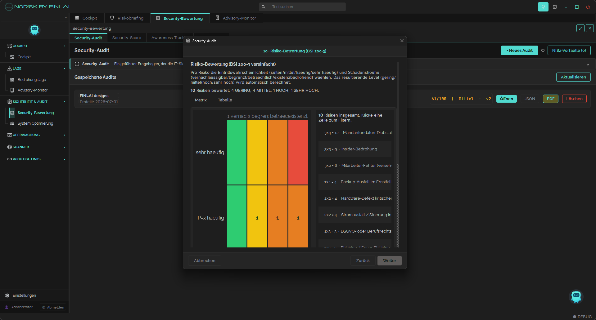

*Abbildung 20: Die Risikomatrix nach BSI 200-3 — jede Zelle zeigt, wie viele Risiken in dieser Kombination aus Wahrscheinlichkeit und Schaden liegen; die Farbe reicht von grün (gering) bis rot (sehr hoch).*

Im letzten Schritt klicken Sie auf „Neu berechnen" und erhalten die Ergebnis-Zusammenfassung.

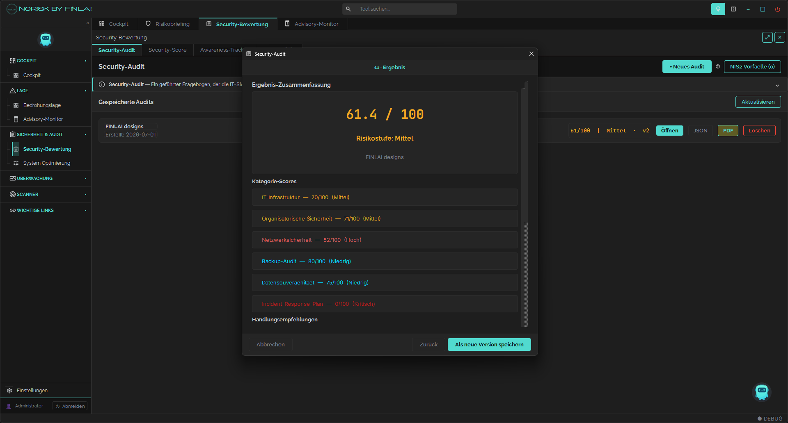

*Abbildung 21: Das Audit-Ergebnis — Gesamtpunktzahl und Risikostufe oben, darunter die einzelnen Kategorien; ein Wert von 0 in einer Kategorie (hier „Incident-Response-Plan") erscheint rot als kritisch.*

So lesen Sie die Risikostufe: ab 75 Punkten „niedrig" (blau/grün), 55 bis 74 „mittel" (gelb/amber), 35 bis 54 „hoch" (lachsrot), unter 35 „kritisch" (tiefrot). Über „Öffnen", „JSON", „PDF" und „Löschen" verwalten Sie gespeicherte Audits.

> **Hinweis:** Jede Neuberechnung wird als **neue Version** gespeichert; das Original bleibt unverändert erhalten. Beim Löschen entfernen Sie wahlweise nur eine Version oder über „Ganze Historie" die komplette Kette (im Sinne des Datenschutz-Löschrechts).

**Alle Funktionen im Detail**

*In der Übersicht (vor dem Assistenten)*

- **„+ Neues Audit" (oben rechts)** — startet den geführten Fragebogen für ein neues Audit; Nutzen: Sie beginnen eine strukturierte Prüfung, ohne selbst eine Vorlage bauen zu müssen.
- **„NIS2-Vorfaelle (Zahl)"** — zeigt in Klammern die Anzahl aktuell offener NIS2-Vorfälle und springt per Klick direkt auf den NIS2-Reiter; Nutzen: Sie sehen sofort, ob ein meldepflichtiger Vorfall aus einem Audit noch offen ist. Ist der Dienst nicht verfügbar, steht neutral „(–)".
- **Hilfe-Streifen (unter der Werkzeugleiste)** — klappt Zweck, Anwendungsfälle und Ergebnis-Erklärung ein; Nutzen: Kontext zur Hand, ohne das Handbuch zu öffnen.
- **„Gespeicherte Audits" + „Aktualisieren"** — Liste aller Audits als Karten, der Knopf lädt sie neu; Nutzen: nach Änderungen sehen Sie den aktuellen Stand.
- **Audit-Karte** — zeigt Firmenname, Erstell-Datum sowie rechts „Punktzahl/100 | Risikostufe · vVersion"; Nutzen: Sie erfassen Ergebnis und Versionsstand auf einen Blick (die Risikostufe färbt die Zahl von Neonblau „Niedrig" bis Tiefrot „Kritisch").
- **„Öffnen"** — lädt das Audit editierbar in den Assistenten; Speichern erzeugt eine **neue Version** (das Original bleibt unangetastet); Nutzen: Sie können ein Re-Assessment machen, ohne die Historie zu verlieren.
- **„JSON"** — exportiert das Audit als Datendatei; Nutzen: maschinenlesbare Weitergabe/Archivierung.
- **„PDF"** — erzeugt den druckfertigen Bericht im dunklen Design; Nutzen: Vorlage für Mandant oder Geschäftsleitung.
- **„Löschen"** — entfernt **nur diese eine Version**, andere bleiben erhalten; Nutzen: gezieltes Aufräumen ohne Datenverlust der Kette.
- **„Ganze Historie"** (nur bei mehreren Versionen) — löscht die komplette Versionskette und anonymisiert zugehörige NIS2-Vorfälle (DSGVO Art. 17); Nutzen: erfüllt das Löschrecht vollständig.

*Der Assistent — Schritt 1: Audit-Modus*

- **„Selbst-Audit" / „Externer Kunde / Mandant" (Auswahlknöpfe)** — legt fest, ob Ihre eigene Kanzlei (mit automatischen Hintergrund-Messungen) oder ein fremder Mandant (reiner Fragebogen) geprüft wird; Nutzen: auf fremden Rechnern läuft bewusst kein Scan, im Selbst-Audit füllen Messungen Teile vor.

*Schritt 2: Kundenstammdaten*

- **„Firmenname *"** — Pflichtfeld, benennt das geprüfte Subjekt; Nutzen: eindeutige Zuordnung in Liste, Export und NIS2-Vorfall.
- **Ansprechpartner (Name / E-Mail / Telefon)** — Kontaktdaten; Nutzen: Rückfragen und Berichtsadressierung.
- **„Branche" / „Mitarbeiter" (Auswahllisten)** — Einordnung nach Wirtschaftszweig und Unternehmensgröße; Nutzen: bessere Einordnung der Ergebnisse.
- **„Privatperson / Kleinstbetrieb" (Häkchen)** — nimmt enterprise-typische Punkte (Zugangskontrollen, Netzsegmentierung, IDS/IPS, Pentest) aus der Wertung; Nutzen: deren Fehlen zählt bei Kleinst-Einheiten nicht fälschlich als Defizit.
- **„Erstellungsdatum"** — Prüfdatum (Vorbelegung heute); Nutzen: nachvollziehbarer Stichtag.

*Schritt 3: IT-Infrastruktur*

- **„Gemessene Werte automatisch uebernehmen" (Häkchen, nur Selbst-Audit)** — misst Firewall, Fernwartung (RDP), Verschlüsselung und Betriebssystem/Patch im Hintergrund und trägt sie schreibgeschützt ein (mit Herkunfts-Hinweis „Gemessen am …"); Nutzen: belastbare Fakten statt Selbstauskunft; Haken entfernen macht die Felder wieder änderbar.
- **„Betriebssysteme" (Mehrfachauswahl)** — welche Systeme im Einsatz sind; Nutzen: Grundlage für Lebenszyklus-Bewertung.
- **„OS Patch-Stand"** — Aktualität der Systeme; Nutzen: erkennt Update-Rückstände.
- **„Antivirus" + „AV-Status"** — Produktname und Zustand (aktiv/inaktiv/veraltet/unbekannt); Nutzen: Schutzstatus wird bewertbar.
- **„Firewall" + „FW-Status"** — analog für die Firewall; Nutzen: offene Grundschutz-Flanken werden sichtbar.
- **„Verschlüsselung" (Mehrfachauswahl)** — BitLocker/VeraCrypt/FileVault u. a.; Nutzen: belegt Schutz gestohlener Datenträger.
- **„VPN-Lösung" / „Browser" / „Server"** — Freitext zu Fernzugang, Browserstand und Serverbetrieb (On-Prem/Cloud/Hybrid); Nutzen: rundet das Infrastrukturbild ab.
- **„Remote-Access-Tools" (Mehrfachauswahl)** — genutzte Fernwartungswege; Nutzen: bewertet eine häufige Angriffsfläche.

*Schritt 4: Organisatorische Sicherheit* — sieben Auswahllisten (Ja / Nein / Teilweise):

- **Zugangskontrollen, Backup-Strategie, Update-Management, Mitarbeitersensibilisierung, Incident-Response-Plan, DSGVO-Konformität** — organisatorische Reifegrade; Nutzen: erfasst Sicherheit jenseits der reinen Technik.
- **„AVV-/Crypto-Schluessel-Trennung"** — ob kryptographische Schlüssel getrennt vom Speichermedium verwahrt werden; Nutzen: ein Schlüssel-Kompromiss hebelt dann nicht alle Schutzebenen zugleich aus.

*Schritt 5: Netzwerksicherheit*

- **„Gemessenen Netzwerk-Scan uebernehmen" (Häkchen, nur Selbst-Audit)** — setzt „Offene Ports bekannt" auf Ja, wenn ein Netzwerk-Scan vorliegt; Nutzen: gemessene statt geschätzte Netzangabe.
- **Netzwerksegmentierung, WLAN-Sicherheit, Offene Ports bekannt, IDS/IPS vorhanden (Auswahllisten)** + **„Letzter Pentest" (Freitext)** — bewerten Netzabschottung, WLAN-Verschlüsselung, Portkenntnis, Angriffserkennung und Prüfhistorie; Nutzen: strukturiert die Netzwerk-Risiken.

*Schritt 6: Backup-Audit*

- **„Automatische Backup-Software-Detektion" (Häkchen, optional)** — durchsucht die Registry nach Veeam/Acronis/Macrium u. a. und listet Treffer; Nutzen: bestätigt, ob überhaupt eine Backup-Software läuft.
- **„3-2-1-1-0-Regel" (fünf Häkchen)** — 3 Kopien, 2 Medien, 1 offsite, 1 unveränderlich/offline, 0 Fehler beim letzten Restore-Test; Nutzen: prüft die Ransomware-Widerstandsfähigkeit Punkt für Punkt.
- **„RPO" / „RTO" (Zahlenfelder, Stunden)** — tolerierbarer Datenverlust bzw. Ausfallzeit; Nutzen: macht Wiederanlauf-Ziele messbar.
- **„Backups sind verschluesselt" / „Schluesselverwahrung getrennt" / „Datensicherungskonzept dokumentiert" (Häkchen)** — Qualitätsmerkmale der Sicherung; Nutzen: deckt Lücken jenseits des reinen Kopierens auf.
- **„Datum letzter verifizierter Restore-Test"** — belegt eine getestete Wiederherstellung; Nutzen: ungetestete Backups sind trügerisch.
- **„Hintergrund-Information" (aufklappbar)** — erklärt Regel, BSI-Bezug und Berufsrechts-Pflicht; Nutzen: Lernkontext direkt am Formular.

*Schritt 7: Datensouveränität*

- **„Auto-Detection aktivieren" (Häkchen) + „Kanzlei-Domain"** — prüft per DNS-MX/SPF und installierter Software, welche Dienstleister im Einsatz sind; Nutzen: findet Cloud-Abhängigkeiten, die man leicht übersieht.
- **Provider-Liste mit Status-Abzeichen** — je Dienst „EU-souverän" (grün), „EU-Boundary" (gelb), „CLOUD Act" (rot) oder „Self-hosted"; Nutzen: macht das US-Zugriffsrisiko (Cloud Act / Schrems II) sichtbar.
- **Selbst-Deklaration (16 vorgegebene Häkchen: DATEV, BMD, Microsoft 365, Google Workspace, Dropbox, Zoom, Teams u. a.)** — manuelle Angabe genutzter Dienste; Nutzen: ergänzt, was der Scan nicht sieht.
- **„Weiterer Dienst … / Hinzufügen"** — erfasst eigene, nicht gelistete Dienste als neue Zeile; Nutzen: vollständige Erfassung ohne feste Liste.
- **„Hintergrund-Information"** — erklärt Cloud Act, Schrems II und Berufsrecht; Nutzen: rechtlicher Kontext.

*Schritt 8: Incident-Response-Plan*

- **Koordinator (Name/Kontakt), Eskalationskette (Mehrfachauswahl der Meldekanäle), Kritische Systeme, Backup-Speicherort, Forensik-Dienstleister (Vendor/Kontakt), „Cyber-Versicherung vorhanden" + Police, letzte Notfall-Übung (Datum/Erkenntnisse)** — der Notfallplan in Bausteinen; Nutzen: im Ernstfall zählen Minuten, nicht Suchen.
- **„Notfallhandbuch als Markdown speichern …"** — schreibt die Eingaben in ein dokumentierfertiges Notfallhandbuch samt Meldevorlagen (auch als PDF); Nutzen: ein prüffähiges Dokument aus dem Fragebogen.

*Schritt 9: Phishing-/E-Mail-Sicherheit* — vier Auswahllisten:

- **„MFA für kritische Zugänge", „Phishing-Schulung < 12 Monate", „SPF/DKIM/DMARC aktiv", „Spam-/Phishing-Mailfilter"** — E-Mail-Schutzniveau; Nutzen: diese Antworten steuern direkt die Eintrittswahrscheinlichkeit des Phishing-Risikos in der Matrix.

*Schritt 10: Risiko-Bewertung (BSI 200-3)*

- **„Matrix" / „Tabelle" (Umschalter)** — wechselt zwischen grafischer 4×4-Matrix und Bearbeitungstabelle; Nutzen: Überblick oder Detailpflege je nach Bedarf.
- **Zusammenfassungs-Zeile** — zählt die Risiken je Stufe (GERING/MITTEL/HOCH/SEHR HOCH) und bewusst akzeptierte; Nutzen: Gesamtlage in einem Satz.
- **Matrix-Achsen** — senkrecht die Eintrittswahrscheinlichkeit (oben „sehr häufig" P4 → unten „selten" P1), waagrecht die Schadenshöhe (links „vernachlässigbar" S1 → rechts „existenzbedrohend" S4); Zellfarbe nach Score-Zone (grün 1–4, gelb 5–8, orange 9–12, rot 13–16), Zellzahl = Anzahl Risiken; Klick zeigt rechts die Risiken dieser Zelle plus Legende. Nutzen: die gefährlichsten Kombinationen springen ins Auge.
- **Tabellenspalten (Risiko, Kategorie, Eintritt, Schaden, Level, Akzeptiert, Typ)** — je Risiko wählbar; „Level" wird automatisch aus Eintritt × Schaden berechnet, „Akzeptiert" markiert ein bewusst getragenes Risiko, „Typ" unterscheidet Katalog (Default) und selbst angelegt (Custom). Nutzen: nachvollziehbare, priorisierbare Risikoliste.
- **„Custom-Risiko hinzufuegen …"** — legt ein eigenes Risiko an (Titel*, Beschreibung, Kategorie, Wahrscheinlichkeit, Schaden); Nutzen: kanzleispezifische Risiken abbilden.
- **„Custom-Risiko entfernen"** — löscht nur selbst angelegte Risiken (Katalog-Risiken bleiben); Nutzen: Schutz der Standard-Risiken.
- **„Notiz bearbeiten …"** — hinterlegt einen Kommentar zum ausgewählten Risiko; Nutzen: Begründung/Maßnahme direkt am Risiko.
- **Automatische Ableitung** — beim Betreten des Schritts leitet NoRisk Start-Werte aus den Antworten (Backup, Organisation, Phishing) ab und schont dabei von Hand angepasste Einträge; Nutzen: die Matrix bleibt mit geänderten Antworten aktuell.

*Schritt 11: Ergebnis*

- **Punktzahl-Karte** — große Gesamtpunktzahl „/100", Risikostufe und Firmenname; Nutzen: das Kernergebnis auf einen Blick (ab 75 „niedrig", 55–74 „mittel", 35–54 „hoch", unter 35 „kritisch").
- **„Kategorie-Scores"** — Teilpunktzahlen je Bereich, farblich bewertet; Nutzen: zeigt, welcher Bereich zieht (eine 0 erscheint rot als kritisch).
- **„Handlungsempfehlungen"** — konkrete Verbesserungsvorschläge; Nutzen: klare nächste Schritte.
- **Read-only-Risikomatrix** — dieselbe Matrix nochmals zur Ansicht; Nutzen: das Risikobild wandert in den Bericht mit.
- **„Berechnen" / „Neu berechnen"** — errechnet das Ergebnis (im Bearbeiten-Modus als neue Version); **„Speichern & Schließen" / „Als neue Version speichern"** sichert es; **„Zurück/Weiter/Abbrechen"** navigieren. Nutzen: kontrollierter Abschluss mit unveränderlicher Historie.

### 11.2 Security-Score

**Worum geht es?** Der Security-Score verdichtet alle technischen Prüfungen Ihres **eigenen** Systems zu einer einzigen, gemessenen Härtungs-Punktzahl von 0 bis 100 mit Ampelstufe. Für Kundensysteme, die sich nicht messen lassen, können Sie dieselben Fakten von Hand erfassen.

**Verstehen.** Der Score fasst mehrere Prüfungen zusammen — die Windows-Härtungs-Prüfungen (Firewall aktiv, Fernwartung deaktiviert, veraltetes Dateiprotokoll aus, Festplattenverschlüsselung und mehr), den Patch-Stand, das Netzwerk und die Passwörter. Anders als das Audit ist dies eine **Messung**, keine Selbsteinschätzung.

**Warum so?** Eine gemessene Zahl macht den Fortschritt über die Zeit sichtbar und hat einen höheren Beweiswert als eine Selbstangabe. Damit eine einzelne schwere Lücke nicht im Durchschnitt verschwindet, deckelt NoRisk den Gesamtwert bei besonders kritischen Funden.

> **Beispiel:** Eine offene kritische Lücke bei zugleich abgeschalteter Firewall ergäbe im reinen Durchschnitt vielleicht 87 von 100 — ein trügerisches „sicher". NoRisk deckelt den Wert in solchen Fällen und macht den eigentlichen Angriffsweg als Top-Priorität sichtbar.

**Anwenden.** Wählen Sie oben das Subjekt und klicken Sie auf „Neu berechnen"; die Messung läuft im Hintergrund. Das Ergebnis erscheint als Halbkreis mit Stufen-Etikett, daneben die Aufschlüsselung nach Kategorien.

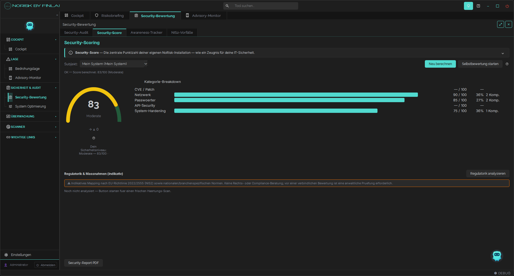

*Abbildung 22: Der Security-Score — der Halbkreis zeigt den gemessenen Gesamtwert und die Stufe, rechts die Aufschlüsselung nach Kategorien mit ihrem Gewicht.*

So lesen Sie die Stufen: 85 bis 100 „Secure" (grün), 65 bis 84 „Moderate" (gelb), 40 bis 64 „At Risk" (orange), unter 40 „Critical" (rot). Fehlt einer Kategorie die Datengrundlage, erscheint sie neutral mit „—/100" und zählt nicht als Verstoß. Ein Pfeil zeigt den Trend gegenüber der letzten Messung.

> **Hinweis:** Manche Prüfungen lassen sich nur mit Administrator-Rechten messen. Solange solche Messungen ausstehen, bleibt der Score gedeckelt, und ein Banner bietet „Mit Admin messen" an. Nicht messbare Punkte gelten immer als neutral, nie als Fehler.

**Alle Funktionen im Detail**

*Kopfbereich und Steuerleiste*

- **Hilfe-Streifen** — klappt Zweck und Deutung der Punktzahl ein; Nutzen: Erklärung direkt an der Anzeige.
- **„Subjekt:" (Auswahlliste)** — schaltet zwischen „Mein System" (Live-Messung) und erfassten Kunden um; Nutzen: dieselbe Ansicht für eigenes und fremdes System, wobei Kundensysteme nie gemessen, sondern nur „erfasst" werden. Ohne hinterlegte Kunden erscheint statt der Liste nur der Name des eigenen Systems.
- **„Neu berechnen"** — misst das eigene System frisch im Hintergrund und aktualisiert Anzeige und Verlauf; Nutzen: gemessene, beweiskräftige Momentaufnahme. Im Kunden-Modus ist der Knopf bewusst gesperrt (kein Scan auf fremdem Rechner).
- **„Selbstbewertung starten"** — öffnet einen Auswahldialog mit zwei Karten; Nutzen: ein Einstieg für zwei ergänzende Bewertungen. Die Karte **„Technische Bewertung"** startet den geführten 5-Schritte-Assistenten (① Klient wählen, ② Prüfbereiche aktivieren, ③ Tests laufen im Hintergrund, ④ Ergebnis mit Aufschlüsselung, ⑤ Report/PDF) über API-Sicherheit, Netzwerk und Zertifikate. Die Karte **„Organisatorische Sicherheit"** startet die Selbstbewertung zu DSGVO, Phishing-Schutz, MFA und Passwort-Manager. Eine nicht verfügbare Karte zeigt statt des Startknopfs einen Schloss-Hinweis (verschwindet nicht spurlos).
- **„Hardening erfassen" (nur im Kunden-Modus)** — öffnet die manuelle Erfassung der Härtungs-Fakten je Kunde als Ja/Nein/Unbekannt-Auswahl; Nutzen: für nicht messbare Fremdsysteme werden dieselben Fakten dokumentiert und mit Herkunft „erfasst" (nie „gemessen") gespeichert.
- **Status-Zeile** — Kurzhinweis wie „Eigenes System — 'Neu berechnen' misst live." oder das Kunden-Ergebnis; Nutzen: Sie wissen jederzeit, was gerade angezeigt wird.

*Mess-Banner (nur wenn nachmessbare Punkte offen sind)*

- **Banner „N Härtungs-Checks noch nicht gemessen"** — nennt in „Betrifft: …", welche Prüfungen nur mit Administratorrechten auslesbar sind; Nutzen: Transparenz, warum der Wert gedeckelt ist.
- **„Mit Admin messen"** — startet über eine Windows-Abfrage (UAC) eine einmalige, mit Adminrechten durchgeführte Nachmessung und führt das Ergebnis fälschungssicher zurück; Nutzen: hebt die Deckelung mit echten Messwerten. Während der Messung zeigt das Banner „Messung läuft …"; bei Fehler oder ausbleibender Rückmeldung (nach 90 Sekunden) erscheint ein ehrlicher Hinweis „Ihr Score wurde nicht verändert" mit „Erneut messen".
- **„Nicht messen"** — markiert die offenen Punkte als bewussten Verzicht; Nutzen: die Punkte drücken transparent die Abdeckung, gelten aber nicht als Verstoß.

*Anzeige des Ergebnisses*

- **Halbkreis-Anzeige (Gauge)** — zeigt die Gesamtpunktzahl 0–100 und die Stufe; die vier Stufenzonen sind gedämpft im Hintergrund sichtbar, der farbige Bogen markiert Ihren Wert; Nutzen: sofortige Einordnung (85–100 „Secure"/grün, 65–84 „Moderate"/gelb, 40–64 „At Risk"/orange, unter 40 „Critical"/rot).
- **Trend-Pfeil neben dem Halbkreis** — ↑ (grün) gestiegen, ↓ (rot) gesunken, → (grau) stabil, dazu die Punkt-Differenz zur letzten Messung; Nutzen: Fortschritt über die Zeit auf einen Blick (ohne Vorgänger: „— kein Vergleich —").
- **Zusammenfassungs-Text** unter dem Halbkreis — kurze Deutung des Ergebnisses; Nutzen: Worteinordnung zur Zahl.
- **„Kategorie-Breakdown" (aufklappbares Panel mit Mini-Balken)** — schlüsselt fünf Kategorien auf: CVE/Patch, Netzwerk, Passwörter, API-Security und System-Hardening, je mit Balken, „Score/100", Gewicht in Prozent und Anzahl geprüfter Komponenten; Nutzen: zeigt genau, welche Kategorie den Gesamtwert zieht (fehlt die Datengrundlage, steht „— / 100" neutral). Bei besonders schweren Funden erscheint zusätzlich der Hinweis „Score gedeckelt von X auf Y" samt Auslöser; Nutzen: eine kritische Lücke verschwindet nicht im Durchschnitt.
- **Aufklapp-Schalter „−/+" (Panel-Kopf)** — blendet die Aufschlüsselung ein/aus; Nutzen: Platz sparen oder Details sehen.

*Regulatorik-Panel*

- **„Regulatorik & Massnahmen (indikativ)" mit „Regulatorik analysieren"** — startet auf Knopfdruck einen Härtungs-Scan und listet je offenem Befund eine Karte mit Prüfname, Schweregrad, indikativem Norm-Bezug (z. B. NIS2/DSGVO), KMU-Priorität und Aufwands-Schätzung; Nutzen: verbindet technische Funde mit ihrer regulatorischen Bedeutung.
- **Disclaimer-Banner** — weist auf „indikativ / keine Rechtsberatung" hin; Nutzen: rechtssichere Einordnung der Hinweise.

*Export*

- **„Security-Report PDF"** — exportiert die zuletzt berechnete Punktzahl samt Verlauf, Kategorien und (falls analysiert) Regulatorik-Befunden als Bericht; Nutzen: belegbarer Nachweis für Prüfung oder Geschäftsleitung.

### 11.3 Awareness-Tracker

**Worum geht es?** Der Awareness-Tracker dokumentiert Mitarbeiter-Schulungen und Phishing-Übungen und verdichtet Melde- und Klickverhalten sowie die Schulungs-Aktualität zu einem Wert für das „menschliche Risiko". So belegen Sie die Awareness-Pflichten nach NIS2 und DSGVO.

**Verstehen.** *Security-Awareness* ist das Sicherheitsbewusstsein der Mitarbeiter. Eine *Phishing-Simulation* ist eine kontrollierte Test-Phishing-Mail; NoRisk erfasst je Kampagne, wie viele Personen angeschrieben wurden, wie viele geklickt und wie viele die Mail gemeldet haben. Das Melden ist bewusst der stärkste positive Faktor.

**Warum so?** Der Mensch ist das häufigste Einfallstor, und nachweisbare Schulung ist zugleich Pflicht und wirksame Prävention.

> **Beispiel:** Eine Mitarbeiterin fällt auf eine gefälschte Rechnungsmail herein, und Erpressungssoftware verschlüsselt Daten. Ohne Tracker fehlt der Beleg, dass überhaupt geschult wurde (zusätzliches Bußgeldrisiko), und die Frühwarnung durch hohe Klickrate bei niedriger Melderate.

**Anwenden.** Oben sehen Sie den Wert für das menschliche Risiko. In den drei Reitern pflegen Sie Mitarbeiter, Schulungen und Phishing-Simulationen. Über „CSV importieren" übernehmen Sie viele Einträge auf einmal; befristete Schulungen erinnern rechtzeitig an ihre Auffrischung.

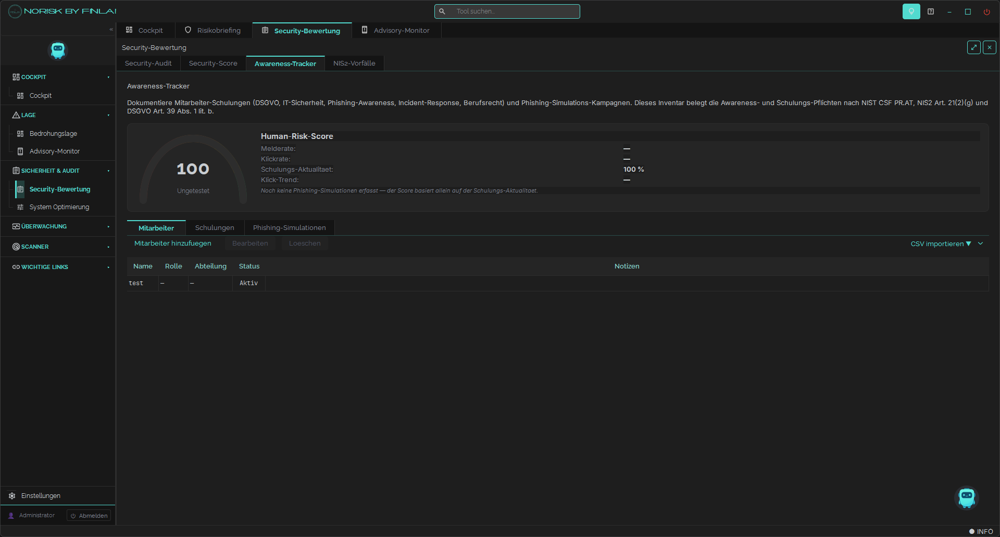

*Abbildung 23: Der Awareness-Tracker — der Anzeigebogen fasst Melderate, Klickrate und Schulungs-Aktualität zusammen; in den Reitern pflegen Sie die Nachweise.*

So lesen Sie den Wert: ab 85 „stark" (grün), 65 bis 84 „solide" (gelb), 40 bis 64 „ausbaufähig" (orange), unter 40 „kritisch" (rot). Liegen noch keine Phishing-Daten vor, steht der Wert neutral auf „ungetestet". Ein rotes oder oranges Banner weist auf abgelaufene oder auslaufende Schulungen hin.

**Alle Funktionen im Detail**

*Kopfbereich — Human-Risk-Score-Übersicht*

- **Halbkreis-Anzeige „Human-Risk-Score"** — verdichtet das „menschliche Risiko" zu einer Punktzahl 0–100 (höher = besser) mit vier Stufen; Nutzen: eine belegbare Kennzahl für die Awareness-Lage (ab 85 „stark"/grün, 65–84 „solide"/gelb, 40–64 „ausbaufähig"/orange, unter 40 „kritisch"/rot; Gewichtung laut Anzeige: Melderate 40 %, Klick-Vermeidung 35 %, Schulung 25 %). Ein Klick springt zum Phishing-Reiter.
- **Kennzahlen-Raster (Melderate, Klickrate, Schulungs-Aktualität, Klick-Trend)** — die Einzelwerte hinter dem Score; Nutzen: zeigt, warum der Score so ausfällt (der „Klick-Trend" ist bewusst nur das Klickraten-Delta, nicht der Gesamttrend).
- **Hinweiszeile** — meldet fehlende Daten, etwa „Noch keine Phishing-Simulationen erfasst — der Score basiert allein auf der Schulungs-Aktualität"; Nutzen: keine Fehldeutung bei dünner Datenlage.

*Reiter „Mitarbeiter"*

- **„Mitarbeiter hinzufuegen" / „Bearbeiten" / „Loeschen"** — pflegt den Personenstamm (Name, Rolle, Abteilung, aktiv/inaktiv, Notizen); Nutzen: die Basis, der Schulungen und Simulationen zugeordnet werden. „Löschen" entfernt auch alle zugehörigen Schulungen.
- **„CSV importieren ▼" (Auswahlmenü Mitarbeiter / Schulungen)** — übernimmt viele Einträge auf einmal aus einer Datei; Nutzen: schneller Erststart ohne Handarbeit; nach dem Lauf erscheint „X importiert, Y übersprungen".
- **Tabelle (Name, Rolle, Abteilung, Status, Notizen)** — Überblick der Belegschaft; Nutzen: Auswahl und Kontrolle auf einen Blick. „Bearbeiten"/„Löschen" werden erst mit ausgewählter Zeile aktiv.

*Reiter „Schulungen"*

- **Renewal-Banner** — fasst abgelaufene und in den nächsten 60 Tagen auslaufende Schulungen zusammen und färbt sich grün/orange/rot; Nutzen: rechtzeitige Warnung vor Nachschulungsbedarf.
- **„Renewal-Liste anzeigen"** — filtert die Tabelle auf renewal-pflichtige Schulungen; Nutzen: direkt zur Handlungsliste.
- **„Renewals als .ics exportieren"** — erzeugt Kalendertermine der fälligen Auffrischungen; Nutzen: Erinnerungen wandern in den eigenen Kalender.
- **Filter „Mitarbeiter" und „Status"** — grenzt die Liste nach Person bzw. Zustand ein (Alle, Nur Renewal, Aktuell, Läuft aus, Abgelaufen, Permanent); Nutzen: gezielt finden statt scrollen.
- **„Schulung hinzufuegen" / „Bearbeiten" / „Loeschen"** — erfasst Schulungen mit Typ (DSGVO-Grundlagen, IT-Sicherheit, Phishing-Awareness, Incident-Response, Berufsrecht, Custom), Titel, Abschlussdatum, Gültigkeit, Anbieter; Nutzen: nachweisbare Schulungshistorie je Person. (Ohne angelegten Mitarbeiter erscheint erst ein Hinweis.)
- **Tabelle (Mitarbeiter, Typ, Titel, Abgeschlossen, Gültig bis, Status, Anbieter)** — die Schulungsnachweise; Nutzen: der Beleg für Prüfungen (Status als Wort: Aktuell/Läuft aus/Abgelaufen/Permanent).

*Reiter „Phishing-Simulationen"*

- **Drei KPI-Karten (Kampagnen, Durchschnittl. Klick-Rate, Trend)** — verdichten die Kampagnen-Historie; Nutzen: der Reifegrad der Belegschaft in Zahlen.
- **Klick-Raten-Trend-Diagramm** — zeigt die Entwicklung der Klickrate über die Zeit; Nutzen: macht Verbesserung oder Rückschlag sichtbar (ab zwei Kampagnen; darunter ein Hinweis).
- **„Kampagne hinzufuegen" / „Bearbeiten" / „Loeschen"** — erfasst je Test-Phishing-Kampagne Name, Anbieter, Datum, Zahl der Angeschriebenen (Targets), Klicks, Meldungen (Reports) und ob nachgeschult wurde; Nutzen: das Melden als stärkster positiver Faktor wird messbar dokumentiert.
- **Tabelle (Datum, Kampagne, Anbieter, Targets, Klicks, Klick-Rate, Reports, Nachgeschult)** — alle Kampagnen im Detail; Nutzen: Nachweis und Nachverfolgung je Übung.

*Übergreifend*

- **Automatische Score-Auffrischung beim Reiterwechsel** — nach jeder Änderung wird die Kopf-Übersicht neu berechnet; Nutzen: die Kennzahl bleibt ohne Zutun aktuell.

### 11.4 NIS2-Vorfälle

**Worum geht es?** Das NIS2-Werkzeug führt einen erheblichen Sicherheitsvorfall entlang der gesetzlichen Meldekette (24 Stunden, 72 Stunden, 30 Tage) mit einem mitlaufenden Countdown und erzeugt Meldevorlagen für die zuständige Stelle. Es meldet nicht selbst, sondern bereitet die Meldung prüffähig vor.

**Verstehen.** *NIS2* ist die EU-Richtlinie zur Cybersicherheit. Ab dem Erkennungszeitpunkt eines erheblichen Vorfalls gelten drei Fristen: eine *Frühwarnung* binnen 24 Stunden, eine *Meldung* binnen 72 Stunden und ein *Abschlussbericht* binnen 30 Tagen. NoRisk protokolliert den Verlauf fälschungssicher: Jeder Schritt wird angehängt und lässt sich nachträglich nicht mehr unbemerkt ändern.

**Warum so?** Fristen und ein manipulationssicherer Nachweis sind gesetzlich verlangt, und die Geschäftsleitung haftet persönlich.

> **Beispiel:** Wird die 24-Stunden-Frühwarnung versäumt, ist das ein eigenständiger Verstoß — selbst wenn der Vorfall harmlos endet. Und ein nachträglich „geglätteter" Verlauf wäre von einer echten Chronologie nicht mehr zu unterscheiden, gäbe es die fälschungssichere Kette nicht.

**Anwenden.** Über „Neuer Vorfall" legen Sie einen Vorfall an (mit Erkennungszeitpunkt, der die Fristen verankert). Der Reiter „Offene Vorfälle" zeigt links die Liste und rechts eine Zeitleiste mit Countdown; über „Phase bearbeiten / einreichen" füllen Sie die Pflichtangaben je Stufe aus, und „Meldevorlage exportieren" erzeugt das PDF für die Behörde.

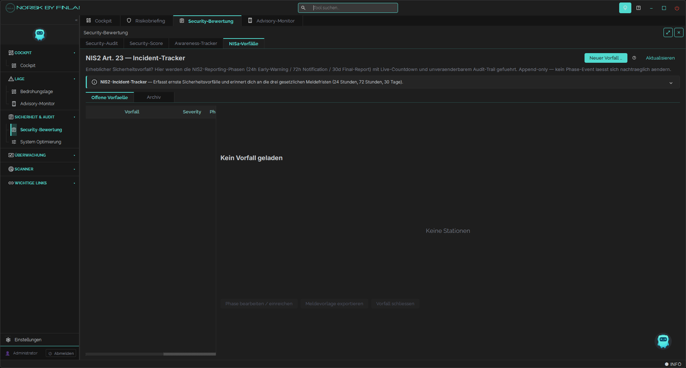

*Abbildung 24: Der NIS2-Vorfall-Tracker — er führt die drei Meldefristen (24 Stunden, 72 Stunden, 30 Tage) mit Live-Countdown und einem fälschungssicheren Protokoll.*

So lesen Sie das Ergebnis: Der Schweregrad reicht von NIEDRIG bis KRITISCH. Die Spalte „nächste Frist" färbt sich orange, wenn weniger als sechs Stunden bleiben, und rot bei abgelaufener Frist. Das Archiv enthält abgeschlossene Vorfälle schreibgeschützt.

**Alle Funktionen im Detail**

*Kopfbereich*

- **„Neuer Vorfall …"** — öffnet das Anlage-Formular für einen erheblichen Sicherheitsvorfall; Nutzen: startet die fristengebundene Meldekette.
- **„Aktualisieren"** — lädt Vorfälle und Countdowns neu; Nutzen: aktueller Fristenstand.
- **Info-Text + Hilfe-Streifen** — erklären die drei Meldephasen und das append-only-Prinzip (kein Phase-Ereignis lässt sich nachträglich ändern); Nutzen: Kontext und Vertrauen in den Nachweis.

*Zwei Reiter mit geteilter Ansicht*

- **„Offene Vorfaelle" / „Archiv"** — trennt laufende von abgeschlossenen (schreibgeschützten) Vorfällen; Nutzen: klarer Fokus auf das, was noch Handlung braucht. Jeder Reiter zeigt links die Liste, rechts die Zeitleiste.
- **Listenspalten (Vorfall, Severity, Phase, Nächste Frist, Erkannt am (UTC))** — Severity ist eingefärbt (NIEDRIG bis KRITISCH), „Nächste Frist" färbt sich orange bei unter sechs Stunden Restzeit und rot bei Ablauf; Nutzen: die dringendsten Vorfälle stehen oben und stechen hervor.

*Zeitleiste (Detail rechts)*

- **Kopf mit Titel, Severity-Pille und Status-Pille** — die Status-Pille zeigt „offen", „Entwurf vollständig — bereit zum Einreichen" oder „geschlossen"; Nutzen: Sie sehen sofort, ob nur noch das Einreichen fehlt.
- **Sechs Phasen-Stationen (Detect, Triage, 24h Early-Warning, 72h Notification, 30d Final-Report, Post-Incident) mit Live-Countdown** — bilden den gesamten NIS2-Ablauf ab und zählen sekündlich zur nächsten Frist herunter; Nutzen: keine Frist geht unbemerkt verloren.
- **Anleitungs-Kasten zur aktuellen Phase** — nennt sichtbar, was in dieser Phase an die zuständige Stelle (CSIRT) muss; Nutzen: Handlungswissen statt nur einer Uhr.
- **„Phase bearbeiten / einreichen" (bzw. „Phase einreichen →")** — öffnet das Pflichtformular der aktuellen Phase; ist der Entwurf vollständig, ruft der hervorgehobene Knopf zum Einreichen; Nutzen: strukturierte, prüffähige Bearbeitung Schritt für Schritt.
- **„Meldevorlage exportieren"** — auch im Archiv nutzbar; Nutzen: der prüffähige Nachweis bleibt jederzeit abrufbar.
- **„Vorfall schliessen"** — schließt den Vorfall unumkehrbar, der Audit-Trail bleibt erhalten; Nutzen: sauberer Abschluss ohne Verlust der Chronologie.

*Neuer-Vorfall-Formular*

- **„Customer-Audit" (Pflicht-Auswahl)** — verknüpft den Vorfall mit einem bestehenden Audit; Nutzen: klare Zuordnung zum betroffenen Subjekt.
- **„Titel" (Pflicht)** — kurze Bezeichnung; Nutzen: Wiedererkennung in Liste und Meldung.
- **„Schweregrad" (LOW/MEDIUM/HIGH/CRITICAL, Vorgabe HIGH)** — Ersteinstufung; Nutzen: steuert Priorität und Sortierung.
- **„Erkannt am" (Datum/Uhrzeit in UTC)** — der Anker für alle Fristen; Nutzen: die 24-/72-Stunden- und 30-Tage-Uhren starten korrekt.
- **„Beschreibung" + „Bearbeiter" (optional)** und **PII-Hinweis** — Kontext und Zuordnung; der Hinweis mahnt zur Datensparsamkeit im fälschungssicheren Trail; Nutzen: Nachvollziehbarkeit ohne unnötige personenbezogene Daten.

*Phasen-Pflichtformular*

- **Dynamische Felder je Phase** — passende Eingaben (Text, Datum in UTC, Ja/Nein/Unbekannt, Zahlen, Listen) mit sichtbarem „Was-zu-tun"-Hilfetext; Nutzen: Sie füllen genau das aus, was die jeweilige Frist verlangt.
- **DSGVO-Warnung in der 72h-Phase** — weist darauf hin, dass bei Personenbezug parallel die 72-Stunden-Frist der Datenschutzbehörde läuft; Nutzen: keine übersehene Doppelmeldung.
- **„Entwurf speichern"** — sichert den Zwischenstand ohne Pflichtprüfung; Nutzen: in Ruhe weiterarbeiten. **„Phase einreichen"** — prüft die Pflichtfelder und schreibt ein unveränderliches Ereignis in die Kette; Nutzen: verbindlicher, prüffähiger Schritt (fehlende Felder werden inline gemeldet).

*Meldevorlage-Export*

- **Fristen-Auswahl (24h-Frühwarnung / 72h-Meldung / 30d-Abschlussbericht)** — bestimmt, für welche Stufe die Vorlage gebaut wird; Nutzen: die richtige Vorlage zur richtigen Frist.
- **Speichern als PDF (Standard), Markdown oder Text** — mit Zwischenablage als Ausweich, falls kein Speicherort gewählt wird; Nutzen: FINLAI-gebrandetes PDF für die Akte oder Text zum Einfügen ins Behördenportal.

### 11.5 System Optimierung

**Worum geht es?** Die System Optimierung nimmt Windows-Datenschutz- und Telemetrie-Einstellungen auf und bewertet sie mit einem Datenschutz-Wert. Sie sagt ehrlich, was Ihre Windows-Ausgabe überhaupt zulässt, und schützt kritische Dienste vor versehentlichem Abschalten.

**Verstehen.** *Telemetrie* sind Nutzungs- und Diagnosedaten, die Windows automatisch an den Hersteller sendet. Eine Besonderheit ist die *Ehrlichkeit bei der Windows-Ausgabe*: Die Stufe „Aus" wirkt nur bei den Ausgaben Enterprise und Education; bei den Ausgaben Home und Pro behandelt Windows „Aus" wie „Erforderlich". Werkzeuge, die auf diesen Ausgaben „telemetriefrei" versprechen, sagen also die Unwahrheit.

**Warum so?** Weniger Datenabfluss ist gelebte Datenminimierung; zugleich schützt eine feste Sperrliste kritische Dienste (Virenschutz, Update, Firewall) davor, von übereifrigen „Optimierern" lahmgelegt zu werden.

> **Beispiel:** Ein aggressives Fremd-Werkzeug meldet auf Windows Home „Telemetrie aus" — real ignoriert Windows das, und der Nutzer wiegt sich in falscher Sicherheit, während dasselbe Werkzeug womöglich den Virenschutz deaktiviert. Die System Optimierung sagt die Wahrheit über die Ausgabe und lässt kritische Dienste unangetastet.

**Anwenden.** Beim Öffnen läuft eine reine Bestandsaufnahme (ohne besondere Rechte). Oben steht der Datenschutz-Wert und ein ehrlicher Hinweis zu Ihrer Windows-Ausgabe; darunter listet die Tabelle jede Empfehlung mit Kategorie, Risiko, Ist- und Soll-Zustand und Status.

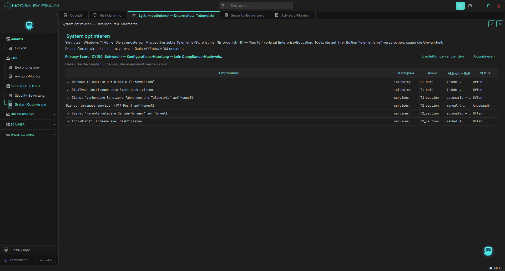

*Abbildung 25: Die System Optimierung — der Banner nennt die von der Windows-Ausgabe erlaubte Telemetrie-Stufe, darunter der Datenschutz-Wert und die Liste der Empfehlungen.*

So lesen Sie das Ergebnis: Der Datenschutz-Wert reicht von „schwach" bis „gut"; der Status je Zeile lautet „offen", „angewandt" oder „unbekannt". Nur „offene" Zeilen lassen sich ankreuzen.

> **Achtung:** In dieser Version ist das tatsächliche **Anwenden** von Änderungen bewusst noch deaktiviert (die rechtliche und sicherheitstechnische Freigabe steht aus). Sie können den Ablauf durchspielen, es wird jedoch nichts verändert — ein entsprechender Hinweis erscheint. Nutzbar ist heute die read-only Bestandsaufnahme und die Bewertung. Der Datenschutz-Wert ist eine Härtungs-Kennzahl, kein Compliance-Nachweis.

**Alle Funktionen im Detail**

*Kopfbereich*

- **Ehrlichkeits-Banner zur Windows-Ausgabe** — nennt die von Ihrer Windows-Ausgabe tatsächlich erlaubte Telemetrie-Stufe; Nutzen: keine Scheinsicherheit, denn auf Home/Pro wirkt „Aus" nur wie „Erforderlich".
- **Verwaltungs-Status-Zeile** — zeigt, ob Einstellungen zentral (z. B. per Gruppenrichtlinie) verwaltet werden; Nutzen: erklärt, warum manches nicht änderbar ist.
- **„Privacy-Score: N/100 (Bewertung) — Disclaimer"** — verdichtet die Datenschutz-Lage zu einer Kennzahl mit Wort-Einstufung und Klarstellung, dass dies eine Härtungs-Kennzahl und kein Compliance-Nachweis ist; Nutzen: Fortschritt messbar, ohne falsche Versprechen.
- **„Aktualisieren"** — führt den reinen, rechtefreien Lese-Scan erneut aus; Nutzen: aktueller Ist-Zustand ohne Systemeingriff.

*Empfehlungstabelle*

- **Spalten (Empfehlung, Kategorie, Risiko, Aktuell → Soll, Status)** — je Einstellung der geprüfte Ist- und der empfohlene Soll-Zustand; Nutzen: Sie sehen genau, was sich ändern würde. Der Status lautet „Angewandt", „Offen" oder „Unbekannt".
- **Häkchen in Spalte „Empfehlung" (nur bei „Offen")** — wählt die anzuwendenden Empfehlungen einzeln aus (offene sind vorab angehakt); Nutzen: gezielte Auswahl statt Alles-oder-Nichts. Bereits angewandte oder nicht auslesbare Zeilen sind nicht ankreuzbar.
- **Hinweiszeile „Haken Sie die Empfehlungen an …"** — Bedienhinweis; Nutzen: klare Erwartung, bevor Sie anwenden.

*Anwenden (mehrstufig, fail-closed)*

- **„Empfehlungen anwenden"** — startet den Anwenden-Ablauf für die angehakten Punkte; Nutzen: ein einziger Einstieg, der Sie sicher durch die Schutzstufen führt. Ohne Auswahl erscheint ein Hinweis.
- **Zustimmungs-Dialog** — zeigt beim ersten Mal (und nach Textänderungen) den vollständigen, scrollbaren Nutzungshinweis; „Zustimmen" wird erst nach dem Häkchen „Ich habe den Hinweis gelesen und stimme zu" aktiv; Nutzen: bewusste, dokumentierte Einwilligung vor jedem Eingriff.
- **Bestätigungs-Dialog** — listet noch einmal alle Änderungen als „Titel — Ist → Soll", weist auf den zuvor erstellten Wiederherstellungspunkt und die Umkehrbarkeit hin und kündigt die Administrator-Abfrage (UAC) an; Nutzen: letzte Kontrolle mit klarer Rückfall-Option, bevor etwas passiert.
- **Ergebnis-Meldung** — fasst nach dem Lauf zusammen: „Angewandt: X · Abgelehnt/gesperrt: Y · Fehlgeschlagen: Z" samt Begründungen; Nutzen: der Ausgang ist sichtbar, nicht stumm. In dieser Version bleibt der eigentliche Eingriff jedoch gesperrt („noch nicht freigegeben") — der Ablauf ist vollständig durchspielbar, verändert aber nichts am System; anschließend wird der Ist-Zustand neu eingelesen.

---

## 12. Einstellungen

**Worum geht es?** In den Einstellungen passen Sie NoRisk an, verwalten Benutzer, hinterlegen optionale Zugangsschlüssel und steuern, ob und welche externen Abrufe erlaubt sind. Sie erreichen die Einstellungen jederzeit über die Schaltfläche ganz unten in der Seitenleiste.

**Verstehen.** Die Einstellungen sind in eine zweizeilige Reiterleiste gegliedert: Die obere Zeile betrifft allgemeine Themen (Erscheinungsbild, Links, Konto, Recht, KI-Verzeichnis), die untere die Werkzeug-Details (KI, Zugangsschlüssel, Feeds, Patchmonitor, Netzwerk, Compliance-Export).

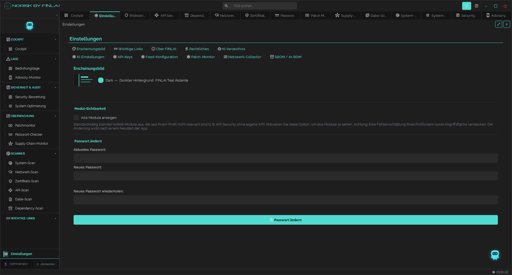

*Abbildung 26: Die Einstellungen — oben die allgemeinen Reiter, darunter die Werkzeug-Reiter; sichtbar ist „Erscheinungsbild" mit Theme, Modul-Sichtbarkeit und Passwortänderung.*

Die wichtigsten Reiter im Überblick:

- **Erscheinungsbild** — das dunkle Design (das derzeit einzige), die Option „Alle Module anzeigen" (blendet profilbedingt versteckte Werkzeuge wieder ein) und das Ändern des eigenen Passworts.
- **Wichtige Links** — kuratierte Fachquellen (etwa BSI, NVD) sowie eigene, frei ergänzbare Links, die dann in der Seitenleiste erscheinen.
- **Über FINLAI** — Ihr Konto (angemeldet als, Rolle, letzter Login) und, nur für Administratoren, die **Benutzerverwaltung**.
- **Rechtliches** — Nutzungsvereinbarung und Datenschutzerklärung zum Nachlesen sowie „Zustimmung zurückziehen".
- **KI-Verzeichnis** — eine Übersicht aller KI-Einsätze und ein Protokoll der letzten KI-Aktionen (im Sinne der Nachvollziehbarkeit nach der EU-KI-Verordnung).
- **KI-Einstellungen** — die Anbindung an das lokale KI-Programm (Ollama), inklusive Modell-Auswahl.
- **Zugangsschlüssel** — optionale, verschlüsselt gespeicherte Schlüssel für bessere Abfrage-Kontingente (Schwachstellen-Datenbank) und den optionalen Datei-Hash-Abgleich.
- **Feed-Konfiguration** — der zentrale Schalter für den Offline-Modus (siehe unten).
- **Patchmonitor**, **Netzwerk-Collector**, **Compliance-Export** — Voraussetzungen und Zusatzfunktionen der jeweiligen Werkzeuge.

**Alle Funktionen im Detail**

Die Einstellungen sind in eine **zweizeilige Reiterleiste** gegliedert: oben die allgemeinen Reiter (Erscheinungsbild, Wichtige Links, Über FINLAI, Rechtliches, KI-Verzeichnis), unten die Werkzeug-Reiter (KI-Einstellungen, API-Keys, Feed-Konfiguration, Patch-Monitor, Netzwerk-Collector, SBOM/AI-BOM). Nur „Erscheinungsbild" wird sofort geladen, die übrigen erst beim Anklicken (schneller Start).

*Reiter „Erscheinungsbild"*

- **Design-Auswahl** — Radioschalter „Dark — Dunkler Hintergrund · FINLAI Teal Akzente" mit Mini-Farbvorschau (derzeit ist nur das dunkle Design verfügbar, das helle wurde entfernt); Nutzen: einheitliches, augenschonendes Aussehen.
- **Kästchen „Alle Module anzeigen" (Modul-Sichtbarkeit)** — hebt das profilbedingte Ausblenden von Werkzeugen auf; Nutzen: Sie sehen auch Werkzeuge, die laut Ihrem Profil eigentlich nicht relevant wären (die Änderung wirkt nach einem Neustart; ein Warnhinweis erklärt, dass eine Fehleinschätzung sonst Angriffsfläche verstecken kann).
- **Bereich „Passwort ändern"** — Felder „Aktuelles Passwort", „Neues Passwort" (mit lebender Stärke-Anzeige Schwach/Mittel/Stark), „Neues Passwort wiederholen" und Schaltfläche „Passwort ändern" (mindestens 6 Zeichen); Nutzen: Sie ändern Ihr eigenes Kennwort sicher und mit sofortiger Rückmeldung.

*Reiter „API-Keys" (Zugangsschlüssel)*

- **Abschnitt „NVD API-Key (kostenlos)"** — Schaltfläche „Zur NVD-Registrierung", Eingabefeld (verdeckt, UUID-Format) mit Anzeigen-/Verstecken-Umschalter und „Speichern"; Statuszeile „API-Key gespeichert." bzw. „Kein API-Key — limitierte Anfragen (5/30s)."; Nutzen: mit Schlüssel deutlich höhere Abfragekontingente (50 statt 5 Anfragen je 30 Sekunden) für CVE-Abrufe.
- **Abschnitt „VirusTotal API-Key (optional)"** — Registrierungs-Schaltfläche, verdecktes Eingabefeld (64-stelliger Hex-Schlüssel) mit Anzeigen-Umschalter, „Speichern" und „Löschen", plus Statuszeile; Nutzen: schaltet im Datei-Scanner den optionalen Abgleich eines Datei-Prüfwerts (SHA-256-Hash) frei — es wird **nur** der Hash übertragen, nie die Datei. Alle Schlüssel liegen verschlüsselt im sicheren Speicher.

*Reiter „Feed-Konfiguration" (Offline-Modus)*

- **Hauptschalter „Externe Abrufe erlauben (Online-Modus)"** — der zentrale Datenschutz-Schalter; beim Ausschalten erscheint eine Sicherheitsabfrage; Nutzen: im Offline-Modus unterbleiben alle automatischen externen Abrufe (übertragen wird ohnehin nur Ihre IP-Adresse bzw. ein Prüfwert, keine Inhalte) — die Schutzwirkung sinkt dann aber spürbar.
- **Gruppe „Consumer-Feeds (KI-Briefing)"** — einzeln zuschaltbare Quellen mit Kurzbeschreibung: **BSI / CERT-Bund WID**, **Microsoft Security Update Guide**, **Chrome Releases**, **Mozilla Security Blog**, **Watchlist Internet (Österreich)**; Nutzen: Sie bestimmen, welche Quellen das KI-Briefing auswertet. Im Offline-Modus ist diese Gruppe ausgegraut.

*Reiter „Netzwerk-Collector"*

- **Erläuterung + Datenschutzhinweis** — beschreibt, dass eine geplante Windows-Aufgabe die Netzwerk-Erfassung bei jeder Anmeldung startet und dass nur lokale Verbindungs-Metadaten für höchstens 48 Stunden erfasst werden (keine Inhalte, keine Weitergabe); Nutzen: volle Transparenz vor der Aktivierung.
- **Status-Zeile** — zeigt „aktiv", „nicht aktiv", „eingerichtet, läuft aber nicht" oder „zeigt auf veralteten Build-Pfad" samt Ampel-Symbol, dazu den Ziel-Startpfad; Nutzen: Sie erkennen den genauen Zustand.
- **Schaltfläche „Hintergrund-Erfassung aktivieren"** — richtet die Aufgabe ein (einmalige Windows-Rückfrage nach Administratorrechten); Nutzen: dauerhafte Erfassung ohne Kommandozeile.
- **Schaltfläche „Deaktivieren"** — entfernt die Aufgabe; Nutzen: die Erfassung startet nicht mehr automatisch.
- **Schaltfläche „Status aktualisieren"** — liest den Zustand neu ein; Nutzen: Kontrolle nach Änderungen.

*Reiter „SBOM / AI-BOM" (Compliance-Export)*

- **Abschnitt „SBOM — Software-Stückliste (CycloneDX 1.5)"** mit Schaltfläche „SBOM erzeugen und exportieren …" — erstellt eine maschinenlesbare Liste aller Software-Bestandteile; Nutzen: Vorlage bei Audits und Behörden (EU Cyber Resilience Act, NIS2, BSI).
- **Abschnitt „AI-BOM — KI-Stückliste (EU AI Act)"** mit Schaltfläche „AI-BOM erzeugen und exportieren …" — erstellt eine Übersicht der eingesetzten KI-Komponenten (die lokalen Ollama-Modelle) mit Zweck und Datenflussrichtung; Nutzen: Nachweis der KI-Nutzung nach der EU-KI-Verordnung. Beide öffnen einen „Speichern-unter"-Dialog und melden die Anzahl der erfassten Komponenten.

*Reiter „KI-Verzeichnis"* (zwei innere Reiter)

- **Innerer Reiter „KI-Verzeichnis"** — Tabelle aller KI-Einsätze (Name, Kategorie, Modell, Lokal/Cloud, Zweck, Human Review, Zuletzt aktiv) mit „Aktualisieren" und „Als PDF exportieren"; Cloud-Einträge werden hervorgehoben; Nutzen: Nachvollziehbarkeit nach EU-KI-VO Art. 4.
- **Innerer Reiter „KI-Audit-Trail"** — die letzten 50 KI-Aktionen (Zeitpunkt, Tool, Aktion, Modell, Zeichen ein/aus, Erfolg) mit Filter „Alle / Nur Fehler / Nur Chat", „Aktualisieren" und „Als CSV exportieren"; Nutzen: prüfbares Protokoll — es werden ausschließlich Metadaten geloggt, keine Inhalte, keine personenbezogenen Daten.

*Reiter „KI-Einstellungen"*

- **Abschnitt „Provider"** — fest „Ollama (Lokal)" mit Status „Verbunden — N Modell(e) installiert" bzw. „Nicht erreichbar — ollama serve starten"; Nutzen: klarer Verbindungsstatus (NoRisk arbeitet ausschließlich lokal, keine Cloud-KI).
- **Auswahl „Modell" + Aktualisieren-Symbol** — wählt das lokale Sprachmodell; ein Empfehlungskasten „Gemma 3 von Google" (mit „ollama pull gemma3" und „Mehr erfahren") erscheint, wenn kein empfohlenes Modell installiert ist; Nutzen: geführte Modellauswahl.
- **Regler „Temperatur" und Auswahl „Max. Tokens"** — steuern Kreativität und Antwortlänge; Nutzen: Feineinstellung für erfahrene Nutzer.
- **Schaltflächen „Speichern" und „Zurücksetzen"** — sichern die Einstellungen bzw. stellen Standardwerte her; Nutzen: jederzeit rückholbare Defaults.

*Reiter „Rechtliches"*

- **Zeilen „Nutzungsvereinbarung" und „Datenschutzerklärung (DSGVO)"** — je mit Version und Zustimmungsdatum („Zugestimmt am … um … Uhr") sowie Schaltfläche „Anzeigen" (öffnet das Dokument nur zum Lesen); Nutzen: Sie können jederzeit nachlesen, wem und wann Sie zugestimmt haben.
- **Abschnitt „Zustimmung zurückziehen"** — Schaltfläche „Zustimmung zurückziehen" mit Sicherheitsabfrage; Nutzen: Sie widerrufen Ihre Einwilligung — NoRisk wird dann beendet und verlangt beim nächsten Start eine erneute Zustimmung.

*Reiter „Über FINLAI" (Benutzerkonto und Benutzerverwaltung)*

- **Bereich „Benutzerkonto"** — zeigt „Angemeldet als", „Benutzername", „Rolle" (Administrator/Benutzer) und „Letzter Login"; Nutzen: schneller Überblick über das eigene Konto.
- **Schaltfläche „Benutzerverwaltung"** — nur für Administratoren sichtbar, öffnet die Verwaltung aller Benutzer und ihrer Werkzeug-Rechte; Nutzen: zentrale Konto- und Rechteverwaltung.

*Anzeige-Modus (einfach/fachlich)*

- **Umschalter „Anzeige-Modus" (Glühbirnen-Symbol in der oberen Leiste)** — schaltet die ganze Anwendung zwischen „Einfach" (mehr Erklärungen) und „Profi" (knappe Fachsprache); Nutzen: Sie passen die Erklärtiefe an Ihr Wissen an (Details in Kapitel 13). Diese Umschaltung sitzt bewusst nicht in den Einstellungen, sondern immer erreichbar oben rechts.

> **Hinweis:** Eine eigene **Lizenz**-Verwaltung gibt es in dieser Version nicht mehr — mit der Umstellung auf ein lokal betriebenes Einzelplatz-Modell (ADR-033) wurden Lizenzstatus, -stufe und die frühere Schaltfläche „Lizenz verwalten" aus den Einstellungen entfernt.

### 12.1 Der Offline-Modus

Der Reiter **Feed-Konfiguration** enthält den wichtigsten Datenschutz-Schalter der Anwendung: „Externe Abrufe erlauben (Online-Modus)". Ist er eingeschaltet, ruft NoRisk aktuelle Bedrohungs- und Schwachstellen-Informationen ab; ausgeschaltet (Offline-Modus) unterbleiben alle automatischen externen Abrufe.

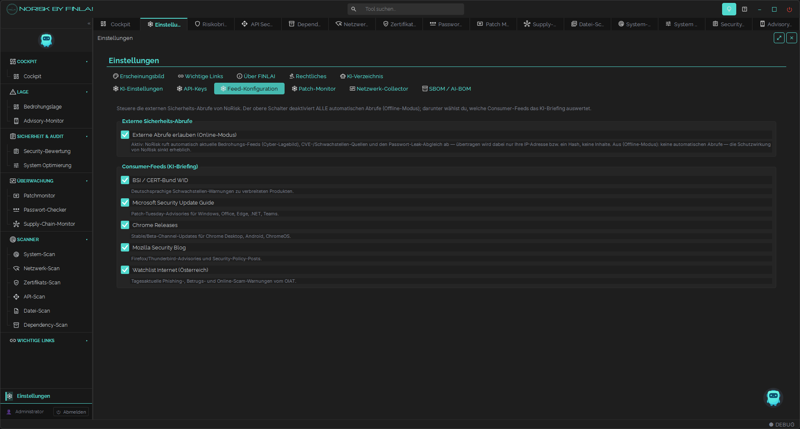

*Abbildung 27: Die Feed-Konfiguration — der obere Schalter aktiviert oder deaktiviert alle externen Abrufe; darunter wählen Sie einzeln, welche Quellen das KI-Briefing auswertet.*

> **Achtung:** Im Offline-Modus fehlen aktuelle Bedrohungs-, Schwachstellen- und Leak-Informationen — die Schutzwirkung sinkt spürbar. Bei den betroffenen Werkzeugen erscheint dann statt eines Ergebnisses der Hinweis „Externe Abrufe deaktiviert (Einstellungen)". Wählen Sie den Offline-Modus nur bewusst, etwa in besonders abgeschotteten Umgebungen.

> **Hinweis:** Bei externen Abrufen überträgt NoRisk ausschließlich Metadaten oder Prüfwerte (Ihre IP-Adresse an die Feed-Quellen, den Prüfwert einer Datei an einen Analyse-Dienst, ein kurzes Präfix beim Passwort-Leak-Abgleich) — niemals Datei- oder Fachinhalte und niemals Passwörter. Es gibt weder einen Auto-Update-Dienst noch eine Lizenz-Anbindung nach außen.

---

## 13. Der FINLAI-Assistent und die Hilfe

**Worum geht es?** NoRisk bringt eine eingebaute Hilfe mit: ein durchsuchbares Handbuch und einen lokalen KI-Assistenten, der Fragen zur Bedienung und zu IT-Sicherheit beantwortet.

**Verstehen.** Der Assistent ist eine künstliche Intelligenz, die vollständig auf Ihrem Gerät läuft (über das Programm Ollama). Ihre Fragen und die Antworten verlassen den Computer nicht. Als Wissensgrundlage dient dieses Handbuch und ein kuratierter Sicherheits-Wissensschatz.

**Warum so?** Eine lokale Hilfe schützt vertrauliche Fragestellungen und funktioniert auch ohne Internet — passend zum lokalen Grundprinzip von NoRisk.

**Anwenden.** Sie öffnen die Hilfe auf mehreren Wegen: mit der Taste F1, über das Fragezeichen-Symbol oben rechts oder über den schwebenden Roboter (das FINLAI-Maskottchen) unten rechts. Das Fenster hat zwei Reiter.

Im Reiter **Handbuch** wählen Sie links ein Werkzeug aus, suchen oben nach einem Stichwort und schalten mit „Einfach erklärt" zwischen laienfreundlicher und fachlicher Darstellung um.

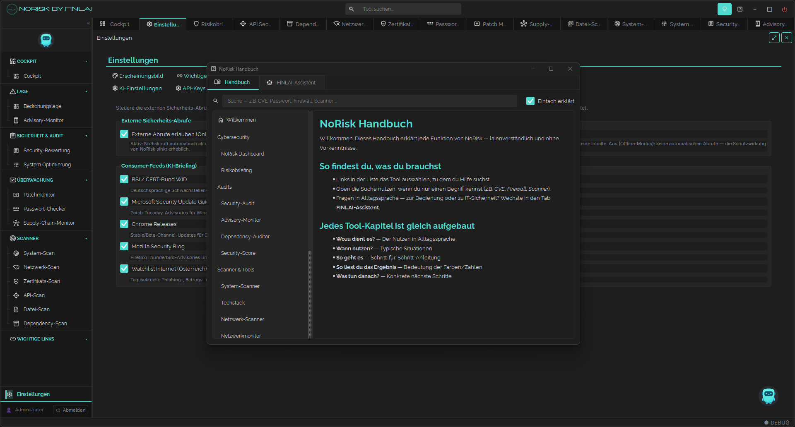

*Abbildung 28: Das eingebaute Handbuch — jedes Werkzeug wird nach demselben Schema erklärt (Wozu, Wann, So geht es, So lesen Sie das Ergebnis, Was tun danach).*

Im Reiter **FINLAI-Assistent** stellen Sie Ihre Frage im Eingabefeld und senden sie mit der Eingabetaste. Die Antwort erscheint Wort für Wort; ein Belege-Bereich zeigt, worauf sie sich stützt.

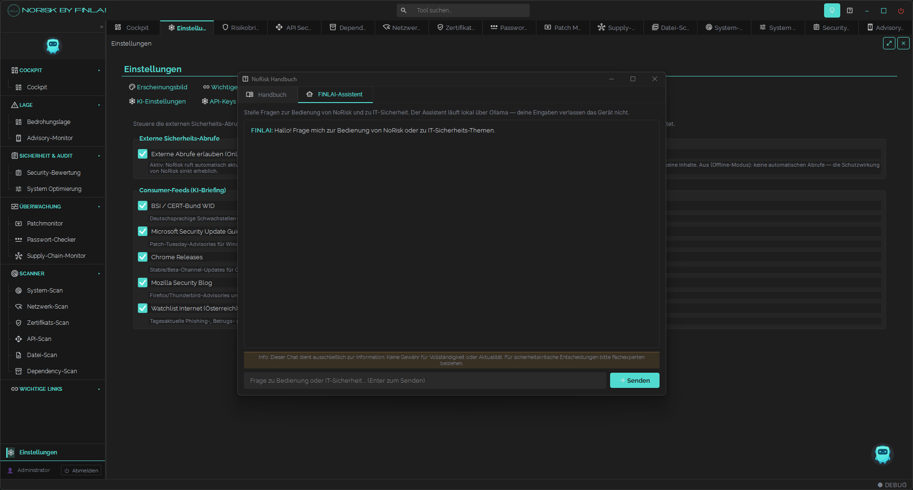

*Abbildung 29: Der FINLAI-Assistent — er läuft lokal über Ollama; die Eingaben verlassen das Gerät nicht.*

> **Hinweis:** Für den Assistenten muss das lokale KI-Programm Ollama installiert sein und ein Sprachmodell bereitstehen. Ist das nicht der Fall, führt Sie NoRisk mit einem Download-Hinweis durch die Einrichtung. Der Assistent dient ausschließlich der Information; für sicherheitskritische Entscheidungen ziehen Sie bitte Fachleute hinzu.

> **Tipp:** Das kleine Glühbirnen-Symbol oben rechts schaltet den Anzeige-Modus der ganzen Anwendung zwischen „Einfach" und „Profi" um. Im einfachen Modus erhalten Sie mehr Erklärungen, im Profi-Modus knappere Fachsprache. Ein eigenes Schlüssel-Symbol gibt es in der oberen Leiste nicht — Funktionen rund um Passwörter finden Sie in den Einstellungen.

**Alle Funktionen im Detail**

*So öffnen Sie die Hilfe (drei Wege)*

- **Taste F1** — globales Tastenkürzel, öffnet das Handbuch-Fenster von überall in der App; Nutzen: Hilfe ohne Mausweg.
- **Fragezeichen-Symbol oben rechts** — Schaltfläche in der Titelleiste (Tooltip „Handbuch öffnen (F1)"); Nutzen: der klassische, immer sichtbare Hilfe-Knopf.
- **Schwebendes FINLAI-Maskottchen (unten rechts)** — der runde Roboter-Knopf öffnet dasselbe Fenster; er ist frei verschiebbar (die Position wird gemerkt) und ein zweiter Klick schließt das Fenster wieder (Tooltip „Ich bin FINLAI — Handbuch & KI-Chat. Du kannst mich verschieben."); Nutzen: die Hilfe ist immer griffbereit und lässt sich aus dem Weg schieben.
- **Kleine „?"-Knöpfe direkt an Bedienelementen** — an vielen Feldern/Reitern; Nutzen: Kurzhilfe genau dort, wo eine Frage entsteht.

*Reiter „Handbuch"*

- **Suchfeld** — Volltextsuche über alle Kapitel (Platzhalter „Suche — z.B. CVE, Passwort, Firewall, Scanner …"), mit Trefferzähler „X Treffer" / „keine Treffer"; Nutzen: Sie finden ein Thema, auch wenn Sie nur ein Stichwort kennen.
- **Kästchen „Einfach erklärt"** — schaltet den Handbuch-Text zwischen laienfreundlicher und fachlicher Darstellung um und rendert das offene Kapitel sofort neu; Nutzen: dieselbe Erklärung in Ihrer Wunsch-Tiefe.
- **Navigationsliste (links)** — alle Werkzeuge, gruppiert nach Bereichen (Cybersecurity, Audits, Scanner & Tools, FINLAI-Assistent) plus „Willkommen"; Nutzen: strukturierter Einstieg statt langem Scrollen.
- **Textbereich (rechts)** — zeigt jedes Kapitel nach demselben Schema: „Wozu dient es?", „Wann nutzen?", „So geht es", „So liest du das Ergebnis", „Was tun danach?" und eine Tooltip-Referenz; Nutzen: Wiedererkennbarkeit — jedes Werkzeug wird gleich erklärt. Die Scroll-Position wird je Werkzeug gemerkt.

*Reiter „FINLAI-Assistent"*

- **Einleitungshinweis** — erklärt, dass der Assistent lokal über Ollama läuft und Ihre Eingaben das Gerät nicht verlassen; Nutzen: Vertrauen bei vertraulichen Fragen.
- **Gesprächsverlauf** — Textfläche mit Begrüßung („Hallo! Frage mich zur Bedienung von NoRisk oder zu IT-Sicherheits-Themen."); Nutzen: Frage und Antwort im Zusammenhang.
- **Eingabefeld** — Platzhalter „Frage zu Bedienung oder IT-Sicherheit … (Enter zum Senden)"; Nutzen: Fragen in Alltagssprache.
- **Schaltfläche „Senden"** — schickt die Frage an das lokale Modell; die Antwort erscheint Wort für Wort und wird am Ende durch die geprüfte Fassung ersetzt (inkl. Hinweis, dass CVE-Daten veraltet sein können); Nutzen: Live-Rückmeldung und geprüftes Endergebnis.
- **Schaltfläche „Stopp"** — bricht eine laufende Antwort ab (das bereits Gezeigte bleibt); Nutzen: Sie warten nicht auf ein zu langsames Modell.
- **Quellen-Bereich** — listet nach dem Antworten die herangezogenen Belege gruppiert nach **Handbuch** und **Sicherheit**; Nutzen: Sie sehen, worauf sich eine Aussage stützt. Wissensgrundlage sind dieses Handbuch und ein kuratierter Sicherheits-Wissensschatz.
- **KI-Hinweis (EU-KI-Verordnung)** — dauerhaft eingeblendeter Human-in-the-Loop-Hinweis; Nutzen: erinnert daran, kritische Entscheidungen immer gegen die Originalquelle (NVD, BSI, CERT.at) zu prüfen — der Assistent ist Bedien- und Recherchehilfe, kein Freigabesignal.

> **Hinweis:** Ist Ollama nicht installiert oder kein Modell vorhanden, weist NoRisk mit einem Download-Hinweis auf die Einrichtung hin; alle übrigen Funktionen arbeiten auch ohne KI. Wird der Assistent außerhalb des laufenden Hauptfensters geöffnet, erscheint der Hinweis, ihn aus dem NoRisk-Fenster heraus zu starten.

*Anzeige-Modus (einfach / fachlich)*

- **Glühbirnen-Symbol oben rechts** — schaltbarer Knopf (Tooltip „Anzeige-Modus: An = Einfach (mehr Erklärungen, ‚Was bedeutet das?'), Aus = Profi (knappe Fachsprache)."); Nutzen: schaltet die Erklärtiefe der Anwendung um — im einfachen Modus sehen Sie mehr Erläuterungen, im Profi-Modus knappere Fachsprache. Voreinstellung ist „Einfach". Das Kästchen „Einfach erklärt" im Handbuch steuert dieselbe Achse speziell für die Handbuch-Texte.

---

## 14. Probleme und Lösungen

**Warum sehe ich manche Werkzeuge nicht in der Seitenleiste?**
Einige Werkzeuge (Zertifikats-Scan, API-Scan, Dependency-Scan) sind an Ihr Profil gebunden und werden ausgegraut, wenn sie laut Ihren Angaben nicht relevant sind. Aktivieren Sie in den Einstellungen unter „Erscheinungsbild" die Option „Alle Module anzeigen", um sie wieder einzublenden (wirkt nach einem Neustart).

**Ein Scanner zeigt „Externe Abrufe deaktiviert (Einstellungen)" statt eines Ergebnisses. Was tun?**
Der Offline-Modus ist aktiv. Schalten Sie in den Einstellungen unter „Feed-Konfiguration" den Punkt „Externe Abrufe erlauben (Online-Modus)" wieder ein. Ohne Internetzugang können Zertifikats-, API- und Dependency-Scan sowie der Datei-Hash-Abgleich nicht arbeiten.

**Der KI-Assistent oder das KI-Lagebild funktioniert nicht.**
Beide brauchen das lokale KI-Programm Ollama samt einem installierten Sprachmodell. NoRisk zeigt in diesem Fall einen Hinweis mit Download-Adresse. Nach der Installation starten Sie den Abruf erneut. Alle übrigen Funktionen arbeiten auch ohne KI.

**Ich habe mein Passwort vergessen.**
Nutzen Sie auf der Anmeldeseite „Passwort vergessen?" und geben Sie Ihren Wiederherstellungs-Code ein. Steht Ihnen ein zweites Administrator-Konto zur Verfügung, kann dieses das Passwort ebenfalls zurücksetzen (Einstellungen, „Über FINLAI", Benutzerverwaltung).

**Der Patchmonitor kann ein Programm nicht automatisch aktualisieren.**
NoRisk aktualisiert nur Programme, die über den Windows-Paket-Mechanismus verwaltet werden; andere werden nur als Hinweis angezeigt (ohne Ankreuz-Häkchen). Fehlt die Voraussetzung, richten Sie sie in den Einstellungen unter „Patchmonitor" ein. Für die Installation sind in der Regel Administrator-Rechte nötig.

**Warum stimmt meine Selbsteinschätzung nicht mit der Messung überein?**
Das ist gewollt: Die Selbsteinschätzung stammt aus Ihren Angaben im Fragebogen, die Messung aus echten Prüfungen. Weichen beide stark ab, weist das Cockpit darauf hin — meist ist die Selbsteinschätzung zu optimistisch oder ein Eingabefehler. Prüfen Sie die betroffenen Punkte und messen Sie gegebenenfalls nach.

**Ich kann einen Kunden nicht löschen.**
Solange noch ein Audit, ein Score oder ein aufbewahrungspflichtiger Vertrag auf den Kunden verweist, schützt NoRisk ihn vor dem Löschen. Entfernen Sie zuerst diese Bezüge; danach ist das Löschen möglich.

**Ein Befund erscheint als „Unbekannt" — ist das schlimm?**
Nein. „Unbekannt" bedeutet nur, dass NoRisk einen Wert nicht automatisch ermitteln konnte. Solche Fälle werden neutral (grau) dargestellt und nie als Verstoß gewertet.

---

## 15. Glossar

- **Advisory** — Eine offizielle Sicherheitsmitteilung eines Herstellers oder einer Behörde zu einem Produkt.
- **API** — Eine maschinelle Schnittstelle, über die Programme Daten austauschen.
- **Audit** — Eine systematische Soll-Ist-Prüfung der Sicherheit; in NoRisk ein geführter Fragebogen.
- **AVV (Auftragsverarbeitungsvertrag)** — Der nach DSGVO Artikel 28 vorgeschriebene Vertrag mit Dienstleistern, die personenbezogene Daten in Ihrem Auftrag verarbeiten.
- **BitLocker** — Die in Windows enthaltene Festplattenverschlüsselung.
- **BSI** — Das deutsche Bundesamt für Sicherheit in der Informationstechnik; unter anderem eine Advisory-Quelle und Herausgeber von Sicherheitsstandards.
- **CSAF** — Ein maschinenlesbares Standardformat für Sicherheitsmitteilungen.
- **CVE** — Die weltweit eindeutige Kennung einer bekannten Schwachstelle.
- **CVSS** — Der Schweregrad-Wert einer Schwachstelle von 0.0 bis 10.0.
- **Defense-in-Depth** — Mehrere gestaffelte Schutzschichten, damit der Ausfall einer Schicht nicht alles gefährdet.
- **Dependency (Abhängigkeit)** — Ein fertiger Fremdbaustein, auf dem eine Software aufbaut.
- **DSGVO** — Die Datenschutz-Grundverordnung der EU.
- **Entropie** — Ein Maß in Bit dafür, wie schwer ein Passwort zu erraten ist.
- **End-of-Life** — Der Zeitpunkt, ab dem ein Produkt keine Sicherheitsupdates mehr erhält.
- **Hardening (Härtung)** — Das Verkleinern der Angriffsfläche eines Systems durch sichere Einstellungen.
- **Hash (Prüfwert)** — Eine nicht rückrechenbare Kurzform von Daten, etwa zur Datei-Wiedererkennung.
- **HIBP** — Ein Dienst, der prüft, ob Zugangsdaten in bekannten Datenlecks auftauchen.
- **Host** — Ein Gerät in einem Netzwerk.
- **KEV** — Eine Schwachstelle, die nachweislich bereits aktiv ausgenutzt wird.
- **k-Anonymität** — Ein Verfahren, das den Leak-Abgleich datenschonend macht, indem nur ein kurzes Präfix eines Prüfwerts übertragen wird.
- **Least Privilege (geringste Rechte)** — Der Grundsatz, jedem nur die minimal nötigen Rechte zu geben.
- **Makro** — Ein in Office-Dateien eingebettetes Miniprogramm, das beim Öffnen Schadcode ausführen kann.
- **MFA / 2FA (Mehr-Faktor-Anmeldung)** — Eine Anmeldung, die zusätzlich zum Passwort einen zweiten Nachweis verlangt.
- **NIS2** — Die EU-Richtlinie zur Cybersicherheit (Richtlinie 2022/2555) mit Melde- und Sorgfaltspflichten.
- **NVD** — Die große öffentliche Schwachstellen-Datenbank, aus der die Schweregrade stammen.
- **Ollama** — Das lokale KI-Programm, über das der FINLAI-Assistent auf Ihrem Gerät läuft.
- **Patch / Update** — Eine Hersteller-Aktualisierung, die eine Schwachstelle schließt.
- **Port** — Ein nummerierter Zugang eines Geräts, hinter dem ein Dienst lauscht.
- **Provider** — Eine vertrauenswürdige Quelle für Sicherheitsmitteilungen (Advisories).
- **Quarantäne** — Ein isolierter, schreibgeschützter Ablageort für verdächtige Dateien.
- **RBAC (rollenbasierte Rechtevergabe)** — Rechte hängen an Rollen statt an Personen.
- **Risikomatrix** — Ein Raster aus Eintrittswahrscheinlichkeit und Schadenshöhe zur Einordnung von Risiken.
- **RPO / RTO** — Der maximal tolerierbare Datenverlust (RPO) und die maximal tolerierbare Ausfalldauer (RTO).
- **Score (Punktzahl)** — Ein Wert von 0 bis 100; höher ist besser.
- **SIEM** — Ein System zur Sammlung und Auswertung sicherheitsrelevanter Ereignisse.
- **SQLCipher** — Das Verfahren, mit dem NoRisk alle lokal gespeicherten Daten verschlüsselt.
- **Sub-Auftragnehmer** — Ein Dritter, den ein Dienstleister seinerseits einsetzt.
- **Supply-Chain (Lieferkette)** — Die Gesamtheit der externen Dienstleister und Software, von denen Ihre IT abhängt.
- **Techstack** — Die Liste aller Programme, die Sie einsetzen.
- **Telemetrie** — Nutzungs- und Diagnosedaten, die ein System automatisch an den Hersteller sendet.
- **TLS-Zertifikat** — Der digitale Ausweis einer Website, der Echtheit belegt und die Verbindung verschlüsselt.
- **Zero Trust** — Der Grundsatz, keiner Anfrage blind zu vertrauen und alles fortlaufend zu prüfen.

---

*NoRisk — by FINLAI designs*
